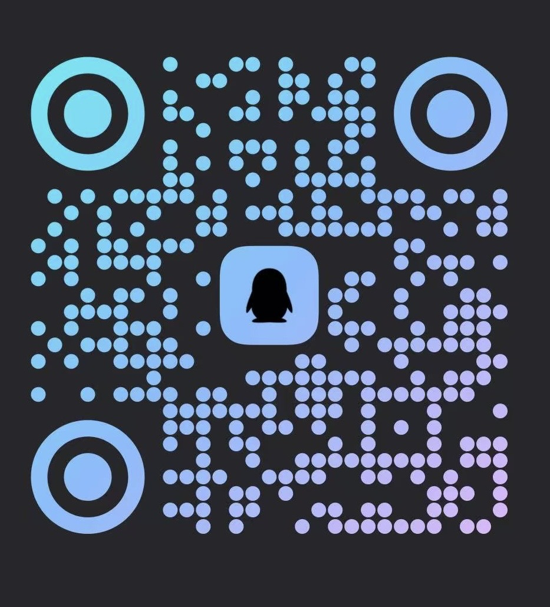

<div align="center">
<picture>
  <source media="(prefers-color-scheme: dark)" srcset="docs/brand/agents-anywhere-wordmark-dark.png">
  
</picture>
</div>

# Agents Anywhere 2.0

Access your agents, sessions and workspaces across mobile, desktop and the web.

Agents Anywhere connects agents running on your Mac, Windows PC, Linux devbox or server to a shared workbench. Continue conversations, inspect files and code, respond to approvals and use remote terminals. Execution stays on the Connector machine with that machine's workspace and permissions.

**2.0.0 is released.** `main` is the v2 development line. Read the [upgrade guide](docs/upgrading.md) before upgrading a legacy deployment. Product, Connector package and database schema versions are managed separately.

[简体中文](README.md) · [Getting started](docs/getting-started.md) · [Self-hosting](docker/README.md) · [Development](docs/development.md) · [Documentation](docs/README.md)

## Downloads and access

| Platform | 2.0.0 entry point | Notes |
| --- | --- | --- |
| macOS | [Universal DMG](https://modelscope.cn/models/t4wefan/deepseek-harness-desktop/resolve/master/Agents%20Anywhere-2.0.0-universal.dmg) | Apple Silicon and Intel; signed and notarized. |
| Windows | [x64 installer](https://modelscope.cn/models/t4wefan/deepseek-harness-desktop/resolve/master/Agents%20Anywhere%20Setup%202.0.0-x64.exe) | NSIS installer; this release is not Authenticode signed. |
| Android | [APK](https://modelscope.cn/models/t4wefan/deepseek-harness-desktop/resolve/master/agents-anywhere-2.0.0-release.apk) | Android 8.0 or later. |
| Web | [Agents Anywhere Cloud](https://web.agents-anywhere.com) | Browser access or your own self-hosted service. |
| iOS | [Native client source](ios/) | No iOS distribution link is included in this release download list. |
| Linux / headless | [Connector CLI](connector/README.md) | Connect the agent machine and control it from another client. |

The installers are **Agents Anywhere** artifacts hosted in the ModelScope repository `t4wefan/deepseek-harness-desktop`. Historical 0.1.x GitHub Releases are not the v2 download channel. In-app update addresses are still placeholders; download manually using these links.

## Features

- **Sessions across devices:** manage projects and sessions, send messages, continue tasks and follow live timelines.
- **Runtime management:** the Connector registers Codex, Claude and DSH providers. Models, permissions, commands and available actions depend on the connected runtime.
- **Approvals and interaction:** respond to approvals and input requests, interrupt or continue work where supported.
- **Workspaces:** browse, preview, upload and download files; use remote shell commands and interactive terminals.
- **Integrated desktop:** Desktop Workbench includes the workbench and a managed local Connector. On Windows, closing the window keeps it running in the system tray.
- **Self-hosting:** run your control plane with FastAPI, PostgreSQL and Redis, serving Web and API from one origin.

Runtime behavior differs between providers; follow the effective capabilities shown in the client. Legacy ACP adapters are not in the current default provider set. See [DSH Bridge Next](dsh-bridge-next/README.md) for DSH integration.

## First use

1. Install Desktop or Android, or open Web. Sign in to Cloud or enter your self-hosted service address.
2. Prepare the runtime on the machine that owns the workspace. Desktop manages a local Connector; Linux and headless hosts use the [CLI](connector/README.md).
3. Follow the client flow to connect a device, configure a runtime and project, and open or create a session.
4. Sign in to the same service and account on another device. Keep the Connector and runtime machine running.

Cloud account access follows the community onboarding process below. Self-hosted accounts are managed by your administrator; the first Server startup prints a setup token. See [Getting started](docs/getting-started.md) for details and login troubleshooting.

## Self-hosting quickstart

Run from the repository root after replacing the example secrets:

```bash
POSTGRES_PASSWORD=replace-with-a-strong-password \
AGENT_SERVER_SECRET=replace-with-a-long-random-secret \
docker compose -f docker/docker-compose.postgres.yml up --build
```

Open `http://127.0.0.1:5174`. Compose starts PostgreSQL, Redis with AOF, a one-shot migrator and the Server with the static Web export. See [Docker](docker/README.md) and [Upgrading](docs/upgrading.md) for public deployments, backups and existing databases.

## Architecture and source

Clients communicate with Server over `/api/v2`; Server routes work to the Connector on the agent machine. The Connector operates Codex, Claude or DSH and local files and terminals. Server stores session metadata and timelines in PostgreSQL and uses Redis for coordination and pending timeline writes.

Local execution does not mean that all data stays on the device: session content, timelines and uploaded attachments can pass through or be stored by Server.

| Directory | Purpose |
| --- | --- |
| `server/` | FastAPI API, authentication, storage and RPC routing. |
| `connector/` | Python CLI, local workspace operations and runtime providers. |
| `web-next/` | Next.js Web client. |
| `desktop-workbench/` | Current Electron desktop app and its renderer. |
| `android/` / `ios/` | Native mobile clients. |
| `dsh-bridge-next/` | Current DSH integration; `dsh-bridge/` also remains a separate package. |
| `contracts/` | Protocol contracts and fixtures. |
| `docker/` / `docs/` | Deployment and user, development and upgrade documentation. |
| `_deprecated/` / `_reference/` | Historical implementations and reference material. |

Use Python 3.12+, uv, Node.js 22 and Corepack/Yarn for development. Commands and headless checks are in the [development guide](docs/development.md).

## Cloud access and community

The China Cloud service currently follows the existing beta access process: join a community group and contact an administrator. The service's access policy is separate from the 2.0.0 software release. Overseas Cloud access has not been announced here; Discord is available for community updates.

| WeChat | Feishu | QQ | Discord |
| --- | --- | --- | --- |
|  |  |  |  |

## License

MIT
