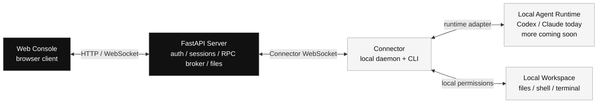

<div align="center">


# Agents Anywhere

<h3>Remote control plane for Claude Code, Codex, and more coding agents.</h3>

Run agents on your own laptop, remote devbox, or cloud sandbox. Control sessions, approvals, files, terminals, and runtime state from one self-hostable web workspace.


[Docker Quickstart](#quickstart-run-the-full-app-with-docker) · [Pair Connector](#pair-and-start-the-connector) · [Docker Docs](docker/README.md) · [简体中文](README.zh-CN.md)


> Screenshots are taken from a fast-moving product surface. UI details may change quickly; use the running app as the source of truth.

Watch long-running sessions, approve actions, inspect files, and open a terminal without moving the agent out of its original machine. To run the current open-source stack, start with [Docker Quickstart](#quickstart-run-the-full-app-with-docker).

</div>

---

> **Status: open-source development.**
> This repository contains the full Web frontend, FastAPI backend, and Python Connector CLI. It can run locally or be self-hosted with Docker. The primary client today is the Web console; mobile browsers are supported, and native mobile/desktop clients are in development.

## What Is Agents Anywhere?

You start a Claude Code or Codex task in a terminal. It runs for a while: reading files, editing code, running tests, waiting for you to approve an operation. When the agent blocks on an approval, an error, or a quick correction from you, you have to get back to that machine.

Agents Anywhere adds a remote control plane:

- The agent still runs on your machine, with your local account, local files, and local permissions.
- The Connector runs next to the agent and syncs runtime state, safe filesystem operations, shell/terminal capabilities, and approval requests to the backend.
- The Web console connects to the backend so you can inspect sessions, take over work, approve actions, browse files, and open terminals.

**It is the remote, not a new agent host.** Your code is not moved into the relay service for execution, and your model accounts and model bills remain with your own Claude Code / Codex toolchain.

## Why It Exists

Coding agents are no longer just one-off chat windows. They can run for minutes or longer, change files across a workspace, call tools, and pause at the exact moment a human decision is needed.

Without a remote control plane:

- You have to stay at the machine running the agent.
- If you walk away, the task can block on an approval or error.
- Multiple machines, sessions, and runtimes become hard to manage together.

Agents Anywhere turns those long-running tasks into a workspace you can reopen at any time: check state, inspect files, watch output, approve, interrupt, continue, and switch devices from the same Web UI.

## Product Preview

**Desktop: unified control plane**


> This screenshot reflects the product direction at the time it was captured. Agents Anywhere is iterating quickly, so the actual UI may differ.

Devices and sessions are collected in one workspace, so you can switch across machines, runtimes, and tasks.

**Mobile: sessions and devices**


> This screenshot reflects the product direction at the time it was captured. Agents Anywhere is iterating quickly, so the actual UI may differ.

Native mobile clients are in development. Today, you can also use the Web console from a mobile browser for status checks, device management, and lightweight approvals.

## Current Capabilities

- **Unified session workspace.** Create, inspect, pin, archive, mark read, take over, and manage sessions.
- **Codex-first runtime integration.** The Connector discovers local Codex and Claude runtimes and reports capabilities. Codex is the best-supported adapter today; Claude has basic support and is still being expanded.
- **Approvals and sync.** Supports interrupt, sync, approval resolution, and timeline polling/SSE.
- **Local file access.** Browse workspaces, read/write files, upload content, and download content through an online Connector.
- **Remote shell and terminal.** Run one-shot shell commands, shell tasks, and interactive terminals.
- **Device pairing.** Start from a Web-generated token command or from `uvx anywhere-cli pair` with a pairing code.
- **Self-hosted backend.** The FastAPI backend supports SQLite for local development and PostgreSQL for production-style deployments.
- **Web console.** Next.js + shadcn frontend for auth, devices, workspaces, runtime settings, team/admin management, and session detail.

## Supported Agents And Runtimes

Agents Anywhere does not replace your agent. It runs next to an existing runtime through the Connector:


| Runtime | Vendor | Current status | Notes |
| --- | --- | --- | --- |
| Codex | OpenAI | Best supported today | Most core capabilities are supported, including runtime discovery, session sync, timeline updates, approvals, interrupt/takeover, filesystem access, shell tasks, interactive terminals, and runtime settings. Some vendor-specific or advanced auxiliary features are still being polished. |
| Claude Code | Anthropic | Basic support | The current code supports discovery and the basic session/control flow. Deeper parity with Codex, richer history/timeline handling, and advanced runtime behavior are still being improved. |
| Cursor | Anysphere | Coming soon | Not yet available as a usable adapter. |
| OpenCode | SST | Coming soon | Not yet available as a usable adapter. |
| Gemini CLI | Google | Coming soon | Not yet available as a usable adapter. |

Connector adapters are extensible. New runtimes should reuse the existing session, timeline, approval, filesystem, and terminal capabilities where possible.

## Supported Client Platforms


| Platform / surface | Current status | Notes |
| --- | --- | --- |
| Web console | Primary supported client | Desktop browsers are the main target today. Mobile browsers are usable for status checks, approvals, device management, and lightweight session control. |
| Connector CLI | Primary runtime bridge | Runs on the machine that owns the workspace and local agent runtime. Platform behavior depends on the local shell, filesystem, and installed Codex / Claude toolchain. |
| iOS | Native client in development | The native client is being built for mobile session/device workflows and lightweight control. |
| Android | Native client in development | The native client is being built for mobile session/device workflows and lightweight control. |
| macOS desktop | Coming soon | Native desktop packaging is planned after the Web and Connector flows stabilize. |
| Windows desktop | Coming soon | Native desktop packaging is planned after the Web and Connector flows stabilize. |

This repository currently includes the Web frontends, FastAPI backend, Connector CLI, and native mobile work in progress. The Web console remains the reference client while native clients mature.

Want to run it now? Jump to [Docker Quickstart](#quickstart-run-the-full-app-with-docker). If you want to connect your own machine, continue to [Pair And Start The Connector](#pair-and-start-the-connector).

## FAQ

**Where does my code actually run?**
On the machine running the Connector. The backend handles auth, state, file metadata, and RPC routing; it does not execute your code on the server.

**What do I install on my dev machine?**
Run the Python CLI in `connector/`. It should live on the same machine as Codex / Claude and the workspace you want to control.

**Do my model accounts go through Agents Anywhere?**
No. The Connector uses the Codex / Claude runtime and login state already present on your machine. Agents Anywhere does not proxy model account credentials.

**Codex and Claude already provide official remote control. Why use Agents Anywhere?**
Official remote control is usually tied to each vendor's subscription account and product surface. Agents Anywhere does not need to bind to your model subscription account; it only needs the Connector to reach a runtime that is already logged in locally. The goal is one unified entry point for multiple agents: Codex, Claude, and more agents over time. More adapters are in development, and Connector adapter contributions are welcome.

**Can I self-host it?**
Yes. The Docker quickstart runs the Web console, FastAPI backend, and PostgreSQL together. For deployment variants and environment variables, see [docker/README.md](docker/README.md).

**Which agents are supported today?**
The current code focuses on Codex and Claude. Codex is the most complete adapter today. Claude supports the basic flow and is still being expanded. Other runtimes are coming soon and can be added by implementing Connector adapters.

## Technical Guide

The sections above describe the product: Agents Anywhere solves the problem of agents running elsewhere while humans still need to take over. The sections below cover the architecture, Docker quickstart, and Connector pairing flow. For detailed Docker deployment options, local development images, environment variables, and verification commands, see [docker/README.md](docker/README.md).

## Architecture



Repository layout:

```text
server/      FastAPI backend, SQLite/PostgreSQL storage, Connector RPC broker
connector/   Local daemon and CLI for Codex / Claude runtime integration
web-next/    Next.js + shadcn Web console
web/         Legacy React + Vite frontend kept as a fallback/reference
docker/      Development, production, and PostgreSQL compose deployment files
docs/        Shared reference notes
```

Package-specific docs:

- [Server](server/README.md)
- [Connector](connector/README.md)
- [Web Next](web-next/)
- [Docker](docker/README.md)

## Quickstart: Run The Full App With Docker

Run the PostgreSQL-backed stack from the repository root:

```bash
POSTGRES_PASSWORD=change-me \
AGENT_SERVER_SECRET=change-me-too \
docker compose -f docker/docker-compose.postgres.yml up --build
```

Open:

```text
http://127.0.0.1:5174
```

This starts two services:

- `postgres-next`: PostgreSQL 17 with a persistent Docker volume.
- `server-next`: FastAPI backend published on host port `5174`; it serves the statically exported `web-next` UI and handles API/WebSocket paths from the same origin.

The first startup on an empty database logs a bootstrap token. Use it in the Web UI to create the first admin user.

For custom ports, production secrets, SQLite/manual Docker runs, mirrors, connector images, and local development containers, see [docker/README.md](docker/README.md).

## Pair And Start The Connector

The Connector should run on the machine that actually owns the workspace and agent runtime. It uses that machine's local filesystem permissions, shell permissions, and Codex / Claude login state.

### Option A: Start From The Web Console

Add a device in the Web UI, copy the generated command, and run it on the target machine. The command shape is:

```bash
cd connector
uv sync
uvx anywhere-cli start \
  --server-url http://127.0.0.1:8000 \
  --connector-id conn_xxx \
  --connector-token cxt_xxx
```

You can also save the config first, then start:

```bash
cd connector
uvx anywhere-cli configure \
  --server-url http://127.0.0.1:8000 \
  --connector-id conn_xxx \
  --connector-token cxt_xxx

uvx anywhere-cli start
```

The default config path is `~/.agent-server/connector.json`. Override it with `--config` or `AGENT_CONNECTOR_CONFIG`.

### Option B: Start Pairing From The CLI

```bash
uvx anywhere-cli pair anywhere.example.com
```

The terminal prints a pairing code. Enter that code in the Web UI pairing dialog; the Connector saves its config and starts. To save the config without starting immediately:

```bash
uvx anywhere-cli pair anywhere.example.com --no-start
```

The server address can be a bare host, host with port, or a full URL. When the scheme is omitted, the CLI tries HTTPS first and then HTTP.

If `codex` or `claude` is not on `PATH`, configure the runtime path from the UI or set these before starting the Connector:

```bash
CODEX_BIN=/path/to/codex
CLAUDE_BIN=/path/to/claude
```

For Dockerized Connector images, SSH-enabled development containers, and agent installer images, see [docker/README.md](docker/README.md).

## License

[MIT](LICENSE)
