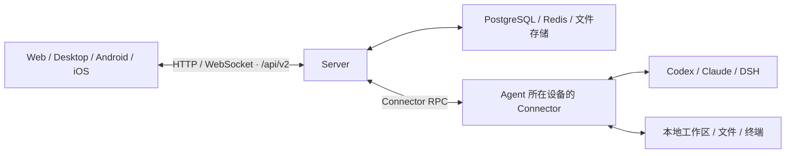

<div align="center">
<picture>
  <source media="(prefers-color-scheme: dark)" srcset="docs/brand/agents-anywhere-wordmark-dark.png">
  
</picture>
</div>

# Agents Anywhere 2.0

在手机、桌面和浏览器之间访问你的 Agent、会话和工作空间。

Agents Anywhere 将运行在 Mac、Windows、Linux 开发机或服务器上的 Agent 接入同一个工作台。你可以继续会话、查看文件与代码、处理审批和操作远程终端。Agent 在 Connector 所在设备执行，使用那台设备的工作区与权限。

**2.0.0 已发布。** `main` 是 v2 主线；旧版部署升级前请阅读[升级指南](docs/upgrading.md)。产品版本、Connector 包版本和数据库 schema 版本分别管理。

[English](README.en.md) · [安装与首次使用](docs/getting-started.md) · [自托管](docker/README.md) · [开发指南](docs/development.md) · [文档目录](docs/README.md)

## 下载与入口

| 平台 | 2.0.0 入口 | 说明 |
| --- | --- | --- |
| macOS | [下载 Universal DMG](https://modelscope.cn/models/t4wefan/deepseek-harness-desktop/resolve/master/Agents%20Anywhere-2.0.0-universal.dmg) | Apple Silicon 和 Intel 通用；已签名、公证。 |
| Windows | [下载 x64 安装包](https://modelscope.cn/models/t4wefan/deepseek-harness-desktop/resolve/master/Agents%20Anywhere%20Setup%202.0.0-x64.exe) | NSIS 安装包；本次发布未做 Windows 代码签名。 |
| Android | [下载 APK](https://modelscope.cn/models/t4wefan/deepseek-harness-desktop/resolve/master/agents-anywhere-2.0.0-release.apk) | Android 8.0 及以上。 |
| Web | [Agents Anywhere Cloud](https://web.agents-anywhere.com) | 浏览器访问，也可连接自托管服务。 |
| iOS | [客户端源码](ios/) | 仓库包含原生客户端；本次下载列表不包含 iOS 分发链接。 |
| Linux / headless | [Connector CLI](connector/README.md) | 在 Agent 所在机器接入设备，通过其他客户端控制。 |

安装包托管在 ModelScope 的 `t4wefan/deepseek-harness-desktop` 仓库中，以上文件均为 **Agents Anywhere** 安装包。历史 GitHub Releases 中的 0.1.x 安装包不作为 v2 下载入口。当前应用内更新地址仍是占位配置，请使用上面的链接手动下载。

## 可以做什么

- **跨设备会话。** 管理项目和会话，发送消息、接续任务，查看实时 Timeline。
- **Runtime 管理。** 当前 Connector 注册 Codex、Claude 和 DSH provider；可用模型、权限、命令及操作由实际 Runtime 能力决定。
- **审批与交互。** 在客户端响应工具审批和输入请求，按 Runtime 能力打断或继续任务。
- **工作空间。** 浏览、预览、上传和下载文件，使用远程 shell 与交互式终端。
- **桌面一体化。** Desktop Workbench 集成工作台和本机 Connector；Windows 关闭窗口后继续在托盘运行。
- **自托管。** 使用 FastAPI、PostgreSQL 和 Redis 部署自己的控制面，Web 与 API 可同源运行。

Codex、Claude 与 DSH 的配置和行为存在差异，请以界面显示的有效能力为准。旧版 ACP adapters 不属于当前默认 provider 集合。DSH 集成说明见 [DSH Bridge Next](dsh-bridge-next/README.md)。

## 首次使用

1. 安装 Desktop 或 Android，或打开 Web。登录 Cloud；使用自托管服务时填写该服务地址。
2. 在拥有工作区的设备上准备 Runtime。Desktop 可管理本机 Connector；Linux 或无图形环境使用 [Connector CLI](connector/README.md)。
3. 按客户端引导连接设备、配置 Runtime 和项目，设备在线后创建或打开会话。
4. 在其他设备登录同一服务和账号，继续操作。Connector 和 Runtime 所在机器需要保持运行。

Cloud 的账号开通方式见下方联系方式。自托管实例由自己的管理员管理账号；首次启动可从 Server 日志获得 setup token。详细步骤与常见登录问题见[安装与首次使用](docs/getting-started.md)。

## 自托管快速开始

在仓库根目录运行，先将示例密码替换为自己的值：

```bash
POSTGRES_PASSWORD=replace-with-a-strong-password \
AGENT_SERVER_SECRET=replace-with-a-long-random-secret \
docker compose -f docker/docker-compose.postgres.yml up --build
```

打开 `http://127.0.0.1:5174`。Compose 启动 PostgreSQL、启用 AOF 的 Redis、一次性迁移任务和托管静态 Web 的 Server。部署到公网、备份及既有数据库升级见 [Docker 文档](docker/README.md)和[升级指南](docs/upgrading.md)。

## 架构与源码


```mermaid
flowchart LR
    Clients["Web / Desktop / Android / iOS"] <-->|"HTTP / WebSocket · /api/v2"| Server["Server"]
    Server <--> Storage["PostgreSQL / Redis / 文件存储"]
    Server <-->|"Connector RPC"| Connector["Agent 所在设备的 Connector"]
    Connector <--> Runtime["Codex / Claude / DSH"]
    Connector <--> Workspace["本地工作区 / 文件 / 终端"]
```

Agent 的执行留在设备上；会话、Timeline 和上传附件等数据会按功能流经或存储在 Server，不能把“本地执行”理解为所有数据都不离开设备。

| 目录 | 用途 |
| --- | --- |
| `server/` | FastAPI API、认证、持久化和 RPC 转发。 |
| `connector/` | Python CLI、本地工作区操作及 Runtime providers。 |
| `web-next/` | Next.js Web 客户端。 |
| `desktop-workbench/` | 当前 Electron 桌面应用与独立 renderer。 |
| `android/` / `ios/` | 原生移动客户端。 |
| `dsh-bridge-next/` | 当前 DSH 集成实现；另保留独立的 `dsh-bridge/` 包。 |
| `contracts/` | 协议契约与 fixtures。 |
| `docker/` / `docs/` | 部署文件及使用、开发、升级文档。 |
| `_deprecated/` / `_reference/` | 历史实现和参考资料，不作为当前应用入口。 |

开发环境使用 Python 3.12+、uv、Node.js 22 和 Corepack/Yarn。完整命令与 headless 检查见[开发指南](docs/development.md)。

## 申请内测与联系方式

Agents Anywhere 已经提供线上 Beta 服务。当前服务免费、仍处于 Beta 阶段，并且只面向中国用户开放，需要申请后使用。

如果你想试用，请扫码加入微信群、飞书群或 QQ 群，并联系管理员开通。

| 微信群 | 飞书群 | QQ 群 | Discord |
| --- | --- | --- | --- |
|  |  |  |  |
| 微信 已支持机器人自助注册 | 中国区 Beta 试用群 | QQ 已支持机器人自助注册 | 海外社区 |

海外用户入口暂未开放。可以先加入 Discord 获取后续社区和开放计划更新。

## 开源许可

MIT
