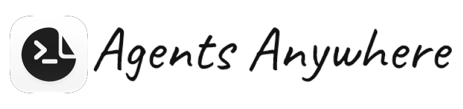
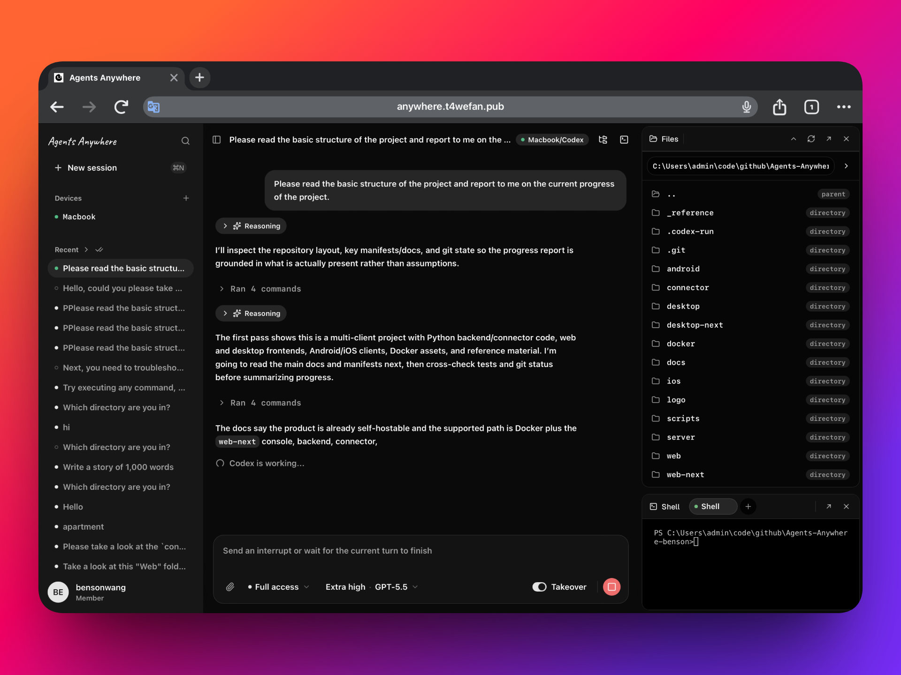
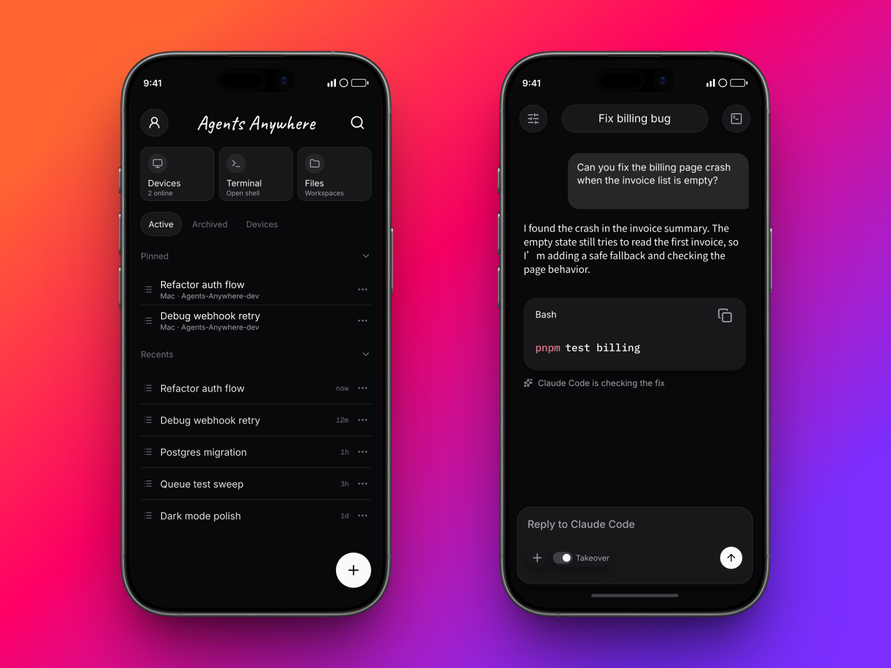
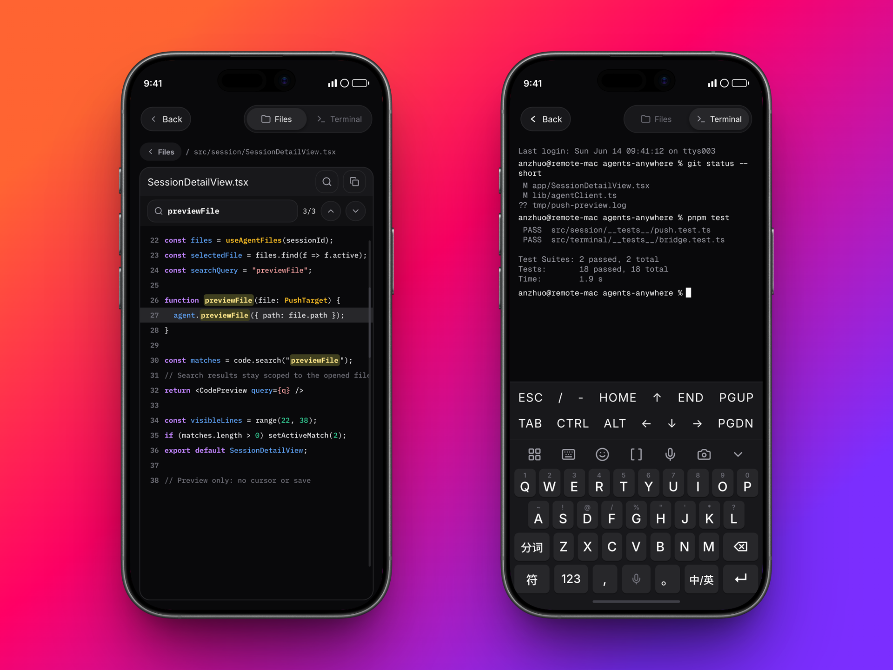
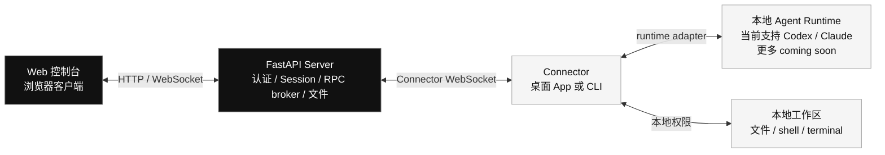
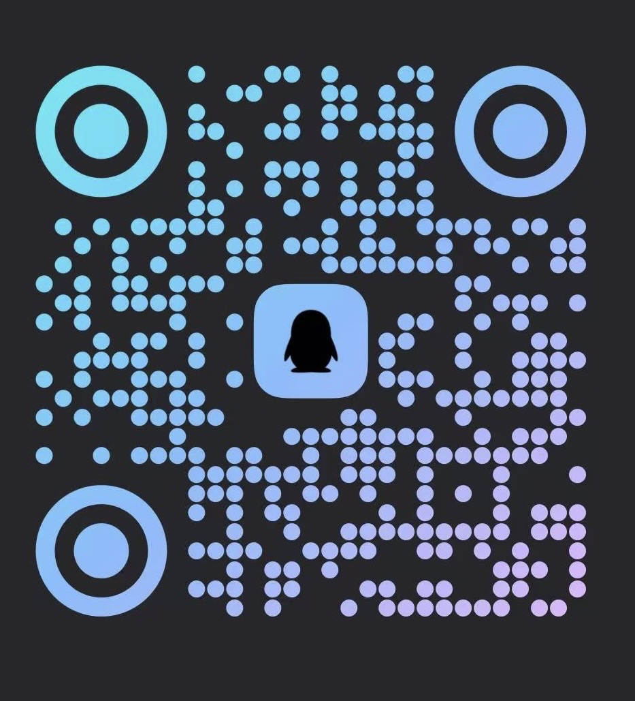

<div align="center">

<picture>
  <source media="(prefers-color-scheme: dark)" srcset="docs/brand/agents-anywhere-wordmark-dark.png">
  
</picture>

<h3>用手机控制任何设备上的编程 Agent。</h3>

让 Codex、Claude Code 和更多 Agent 继续运行在你的 Mac、Windows 电脑、Linux devbox 或云沙箱里。你可以用手机和 Session 对话、预览文件和代码、处理审批，并打开那台设备上的远程终端。


[Docker Quickstart](#quickstartdocker-启动完整应用) · [首次使用](#首次使用流程) · [Downloads](https://github.com/anywhere-labs/Agents-Anywhere/releases) · [Docker 文档](docker/README.md) · [English](README.md)

</div>

---

> [!IMPORTANT]
> 中国区 Beta 已上线，目前免费试用，仅对中国用户开放。想申请内测，请跳转到 [申请内测与联系方式](#申请内测与联系方式)，扫码进群并联系管理员。

## Agents Anywhere 是什么？

Agents Anywhere 让你用手机控制正在别的设备上运行的编程 Agent。

你可以在 Mac、Windows 电脑、Linux 服务器、远程 devbox 或云沙箱上运行 Codex / Claude Code。Agents Anywhere 会把手机连接到这些设备，让你随时查看和控制设备上的 Agent Session。

在手机上，你可以：

- 和正在运行的 Session 对话，在需要时接管任务。
- 预览远程设备上的文件、代码、日志和 Runtime 状态。
- 处理审批、打断、继续或同步长时间运行的任务。
- 打开远程终端，直接操作 Agent 所在的那台设备。

Agents Anywhere 是遥控器，不是新的 Agent 运行环境。你的代码仍然留在原设备上，Agent 仍然使用那台设备的本地文件和权限，模型账号和模型费用也仍然来自你自己的 Claude Code / Codex 等工具链。

如果你在电脑前，也可以直接使用 Web 控制台。Web 端提供同样的 Session、Device、审批、文件和终端管理能力，适合桌面浏览器和团队自托管场景。

## 产品预览

**Web**



**移动端**



**移动端：文件与终端**



## 当前能力

- **统一 Session 工作台。** 创建、查看、置顶、归档、标记已读、接管和管理多条 Session。
- **Codex 优先的 Runtime 集成。** Connector 会发现本机 Codex 和 Claude，并上报可用能力。目前 Codex 是适配最完整的 Runtime；Claude 已支持基础流程，仍在继续完善。
- **审批与同步。** 支持打断、同步、审批处理和 timeline 轮询/SSE。
- **本地文件访问。** 通过在线 Connector 浏览工作目录、读取/写入文件、上传和下载内容。
- **远程 shell 与终端。** 支持一次性 shell 命令、shell task 和交互式 terminal。
- **设备配对。** 通过 Windows/macOS Connector App 或 Linux Connector CLI，把真正拥有工作区的机器接入控制面。
- **自托管后端。** FastAPI 后端支持 SQLite 本地开发和 PostgreSQL 生产风格部署。
- **Web 和 Android 客户端。** 使用 Web 控制台或 Android App 管理 Session、Device、审批、文件、终端和远程控制流程。

## 支持的 Agent 与 Runtime

Agents Anywhere 不替代你的 Agent，而是通过 Connector 运行在现有 Runtime 旁边：


| Runtime | 当前状态 | 说明 |
| --- | --- | --- |
| Codex | ✅ | 支持 Runtime 发现、Session 同步、timeline 更新、审批、打断/接管、文件访问、shell task、交互式 terminal 和 Runtime 设置。 |
| Claude Code | ✅ | 支持发现和基础 Session/控制流程，更多深度能力仍在继续完善。 |
| Cursor | Coming soon | 暂未提供可用 adapter。 |
| OpenCode | Coming soon | 暂未提供可用 adapter。 |
| Gemini CLI | Coming soon | 暂未提供可用 adapter。 |

Connector adapter 是可扩展的；新增 Runtime 时，应优先复用现有的 session、timeline、approval、filesystem 和 terminal 能力。

## 支持的客户端与 Connector 平台


| 平台 / 入口 | 状态 | 说明 |
| --- | --- | --- |
| Web 控制台 | ✅ | 支持 Session、Device、审批、文件、终端、Runtime 设置、团队/管理员管理和 Session 详情。 |
| Android | ✅ | 可从 [GitHub Releases](https://github.com/anywhere-labs/Agents-Anywhere/releases) 下载 APK。支持 Session、Device、审批、文件、终端和移动端控制工作流。 |
| iOS | Coming soon | 正在开发中。 |
| Windows / macOS Connector App | ✅ | 可从 [GitHub Releases](https://github.com/anywhere-labs/Agents-Anywhere/releases) 下载。支持配对、日志、托盘和开机启动控制。 |
| Linux Connector CLI | ✅ | 使用 `connector/` 里的 Python CLI 或 `uvx anywhere-cli`，适合 Linux 服务器、开发机和 headless 环境。 |

当前仓库已包含 Web 前端、FastAPI 后端、Connector CLI、Windows/macOS Connector App、Android 原生客户端，以及开发中的 iOS 客户端代码。Web 和 Android 是当前主要支持的客户端入口；Connector App/CLI 用来把你自己的机器接入控制面。

想直接跑起来，可以跳到 [Docker Quickstart](#quickstartdocker-启动完整应用)；服务启动后，继续看 [首次使用流程](#首次使用流程)。

## 常见问题

**我的代码到底跑在哪？**
跑在 Connector 所在的机器上。后端负责认证、状态、文件元数据和 RPC 转发，不把你的代码搬到服务器上执行。

**需要在开发机上装什么？**
需要在拥有工作区和本地 Agent Runtime 的机器上安装 Connector。Windows 和 macOS 使用 Agents Anywhere Connector 桌面 App；Linux 使用 `connector/` 里的 Python CLI 或 `uvx anywhere-cli`。

**模型账号会经过 Agents Anywhere 吗？**
不会。Connector 使用本机已有的 Codex / Claude Runtime 和登录状态，Agents Anywhere 不代理模型账号凭据。

**Codex、Claude 已经有官方远程控制，为什么还要用 Agents Anywhere？**
官方远程控制通常绑定各自的订阅账号和产品体系；Agents Anywhere 的控制面不需要绑定你的模型订阅账号，只需要 Connector 能在本机访问你已经登录好的 Runtime。它的目标是做一个多 Agent 的统一入口：同一个 Web 控制台里接入 Codex、Claude，以及未来更多 Agent。更多适配正在开发中，也欢迎贡献新的 Connector adapter。

**可以自托管吗？**
可以。Docker quickstart 会一起启动 Web 控制台、FastAPI 后端和 PostgreSQL。更多部署方式和环境变量请看 [docker/README.md](docker/README.md)。

**当前支持哪些 Agent？**
当前代码重点集成 Codex 和 Claude。Codex 是目前最完整的适配目标；Claude 已支持基础流程，仍在继续完善。其他 Runtime 处于 coming soon 状态，可以通过新增 Connector adapter 的方式扩展。

## 技术说明

上面是产品层面的说明：Agents Anywhere 解决的是“Agent 跑在别处，但人需要随时接管”的问题。下面介绍系统架构、Docker quickstart、首次使用流程和 Connector 平台选择。详细的 Docker 部署方式、本地开发镜像、环境变量和验证命令请看 [docker/README.md](docker/README.md)。

## 架构



仓库结构：

```text
server/      FastAPI 后端，SQLite/PostgreSQL 存储，Connector RPC broker
connector/   本地守护进程和 CLI，集成 Codex / Claude runtime
desktop/     Windows/macOS Electron App，用于运行本机 Connector
web-next/    Next.js + shadcn Web 控制台
web/         旧版 React + Vite 前端，保留作 fallback/reference
docker/      开发、生产和 PostgreSQL compose 部署文件
docs/        共享参考文档
```

各包文档：

- [Server](server/README.md)
- [Connector](connector/README.md)
- [Desktop Connector](desktop/README.md)
- [Web Next](web-next/)
- [Docker](docker/README.md)

## Quickstart：Docker 启动完整应用

从仓库根目录运行 PostgreSQL compose：

```bash
POSTGRES_PASSWORD=change-me \
AGENT_SERVER_SECRET=change-me-too \
docker compose -f docker/docker-compose.postgres.yml up --build
```

打开：

```text
http://127.0.0.1:5174
```

这会启动两个服务：

- `postgres-next` 服务运行 PostgreSQL 17。
- `server-next` 服务运行 FastAPI 后端，发布在宿主机 `5174` 端口；它会同源托管静态导出的 `web-next` UI，并处理 API/WebSocket 路径。

首次启动空数据库时，服务日志会输出 setup token。用它在 Web UI 中创建第一个管理员用户。

自定义端口、生产环境密钥、SQLite/manual Docker 启动、镜像源、Connector 镜像和本地开发容器，请看 [docker/README.md](docker/README.md)。

## 首次使用流程

Docker stack 或 server 启动后，按下面流程完成第一次配置。

### Step 0：先理解三个部分

Agents Anywhere 由三个部分组成：

- **Client**：你直接使用的入口，包括 Web 控制台、iOS App 和 Android App。
- **Server**：中间服务，负责账号、设备、Session 状态和指令转发。
- **Connector App**：运行在被控设备上的本地程序，比如你的 Mac、Windows 电脑、Linux 服务器或 devbox。

简单来说：你在 Client 上发出指令，指令先到 Server，再转发给被控设备上的 Connector App。Connector App 会在那台设备上操作本地的 Codex / Claude Code 等 Agent，完成任务。你的代码、终端和 Agent 运行环境仍然都在被控设备本地。

### Step 1：创建 Admin 账号

打开 Web 控制台，填入服务端日志里的 setup token，创建第一个账号。这个账号会成为默认管理员。

> [!TIP]
> setup token 是什么？
>
> 新部署的服务还没有用户时，第一个注册成功的人会成为管理员。为了避免服务暴露到公网后被别人抢先注册，Agents Anywhere 要求第一次注册必须填写后端日志里打印出来的 setup token。
>
> 请在后端服务启动日志中查找类似下面的内容：
>
> ```text
> AGENT SERVER  ·  first-run setup required
> Paste this token into the setup page to create the admin:
>
>   setup-token: xxxxxxxxxxxxxxxxxxxxxxxx
> ```
>
> 复制 `setup-token:` 后面的值，粘贴到 Web 注册页即可。

### Step 2：准备 Connector

在运行 Codex / Claude Code 的设备上准备 Connector。

| OS | 版本 | 操作 |
| --- | --- | --- |
| Windows | 0.1.6 | 从 [GitHub Releases](https://github.com/anywhere-labs/Agents-Anywhere/releases) 下载 Connector App |
| macOS | 0.1.6 | 从 [GitHub Releases](https://github.com/anywhere-labs/Agents-Anywhere/releases) 下载 Connector App |

### Step 3：配对 Device

按照 Web 端 UI 引导发起配对。你也可以在手机端发起配对。

#### Linux：使用命令行配对

Linux 设备在 Web 端配对流程里选择 **使用命令行配对**。复制 Web 端显示的命令，粘贴到 Linux 终端里运行即可。

注意保持这个终端会话存活。如果关闭终端，`anywhere-cli` 进程也会退出，Linux 设备就会下线。最简单的持久化方式是把配对命令放到 `screen` 里运行：

```bash
screen -S anywhere
# 在这里粘贴并运行 Web 配对页面给出的命令
```

Connector 在线后，可以按 `Ctrl-A`，再按 `D` 退出但不关闭会话。之后需要回到这个会话时运行：

```bash
screen -r anywhere
```

### Step 4：开始聊天

Device 在线后，就可以在 Web 控制台或手机端和 Agent 开始聊天。

Android 用户可以从 [GitHub Releases](https://github.com/anywhere-labs/Agents-Anywhere/releases) 下载 APK。iOS 仍在开发中。

## 申请内测与联系方式

Agents Anywhere 已经提供线上 Beta 服务。当前服务免费、仍处于 Beta 阶段，并且只面向中国用户开放，需要申请后使用。

如果你想试用，请扫码加入微信群、飞书群或 QQ 群，并联系管理员开通。

| 微信群 | 飞书群 | QQ 群 | Discord |
| --- | --- | --- | --- |
|  |  |  |  |
| 中国区 Beta 试用群 | 中国区 Beta 试用群 | 中国区 Beta 试用群 | 海外社区 |

海外用户入口暂未开放。可以先加入 Discord 获取后续社区和开放计划更新。

## Star History

<a href="https://www.star-history.com/?repos=anywhere-labs%2FAgents-Anywhere&type=timeline&legend=top-left">
 <picture>
   <source media="(prefers-color-scheme: dark)" srcset="https://api.star-history.com/chart?repos=anywhere-labs/Agents-Anywhere&type=timeline&theme=dark&legend=top-left&sealed_token=SPETRwhaIk_DrwoTkhKh6IjCtLF2FYRqOJrHbR2sSTEl2zXb2IbOv7faUaN4gwckAO39WDYotDIiIjpB-vIAD9tc5CSsgN-9R6Ep5VUxYnn1JCmmcCUDcPvLHJnXL-Z1IRDACNbYw7vSLO-bSNdM5Aegroif3P5DGuV2O_Pb9uLXZ3Jgsx4GkMPocing" />
   <source media="(prefers-color-scheme: light)" srcset="https://api.star-history.com/chart?repos=anywhere-labs/Agents-Anywhere&type=timeline&legend=top-left&sealed_token=SPETRwhaIk_DrwoTkhKh6IjCtLF2FYRqOJrHbR2sSTEl2zXb2IbOv7faUaN4gwckAO39WDYotDIiIjpB-vIAD9tc5CSsgN-9R6Ep5VUxYnn1JCmmcCUDcPvLHJnXL-Z1IRDACNbYw7vSLO-bSNdM5Aegroif3P5DGuV2O_Pb9uLXZ3Jgsx4GkMPocing" />
   
 </picture>
</a>

## 开源许可

[MIT](LICENSE)
