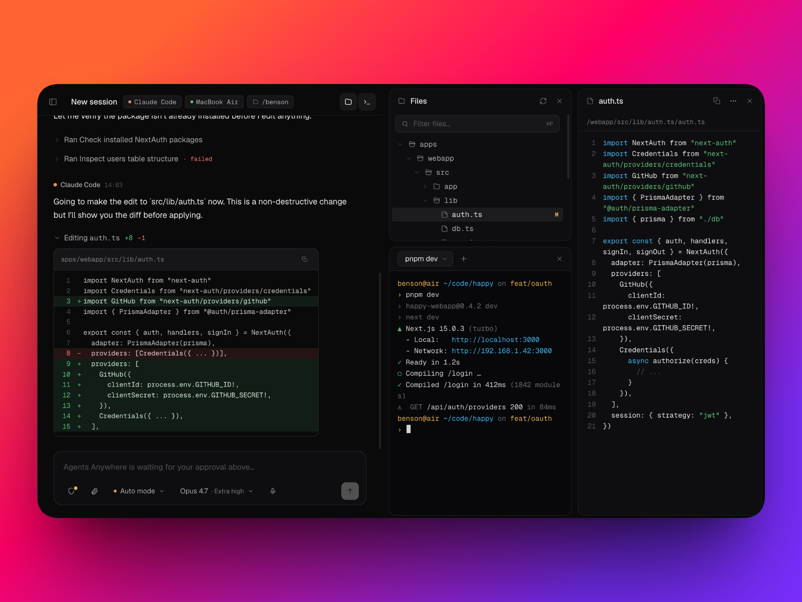
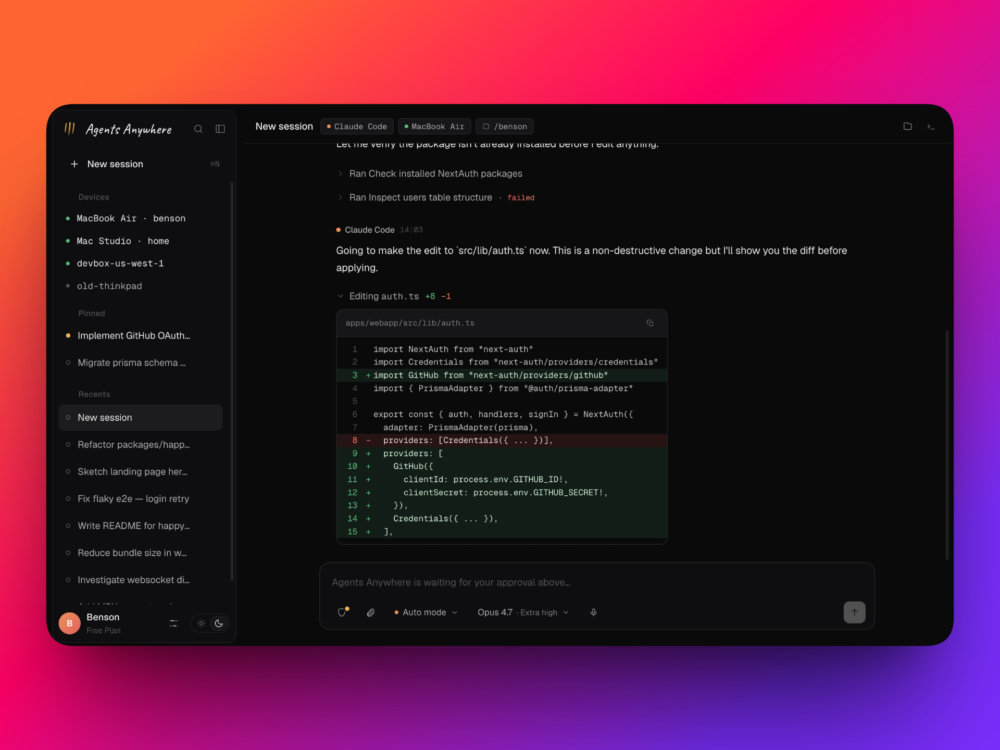
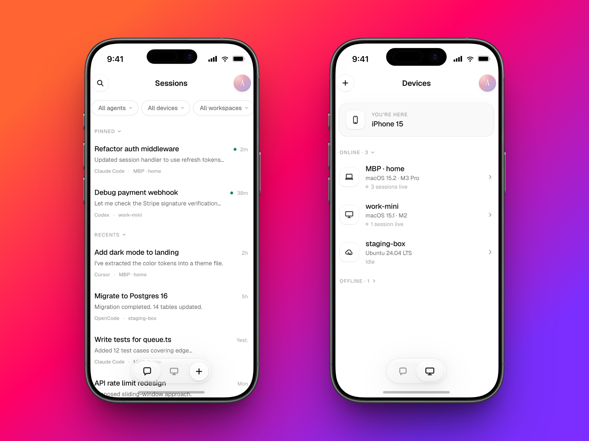

<div align="center">

# Agents Anywhere

<h3>面向 Claude Code、Codex 和更多编码 Agent 的远程控制台。</h3>

让 Agent 继续运行在你的笔记本、远程开发机或云端沙箱里；在一个可自托管的 Web 工作台里管理会话、审批、文件、终端和 Runtime 状态。

[Docker Quickstart](#quickstartdocker-启动完整应用) · [配对 Connector](#配对并启动-connector) · [自托管](#self-host生产风格部署) · [English](README.md)



查看长时间运行的 Session、批准操作、浏览文件、打开终端，同时让 Agent 留在原来的机器上运行。想跑起当前开源版本，可以从 [Docker Quickstart](#quickstartdocker-启动完整应用) 开始。

</div>

---

> **当前状态：开源开发中。**
> 当前仓库包含完整的 Web 前端、FastAPI 后端和 Python Connector CLI，可本地运行，也可通过 Docker 自托管。当前主要客户端是 Web 控制台；移动端可通过浏览器访问，原生移动/桌面客户端正在开发中。

## Agents Anywhere 是什么？

你在终端里启动了一个 Claude Code 或 Codex 任务，然后它开始跑很久：读文件、改代码、跑测试、等你批准某个操作。问题是，Agent 一旦卡在审批、报错或需要你补一句话，你就必须回到那台机器前。

Agents Anywhere 做的是一层远程控制面：

- Agent 仍然运行在你的机器上，使用你的本地账号、本地文件和本地权限。
- Connector 和 Agent 跑在同一台机器上，负责把 Runtime 状态、安全范围内的文件操作、shell/terminal 能力和审批请求同步给后端。
- Web 控制台连接后端，让你查看 Session、接管任务、处理审批、浏览文件、打开终端。

**它是遥控器，不是新的 Agent 运行环境。** 你的代码不会被搬到中继服务里执行，模型账号和模型费用也仍然来自你自己的 Claude Code / Codex 等工具链。

## 为什么需要它？

编码 Agent 已经不再只是一次性的聊天窗口。它会跑几分钟甚至更久，会跨文件改动，会触发工具调用，也会在关键时刻等你做决定。

没有远程控制面时，现实通常是：

- 你必须一直盯着运行 Agent 的电脑。
- 你离开后，任务很可能卡在审批或错误上。
- 多台机器、多条 Session、多种 Runtime 很难统一管理。

Agents Anywhere 把这些长跑任务变成一个可以随时打开的工作台：看状态、看文件、看输出、批操作、打断、继续、切换设备，都在同一个 Web UI 里完成。

## 产品预览

**桌面端：统一控制台**



所有设备和 Session 集中在一个工作台里，便于在不同机器、不同 Runtime 和不同任务之间切换。

**移动端：Sessions 与 Devices**



移动端原生客户端正在开发中；当前也可以通过移动浏览器访问 Web 控制台，处理状态查看、设备管理和轻量审批场景。

## 当前能力

- **统一 Session 工作台。** 创建、查看、置顶、归档、标记已读、接管和管理多条 Session。
- **Codex / Claude Runtime 集成。** Connector 会发现本机 Codex 和 Claude，并上报可用能力。
- **审批与同步。** 支持打断、同步、审批处理和 timeline 轮询/SSE。
- **本地文件访问。** 通过在线 Connector 浏览工作目录、读取/写入文件、上传和下载内容。
- **远程 shell 与终端。** 支持一次性 shell 命令、shell task 和交互式 terminal。
- **设备配对。** 支持从 Web 端生成 token 启动命令，也支持 Connector 端 `login` 输出配对码。
- **自托管后端。** FastAPI 后端支持 SQLite 本地开发和 PostgreSQL 生产风格部署。
- **Web 控制台。** React + Vite 前端提供登录、设备、工作区、Runtime 设置、团队/管理员和 Session 详情页。

## 支持的 Agent

Agents Anywhere 不替代你的 Agent，而是通过 Connector 运行在现有 Runtime 旁边：

| Agent | 厂商 | 当前状态 |
| --- | --- | --- |
| Claude Code | Anthropic | 当前代码已集成 |
| Codex | OpenAI | 当前代码已集成 |
| Cursor | Anysphere | 规划中 |
| OpenCode | SST | 规划中 |
| Gemini CLI | Google | 规划中 |

Connector adapter 是可扩展的；新增 Runtime 时，应优先复用现有的 session、timeline、approval、filesystem 和 terminal 能力。

## 支持的平台

| 平台 | 当前状态 |
| --- | --- |
| Web | 当前主要客户端，支持现代桌面/移动浏览器 |
| iOS | 原生客户端开发中 |
| Android | 原生客户端开发中 |
| macOS | 原生桌面客户端开发中 |
| Windows | 原生桌面客户端开发中 |

当前仓库已包含 Web 前端、FastAPI 后端和 Connector CLI。原生客户端相关代码会在对应实现成熟后进入公开仓库或独立包。

想直接跑起来，可以跳到 [Docker Quickstart](#quickstartdocker-启动完整应用)；如果要本地开发或接入自己的机器，继续看后面的 [配对并启动 Connector](#配对并启动-connector)。

## 常见问题

**我的代码到底跑在哪？**
跑在 Connector 所在的机器上。后端负责认证、状态、文件元数据和 RPC 转发，不把你的代码搬到服务器上执行。

**需要在开发机上装什么？**
需要运行 `connector/` 里的 Python CLI。它应该和 Codex / Claude 以及代码工作区在同一台机器上。

**模型账号会经过 Agents Anywhere 吗？**
不会。Connector 使用本机已有的 Codex / Claude Runtime 和登录状态，Agents Anywhere 不代理模型账号凭据。

**Codex、Claude 已经有官方远程控制，为什么还要用 Agents Anywhere？**
官方远程控制通常绑定各自的订阅账号和产品体系；Agents Anywhere 的控制面不需要绑定你的模型订阅账号，只需要 Connector 能在本机访问你已经登录好的 Runtime。它的目标是做一个多 Agent 的统一入口：同一个 Web 控制台里接入 Codex、Claude，以及未来更多 Agent。更多适配正在开发中，也欢迎贡献新的 Connector adapter。

**可以自托管吗？**
可以。开发环境可用 SQLite，生产风格部署可用单容器 SQLite 或 PostgreSQL compose。详见 [docker/README.md](docker/README.md)。

**当前支持哪些 Agent？**
当前代码重点集成 Codex 和 Claude。其他 Runtime 可以通过新增 Connector adapter 的方式扩展。

## 技术说明与自托管

上面是产品层面的说明：Agents Anywhere 解决的是“Agent 跑在别处，但人需要随时接管”的问题。下面是面向开发者和自托管用户的部分，包括系统架构、本地启动、Connector 配对、生产风格部署、关键环境变量和验证命令。如果你只想先试用，可以从 [Docker Quickstart](#quickstartdocker-启动完整应用) 开始；如果你要接入自己的 Runtime 或部署给团队使用，建议先读架构和 Connector 配对流程。

## 架构

```text
┌────────────────────┐        HTTP / WebSocket        ┌────────────────────┐
│     Web Client     │  ───────────────────────────▶  │   FastAPI Server   │
│  browser console   │  ◀───────────────────────────  │ auth / sessions /  │
└────────────────────┘                                │ RPC broker / files │
                                                      └─────────┬──────────┘
                                                                │
                                                       connector WebSocket
                                                                │
                                                      ┌─────────▼──────────┐
                                                      │     Connector      │
                                                      │ local daemon + CLI │
                                                      └─────────┬──────────┘
                                                                │
                                                      ┌─────────▼──────────┐
                                                      │ Codex / Claude     │
                                                      │ local workspace    │
                                                      └────────────────────┘
```

仓库结构：

```text
server/      FastAPI 后端，SQLite/PostgreSQL 存储，Connector RPC broker
connector/   本地守护进程和 CLI，集成 Codex / Claude runtime
web/         React + Vite 前端
docker/      开发、生产和 PostgreSQL compose 部署文件
docs/        共享参考文档
```

各包文档：

- [Server](server/README.md)
- [Connector](connector/README.md)
- [Web](web/README.md)
- [Docker](docker/README.md)

## Quickstart：Docker 启动完整应用

从仓库根目录运行开发容器。它会在同一个容器内启动 FastAPI 后端和 Vite 前端，只暴露 Vite 端口：

```bash
docker build -f docker/Dockerfile.dev -t agents-anywhere:dev . \
  && docker run --rm -it \
    --name agents-anywhere-dev \
    -p 5173:5173 \
    -v agents-anywhere-dev-data:/data \
    agents-anywhere:dev
```

打开：

```text
http://127.0.0.1:5173
```

首次启动空数据库时，服务日志会输出 bootstrap token。用它在 Web UI 中创建第一个管理员用户。

## Quickstart：本地开发

后端使用 Python + FastAPI，推荐用 `uv` 管理依赖：

```bash
cd server
uv sync
AGENT_SERVER_DB=agent-server.sqlite3 \
  uv run uvicorn agent_server.app:create_app --factory --host 127.0.0.1 --port 8000
```

前端使用 React + Vite，推荐用 `yarn`：

```bash
cd web
yarn install
yarn dev
```

Vite 默认监听 `127.0.0.1:5173`，并把 API / WebSocket 请求代理到 `http://127.0.0.1:8000`。需要换后端地址时：

```bash
cd web
AGENTS_ANYWHERE_API=http://127.0.0.1:8000 yarn dev
```

## 配对并启动 Connector

Connector 应该运行在真正拥有代码工作区和 Agent Runtime 的机器上。它会使用该机器的本地文件权限、本地 shell 权限，以及本地 Codex / Claude 登录状态。

### 方式 A：从 Web 控制台生成启动命令

在 Web UI 里添加设备，复制生成的命令，然后在目标机器上运行。命令形态如下：

```bash
cd connector
uv sync
uv run agent-connector start \
  --server-url http://127.0.0.1:8000 \
  --connector-id conn_xxx \
  --connector-token cxt_xxx
```

也可以先保存配置，再启动：

```bash
cd connector
uv run agent-connector configure \
  --server-url http://127.0.0.1:8000 \
  --connector-id conn_xxx \
  --connector-token cxt_xxx

uv run agent-connector start
```

默认配置文件路径是 `~/.agent-server/connector.json`，可用 `--config` 或 `AGENT_CONNECTOR_CONFIG` 覆盖。

### 方式 B：从 Connector 端发起配对

```bash
cd connector
uv sync
uv run agent-connector login --server-url http://127.0.0.1:8000
```

终端会输出 pairing code。在 Web UI 的配对窗口中输入该 code 后，Connector 会保存配置并启动。只想保存配置、不立即启动时：

```bash
uv run agent-connector login --server-url http://127.0.0.1:8000 --no-start
```

如果 `codex` 或 `claude` 不在 `PATH` 中，可以在 UI 中配置 Runtime 路径，或在启动 Connector 前设置：

### Docker 化 Ubuntu Connector

如果需要一个带 SSH 和 Connector 的一次性 Ubuntu 24.04 runtime：

```bash
docker build -f docker/Dockerfile.connector-ubuntu -t agents-anywhere-connector:ubuntu2404 .
docker run --rm -it \
  -p 2222:2222 \
  -v agents-anywhere-connector-data:/data \
  -v "$PWD:/workspace" \
  -e AGENT_SERVER_URL=http://host.docker.internal:8000 \
  -e AGENT_CONNECTOR_ID=conn_xxx \
  -e AGENT_CONNECTOR_TOKEN=cxt_xxx \
  -e SSH_AUTHORIZED_KEYS="$(cat ~/.ssh/id_ed25519.pub)" \
  agents-anywhere-connector:ubuntu2404
```

如果不传 `AGENT_CONNECTOR_ID` / `AGENT_CONNECTOR_TOKEN`，并设置
`AGENT_CONNECTOR_MODE=pair`，容器会进入配对流程。

```bash
CODEX_BIN=/path/to/codex
CLAUDE_BIN=/path/to/claude
```

## Self-host：生产风格部署

### 单容器 SQLite

生产风格镜像会先构建前端，再由 FastAPI 托管静态资源；数据库和文件数据持久化到 `/data`：

```bash
docker build -f docker/Dockerfile -t agents-anywhere:latest . \
  && docker run --rm -it \
    --name agents-anywhere \
    -p 8000:8000 \
    -v agents-anywhere-data:/data \
    -e AGENT_SERVER_SECRET=change-me-before-production \
    agents-anywhere:latest
```

打开：

```text
http://127.0.0.1:8000
```

### PostgreSQL compose

```bash
POSTGRES_PASSWORD=change-me \
AGENT_SERVER_SECRET=change-me-too \
docker compose -f docker/docker-compose.postgres.yml up --build
```

如果构建环境访问 Debian 或 PyPI 官方源较慢，可以在 compose build 时传入镜像：

```bash
docker compose -f docker/docker-compose.postgres.yml build \
  --build-arg APT_MIRROR=https://mirrors.ustc.edu.cn/debian \
  --build-arg PIP_INDEX_URL=https://mirrors.ustc.edu.cn/pypi/simple \
  server
```

compose 会启动 PostgreSQL 和生产风格 server 镜像：

- 后端和前端默认通过 `8000` 端口访问。
- 设置 `AGENTS_ANYWHERE_PORT=18000` 可以改用其他宿主机端口。
- PostgreSQL 数据使用 `agents-anywhere-pg` volume。
- 上传文件和附件使用挂载到 `/data` 的持久化 volume。
- 后端会从 `/app/web-dist` 托管构建后的 Web UI，包括 `/site.webmanifest`
  这类根路径静态资源。

生产环境请至少修改 `AGENT_SERVER_SECRET` 和数据库密码，并在反向代理层配置 HTTPS。

## 关键环境变量

Server：

| 变量 | 说明 |
| --- | --- |
| `AGENT_SERVER_DB` | SQLite 数据库路径，默认 `agent-server.sqlite3`。 |
| `AGENT_SERVER_DB_URL` | 显式 SQLAlchemy URL，优先级高于 `AGENT_SERVER_DB`。 |
| `AGENT_SERVER_DB_BACKEND` | 数据库后端选择，PostgreSQL 部署时使用 `postgres`。 |
| `AGENT_SERVER_FILES_BACKEND` | 文件存储后端，可选 `local` 或 `s3`，默认 `local`。 |
| `AGENT_SERVER_FILES_LOCAL_ROOT` | 本地文件/附件存储目录。 |
| `AGENT_SERVER_FILES_S3_BUCKET` | `AGENT_SERVER_FILES_BACKEND=s3` 时的 S3 bucket。 |
| `AGENT_SERVER_FILES_S3_PREFIX` | 可选 S3 key 前缀。 |
| `AGENT_SERVER_FILES_S3_ENDPOINT_URL` | 可选 S3 兼容服务 endpoint URL。 |
| `AGENT_SERVER_SECRET` | 签发认证 token 的服务端密钥，生产环境必须设置。 |
| `AGENT_SERVER_STATIC_DIR` | 前端构建产物目录，设置后由后端托管 Web UI。 |
| `AGENT_SERVER_CORS_ORIGINS` | 显式允许的 CORS origin 列表。 |

Connector：

| 变量 | 说明 |
| --- | --- |
| `AGENT_CONNECTOR_CONFIG` | Connector 配置文件路径。 |
| `AGENT_SERVER_URL` | 未传 `--server-url` 时使用的后端地址。 |
| `AGENT_CONNECTOR_ID` | 未传 `--connector-id` 时使用的 Connector id。 |
| `AGENT_CONNECTOR_TOKEN` | 未传 `--connector-token` 时使用的 Connector token。 |
| `AGENT_CONNECTOR_ATTACHMENTS_ROOT` | Runtime 附件下载目录，默认 `~/.agents-anywhere/attachments`。 |
| `CODEX_BIN` | Codex CLI/app-server 路径。 |
| `CLAUDE_BIN` | Claude Code CLI 路径。 |

## 验证

```bash
cd server
uv run ruff check . --exclude .venv
uv run pytest -q

cd ../connector
uv run ruff check connector tests
uv run pytest -q

cd ../web
yarn build
```

## 开源许可

[MIT](LICENSE)
