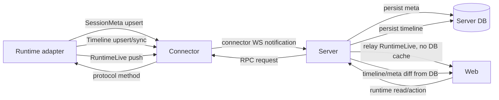

# Session Service Architecture

Status: authoritative proposal for the next Server/Connector/Web boundary pass.

This document describes how SessionMeta, SessionTimeline, and RuntimeLive move
through the system. It complements [Session API Proposal](./session-api-proposal.md).

## High-level boundary

```text
Runtime adapter
  owns live runtime facts
  reduces native events into timeline items
  emits host updates

Connector host
  maps RuntimeHostClient updates to connector WS notifications
  forwards Server RPC requests to runtime protocol methods
  does not persist session facts

Server
  persists SessionMeta and SessionTimeline
  authorizes users
  computes timeline/meta diffs
  relays RuntimeLive facts over session WS
  calls runtime RPC for RuntimeLive reads/actions

Web
  renders timeline as the chat context source of truth
  renders runtime state/notices/capabilities from RuntimeLive
  uses one session WS for updates
```

## Fact ownership diagram



## Durable Server domain

The durable Server session domain contains only:

```text
SessionMeta
SessionTimeline
```

### SessionMeta service

Responsibilities:

- create/bind platform session ids;
- list sessions;
- update platform-owned display fields;
- track archived/pinned/read state;
- compute list ordering from timeline/meta fields;
- expose connector presence projection.

Non-responsibilities:

- determining `running`, `blocked`, or `idle`;
- storing model/permission selection truth;
- storing current notices;
- validating runtime catalog ids except by forwarding to runtime.

### SessionTimeline service

Responsibilities:

- validate incoming platform timeline item shape;
- upsert timeline items;
- preserve stable item identity;
- compare by `contentHash`;
- allocate durable sequence numbers;
- compute `timeline.item_created` and `timeline.item_updated`;
- serve timeline windows;
- recover durable timeline events after cursor reconnect.

Non-responsibilities:

- deriving runtime session state;
- closing runtime notices;
- deciding interrupt/steer capability;
- deleting items. Hidden items are upserts.

## RuntimeLive relay domain

RuntimeLive includes:

```text
RuntimeState
RuntimeNotice
RuntimeCapability
RuntimeCatalog
RuntimeCommand
RuntimeSelection
```

These facts are not persisted by Server as session truth.

### Live read path

```text
Web GET /sessions/{id}/runtime/state
Server authorizes session
Server sends connector RPC session.state
Connector calls runtime.get_session_state
Runtime returns current fact
Server returns response to Web
```

The same shape must be used when runtime pushes:

```text
RuntimeHostClient.session_state_update
Connector sends session.state.updated
Server relays runtime.state.updated over session WS
Web merges RuntimeLive state
```

### Live notice path

Notice is a special live runtime resource.

```text
Web GET /sessions/{id}/runtime/notices
Server sends connector RPC session.notices
Runtime returns current notices
Server returns notices without caching
```

Push:

```text
RuntimeHostClient.notice_update / notice_snapshot
Connector sends runtime notice notification
Server relays runtime.notice.* over session WS
Web renders current notice UI
```

Response:

```text
Web POST /sessions/{id}/runtime/notices/{noticeId}/respond
Server sends connector RPC notice.respond
Runtime applies action
Runtime pushes updated notices and timeline changes when needed
```

Server must not automatically close a notice after forwarding a response. The
runtime is the owner of notice lifecycle.

### Live capability and catalog path

Catalogs and capabilities are read when needed:

```text
selector opens
Web GET /sessions/{id}/runtime/catalogs/model
Server RPC runtime/session catalog read
Runtime returns current catalog
Web renders options
```

Capability availability is:

```text
runtime capability
AND Server user authorization
AND connector/runtime reachable
```

Server must not use persisted `sessions.status` or open notices to compute
runtime command/interrupt/steer availability.

## Connector host notification contract

The target connector-to-server notifications are:

```text
session.meta.upsert       durable meta write
timeline.sync             durable timeline write
timeline.itemUpsert       durable timeline write
runtime.state.updated     live relay
runtime.notice.snapshot   live relay
runtime.notice.updated    live relay
runtime.capability.updated live relay
runtime.catalog.updated   live relay
runtime.error             live relay or timeline-producing error
```

Compatibility names may exist during migration:

```text
session.state.updated -> runtime.state.updated
notice.upsert         -> runtime.notice.updated
protocol.capabilitiesUpdated -> runtime.capability.updated
```

The compatibility names should be translated at the Server boundary and should
not define the domain model.

## Session WebSocket event contract

A single session WebSocket carries durable and live events:

```text
WS /api/v2/sessions/{sessionId}/ws?ticket=...
```

Durable events:

```text
session.meta.updated
timeline.item_created
timeline.item_updated
timeline.snapshot
session.refetch_required
```

Live events:

```text
runtime.state.updated
runtime.notice.snapshot
runtime.notice.updated
runtime.capability.updated
runtime.catalog.updated
runtime.refetch_required
```

Durable event recovery uses Server DB. Runtime live recovery uses live RPC reads.

## Snapshot assembly

`GET /sessions/{id}/snapshot` is an aggregate view:

```text
meta      <- Server DB
timeline  <- Server DB
runtime   <- Runtime RPC
```

Snapshot assembly must not write runtime live facts into DB.

If runtime RPC fails:

- return durable meta/timeline;
- mark runtime unavailable;
- do not return stale cached runtime notices/state/catalogs as facts.

## Compact example

Compact exercises all boundaries:

```text
Web executes /compact
Server forwards command RPC
Runtime pushes RuntimeState blocked
Runtime upserts timeline compact started
Server persists timeline and relays runtime state
Runtime receives native compact complete event
Runtime upserts same timeline item completed
Runtime pushes RuntimeState idle
Server persists timeline update and relays runtime idle
```

Server does not know compact lifecycle rules. It only sees:

- runtime live state updates;
- timeline item upserts.

## What must be removed or demoted

These current components conflict with the target boundary if used as session
truth:

```text
sessions.status as UI runtime state
session_active_runs as durable runtime state
notices table as runtime notice truth
connector_runtime_catalogs as runtime catalog truth
connector_protocol_capabilities as runtime capability truth
SessionStateService.reconcile deriving running/blocked from DB facts
timeline active items deriving SessionState
open notices deriving SessionState
```

They may remain temporarily as compatibility or implementation details, but new
code must not depend on them as authoritative facts.

## Migration order

1. Freeze this boundary in docs and tests.
2. Add new split API response models.
3. Add live runtime RPC read endpoints for state/notices/catalogs/capabilities.
4. Translate connector compatibility notifications into `runtime.*` live WS
   events without DB caching.
5. Move Web session detail to `meta + timeline + runtime` snapshot shape.
6. Stop using `session.status_changed` as the main runtime update event.
7. Remove Server status reconcile from runtime running/blocking UI path.
8. Remove durable notice/catalog/capability tables from authoritative reads.
9. Keep timeline upsert/diff/recovery as the durable session context path.

## Invariants

- Timeline is the only durable chat context.
- Runtime is the only current runtime fact source.
- Server DB is not a runtime cache.
- One session WS carries all session-scoped updates.
- Pull and push for the same fact always use the same owner.
- Server can report unavailability, but must label it as presence projection.
