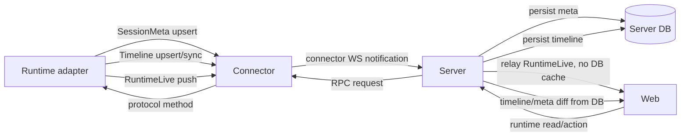

# Session 服务架构

状态：下一轮 Server/Connector/Web 边界改造的权威提案。

本文档描述 SessionMeta、SessionTimeline 与 RuntimeLive 在系统中的流转方式，是
[Session API 提案](./session-api-proposal.md)的补充。

## 高层边界

```text
Runtime adapter（运行时适配器）
  持有实时运行时事实
  把原生事件归约为 timeline 条目
  发出宿主更新

Connector host（连接器宿主）
  把 RuntimeHostClient 更新映射为连接器 WS 通知
  把 Server RPC 请求转发为运行时协议方法
  不持久化会话事实

Server
  持久化 SessionMeta 与 SessionTimeline
  对用户授权
  计算 timeline/meta 差异
  在会话 WS 上转发 RuntimeLive 事实
  为 RuntimeLive 的读取/操作调用运行时 RPC

Web
  把 timeline 渲染为会话上下文的事实来源
  从 RuntimeLive 渲染运行时状态/通知/能力
  使用一条会话 WS 接收更新
```

## 事实归属图


```mermaid
flowchart LR
  Runtime["Runtime adapter"]
  Connector["Connector"]
  Server["Server"]
  DB[("Server DB")]
  Web["Web"]

  Runtime -- "SessionMeta upsert" --> Connector
  Runtime -- "Timeline upsert/sync" --> Connector
  Runtime -- "RuntimeLive push" --> Connector
  Connector -- "connector WS notification" --> Server

  Server -- "persist meta" --> DB
  Server -- "persist timeline" --> DB
  Server -- "relay RuntimeLive, no DB cache" --> Web
  Server -- "timeline/meta diff from DB" --> Web

  Web -- "runtime read/action" --> Server
  Server -- "RPC request" --> Connector
  Connector -- "protocol method" --> Runtime
```

## 持久的 Server 领域

持久的 Server 会话领域只包含：

```text
SessionMeta
SessionTimeline
```

### SessionMeta 服务

职责：

- 创建/绑定平台会话 id；
- 列出会话；
- 更新平台持有的展示字段；
- 跟踪归档/置顶/已读状态；
- 从 timeline/meta 字段计算列表排序；
- 暴露连接器在线投影。

非职责：

- 判定 `running`、`blocked` 或 `idle`；
- 存储模型/权限选择的事实；
- 存储当前通知；
- 校验运行时目录 id（只能转发给运行时）。

### SessionTimeline 服务

职责：

- 校验传入的平台 timeline 条目形状；
- upsert timeline 条目；
- 保持稳定的条目身份；
- 按 `contentHash` 比较；
- 分配持久 sequence 号；
- 产生 `timeline.item_created` 与 `timeline.item_updated`；
- 提供 timeline 窗口读取；
- 游标重连后恢复持久的 timeline 事件。

非职责：

- 推导运行时会话状态；
- 关闭运行时通知；
- 判定 interrupt/steer 能力；
- 删除条目——隐藏条目也是 upsert。

## RuntimeLive 转发领域

RuntimeLive 包括：

```text
RuntimeState
RuntimeNotice
RuntimeEffectiveCapability
RuntimeCatalog
RuntimeCommand
RuntimeSelection
```

这些事实不由 Server 作为会话事实持久化。

### 实时读取路径

```text
Web GET /sessions/{id}/runtime/state
Server 鉴权会话
Server 发送连接器 RPC session.state
Connector 调用 runtime.get_session_state
Runtime 返回当前事实
Server 把响应返回给 Web
```

运行时推送时必须使用同样的形状：

```text
RuntimeHostClient.session_state_update
Connector 发送 session.state.updated
Server 在会话 WS 上转发 runtime.state.updated
Web 合并 RuntimeLive 状态
```

### 实时通知路径

通知是一种特殊的实时运行时资源。

```text
Web GET /sessions/{id}/runtime/notices
Server 发送连接器 RPC session.notices
Runtime 返回当前通知
Server 不做缓存地返回通知
```

推送：

```text
RuntimeHostClient.notice_update / notice_snapshot
Connector 发送运行时通知通知
Server 在会话 WS 上转发 runtime.notice.*
Web 渲染当前通知 UI
```

回应：

```text
Web POST /sessions/{id}/runtime/notices/{noticeId}/respond
Server 发送连接器 RPC notice.respond
Runtime 执行动作
Runtime 在需要时推送更新后的通知与 timeline 变更
```

Server 在转发回应之后不得自动关闭通知。通知的生命周期由运行时所有。

### 实时能力与目录路径

UI 只消费有效能力。运行时能力事实是有效能力计算的输入，不作为独立的 UI 状态机
暴露。

有两个作用域：

```text
运行时级有效能力
会话级有效能力
```

运行时级有效能力从运行时资源读取，影响 dashboard/设置/新建会话行为：

```text
Web GET /connectors/{connectorId}/runtimes/{runtime}/capabilities
Server RPC 运行时能力读取
Runtime 返回当前运行时拥有的能力事实
Server 叠加用户授权、连接器可达性与功能策略
Server 返回有效的运行时级能力
```

会话级有效能力从会话运行时资源读取，影响当前会话的操作：

```text
Web GET /sessions/{id}/runtime/capabilities
Server RPC 会话能力读取
Runtime 返回当前会话拥有的能力事实
Server 叠加用户授权、接管、连接器可达性与策略
Server 返回有效的会话级能力
```

目录按需读取：

```text
选择器打开
Web GET /sessions/{id}/runtime/catalogs/model
Server RPC 运行时/会话目录读取
Runtime 返回当前目录
Web 渲染选项
```

能力可用性为：

```text
运行时能力
AND Server 用户授权
AND 连接器/运行时可达
```

对于会话级操作，运行时拥有诸如活跃 turn、当前压缩操作、等待审批、以及 interrupt/
steer 此刻是否可接受等事实。Server 不得用持久化的 `sessions.status`、timeline
条目、活跃运行或打开的通知来计算运行时命令/interrupt/steer 的可用性。

Web 应使用有效能力判断操作可用性：

```text
session.send_message
session.steer
session.interrupt
session.selection.update
session.command.execute
session.interaction.approval.respond
```

运行时状态仍然是展示性事实。它可以渲染"running""blocked"这类标签，但按钮与菜单
应由有效能力把关。

## 连接器宿主通知契约

目标形态的连接器到服务器通知为：

```text
session.meta.upsert        持久 meta 写入
timeline.sync              持久 timeline 写入
timeline.itemUpsert        持久 timeline 写入
runtime.state.updated      实时转发
runtime.notice.snapshot    实时转发
runtime.notice.updated     实时转发
runtime.capability.updated 实时转发
runtime.catalog.updated    实时转发
runtime.error              实时转发，或产生 timeline 的错误
```

迁移期间可以存在兼容名：

```text
session.state.updated -> runtime.state.updated
notice.upsert         -> runtime.notice.updated
protocol.capabilitiesUpdated -> runtime.capability.updated
```

兼容名应在 Server 边界被翻译，不应定义领域模型。

## 会话 WebSocket 事件契约

一条会话 WebSocket 同时承载持久事件与实时事件：

```text
WS /api/v2/sessions/{sessionId}/ws?ticket=...
```

持久事件：

```text
session.meta.updated
timeline.item_created
timeline.item_updated
timeline.snapshot
session.refetch_required
```

实时事件：

```text
runtime.state.updated
runtime.notice.snapshot
runtime.notice.updated
runtime.capability.updated
runtime.catalog.updated
runtime.refetch_required
```

持久事件恢复使用 Server 数据库。运行时实时恢复使用实时 RPC 读取。

## 快照组装

`GET /sessions/{id}/snapshot` 是聚合视图：

```text
meta      <- Server 数据库
timeline  <- Server 数据库
runtime   <- Runtime RPC
```

快照组装不得把运行时实时事实写入数据库。

运行时 RPC 失败时：

- 返回持久的 meta/timeline；
- 标记运行时不可用；
- 不要把陈旧缓存的通知/状态/目录当作事实返回。

## Compact 示例

Compact 贯穿所有边界：

```text
Web 执行 /compact
Server 转发命令 RPC
Runtime 推送 RuntimeState blocked
Runtime upsert timeline compact started
Server 持久化 timeline 并转发运行时状态
Runtime 收到原生 compact 完成事件
Runtime upsert 同一 timeline 条目为 completed
Runtime 推送 RuntimeState idle
Server 持久化 timeline 更新并转发运行时 idle
```

Server 不知道 compact 的生命周期规则。它只看到：

- 运行时实时状态更新；
- timeline 条目 upsert。

## 必须移除或降级的内容

以下现状组件如果被当作会话事实使用，就与目标边界冲突：

```text
sessions.status 作为 UI 运行时状态
session_active_runs 作为持久运行时状态
notices 表作为运行时通知事实
connector_runtime_catalogs 作为运行时目录事实
connector_protocol_capabilities 作为运行时能力事实
SessionStateService.reconcile 从数据库事实推导 running/blocked
从活跃 timeline 条目推导 SessionState
从打开的通知推导 SessionState
```

它们可以作为兼容或实现细节暂时保留，但新代码不得把它们当作权威事实。

## 迁移顺序

1. 在文档与测试中冻结此边界。
2. 新增拆分后的 API 响应模型。
3. 为状态/通知/目录/能力新增实时运行时 RPC 读取端点。
4. 把连接器兼容通知翻译为 `runtime.*` 实时 WS 事件，不做数据库缓存。
5. 把 Web 会话详情迁移到 `meta + timeline + runtime` 快照形状。
6. 停止把 `session.status_changed` 作为主要的运行时更新事件。
7. 在运行时 running/blocking 的 UI 路径中移除 Server 状态 reconcile。
8. 从权威读取中移除持久的通知/目录/能力表。
9. 保持 timeline 的 upsert/差异/恢复作为持久的会话上下文路径。

## 不变式

- Timeline 是唯一持久的会话上下文。
- Runtime 是唯一当前的运行时事实来源。
- Server 数据库不是运行时缓存。
- 一条会话 WS 承载所有会话级的更新。
- 同一事实的拉取与推送必须使用同一个属主。
- Server 可以报告不可用，但必须把它标记为在线投影。
