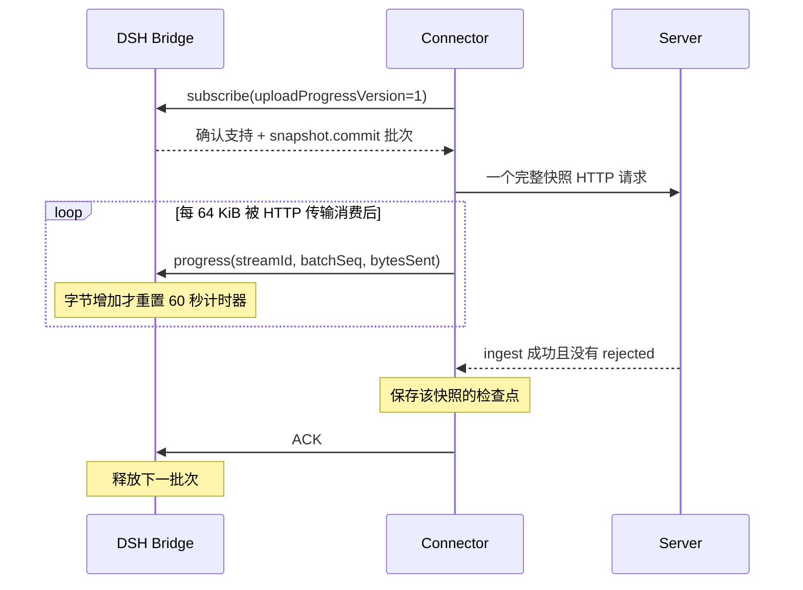

# DSH 大历史的慢速上传

## 问题与最小修复

[Issue #138](https://github.com/anywhere-labs/Agents-Anywhere/issues/138) 的同步链路是：Bridge 分页发送历史，Connector 暂存页面，再在 `snapshot.commit` 时组装完整历史并提交 HTTP ingest。Connector 等云端成功后才 ACK；Bridge 原来对每批只等 60 秒。健康但低带宽的上传可能超过该窗口，导致流关闭、重新订阅、重传整份快照，持续无法完成校准。

HTTPX 的 60 秒配置限制各网络阶段的无活动时间，不是整个请求的总时长。修复把 Bridge 的固定 ACK 截止时间改成**协商后的无进展截止时间**，而不改变数据提交语义。

进度来自 HTTP 异步正文生成器：先 yield 一段字节，传输再次请求下一段时才报告上一段。它代表传输消费正文，不能证明服务器已持久化，不能提前 ACK。累计字节包含同一批次中的先前排队请求和 401 认证重放，避免计数重置导致续期失效。

重复、倒退的字节计数不续期；错误 stream/batch、非正整数或超出 JavaScript 安全整数范围的值被拒绝。没有继续推进则仍在 60 秒后关闭；HTTP connect/write/read/pool 超时也保留。新版 Connector 只有在 Bridge 确认支持后才发送进度；旧端保持原流程。最低配套版本见[2.1.0 发布说明](releases/2.1.0.md)。

## 为什么保留一次完整提交

Server 的 `timeline.sync complete=true` 会按完整历史替换已有条目，删除新快照中不存在的条目。把每个页面分别标成完整快照会造成历史丢失。此次仍使用一个带 Content-Length 的完整 JSON 请求，只让 HTTP 传输分段消费正文；没有增加服务端快照 staging 表、分块提交 API 或数据库迁移。

这个取舍解决持续推进的上传被过早打断的问题，保留原有完整替换和检查点边界。它不提供断点续传：真正断网、进程退出或响应丢失时，仍按原恢复机制重传。提交时完整条目和编码后的 JSON 仍在内存中；服务端处理与等待响应仍受无进展超时约束。

## 可复现验证

在 Connector 目录执行 `uv run pytest -q tests/test_dsh_slow_upload.py tests/test_dsh_checkpoints.py`。慢速载体使用实际 HTTPX 异步请求和实际 SyncRelay/Host 绑定：约 540 KB 的 Unicode 正文以每 64 KiB 40 ms 消费，把 ACK 窗口缩为 150 ms，确保总上传时间超过窗口。成功和云端拒绝两条路径均验证响应到来前没有 ACK 或检查点；另测认证重放、FIFO 排队与失败写入不虚报进度。旧实现无法通过慢速测试。

在 DSH 插件目录执行 `yarn tsx --test tests/unit/sync-progress.test.ts tests/integration/runtime-recovery.test.ts`。定时器测试模拟 160 秒持续推进、停滞及重复进度；真实 loopback TCP/RPC 测试覆盖能力协商、旧端、错误流标识以及最终 ACK 才释放下一批次。

完整插件测试中的 `runtime-events.test.ts` 使用官方 DSH SDK、真实 Python Connector、临时 SQLite 的实际 Server ingest，覆盖整份历史、冷启动、增量恢复和丢失响应后的重传。上述检查使用合成历史与受控载体，没有使用生产数据，也不能代替真实 DSH 安装和低带宽设备验收。

### 本机 TCP 验证记录（2026-10-02）

独立部署官方 DSH 0.2 CLI，加载本次构建的 Bridge 与 Connector，向本地 Server 上传通过官方 SDK 写入的合成历史。后端在实际 HTTP 接收链路限速至 128 KiB/s：12,702,314 bytes 请求耗时 97.1 秒，`snapshot.commit` 最终 ACK 等待 97,164 ms，没有在固定 60 秒处中断。

后端保存的 194 条消息、194 个唯一 ID、192 条大消息的完整正文及 START/END 首尾标记逐一核对通过。检查点写入本地文件后，重启 DSH、Connector 和 Server，新流恢复检查点，没有再次提交完整快照，消息仍完整且无重复。

这验证了合成历史经本机真实 TCP 的慢速传输和冷启动恢复；不包含生产会话、真实模型调用、物理低带宽网络或本机停滞测试。验证结束后已取消限速。
