# 配置管理：链接 Tokens Anywhere 并把模型配置应用到设备

状态：AA 一侧第一版已实现，当前接口以 [模型配置 API](api/model-config.md) 和 Runtime Control 2.0 契约为准。按 [anywhere-labs/Agents-Anywhere#510](https://github.com/anywhere-labs/Agents-Anywhere/issues/510) 重写，并吸收了两轮 review 的结论。

**实现与本文的差异**

- Tokens Anywhere 地址没有内置默认值：取环境变量 `AGENT_SERVER_TOKENS_URL`，管理员可以在实例设置里改；两者都没有时不显示入口。Tokens 云的正式地址确定后再作为默认值。
- 声明多个协议的 Runtime 在连接对象里多一个 `protocol` 字段；Runtime 的模式由能力里的 `modeField` 指出。
- 第一版不接入 DSH：DSH 插件由其他同事维护，DSH 不声明模型连接能力，配置管理把它显示为不支持。本文中 DSH 的设计（第 7.6 节、插件写入 Provider 等）留待单独实现。
- 已实现：已有账户链接时锁定 Tokens Anywhere 地址。改成别的地址或清空会返回 409 `tokens_links_exist`，全部账户断开后才能修改。一次操作里断开所有账户并改地址还没有。
- 尚未实现：嵌入 Tokens 控制台的票据（8.4）、DSH 接入（7.6 及相关章节）、Runtime 配置的字段加密（第三阶段）。
- #470 已关闭且未合并，用 AA 账号登录 Tokens（机密客户端 `tokens-anywhere`）由 #571 实现。下文把 #470 写成前置条件或待合并的地方，都按 #571 理解。

## 关于本文

**依据**

| 来源 | 用途 |
| --- | --- |
| #510 | AA 一侧要做的事，以及 Tokens 的接口约定 |
| Tokens Anywhere 的 `docs/oauth-provider-design.md`（私有仓库，2026-11-02 定稿） | Tokens 作为 OAuth 授权服务器的完整设计；第 3 节是它的摘要，两者不一致时以它和 #510 为准 |
| #470（`f1ecbc69`） | Tokens 用 AA 云账号登录，是 #510 的前置条件 |
| AA `main`（`bbfb64c`） | 现有代码事实：Runtime 配置、实时快照、各 Runtime 的写法 |
| Tokens `main`（`997f5dd`） | 授权服务器第 1 步（[anywhere-tokenhub#94](https://github.com/anywhere-labs/anywhere-tokenhub/pull/94)）、托管 Key、`/v1/models`、分组策略 |

**和上一版相比的主要变化**

- **账号打通改按 #510**：Tokens 是 OAuth 授权服务器，每个 AA 实例都是它的公共客户端，用用户级 token 调用 Tokens 现有的控制台接口。AA 不再扩展 #470 的 scope，也没有服务间签名接口。
- **Key 按授权区分**：每个实例一把，撤销授权时 Tokens 会删除它。
- **自部署和云端同一流程**：去掉了 Device Flow 和导入链接。
- **模型列表直接用 Key 调 `/v1/models`**：它已经按 Key 的策略和可用线路过滤。
- **应用流程按真实代码重新设计**：网关型 Runtime 由 Server 直接写配置，避免死锁和 Key 来回传；恢复改为反向修改，绝不删除 Runtime。
- **Key 脱敏在 Server 统一处理**：不依赖 Connector 版本。
- **删除了中转站内部实现**：那部分以 Tokens 仓库的设计文档为准，本文可以公开。
- **对齐 Tokens #94、#95、#98、#99**：授权服务器的服务端核心、授权页、嵌入控制台和 DSH 接入都已合并，AA 一侧按正式授权页对接（见 3.7）。

## 1. 结论

- **入口**：设置里新增「配置管理」，Web、Desktop、Android、iOS 都有。页面顶部是「链接 Tokens」，下面是模型配置和设备。
- **链接**：用户在任意一端点「链接 Tokens」，用 AA 云账号确认一次。之后这个实例上的这个本地账户，以该 AA 云账号的身份使用 Tokens。
- **导入**：AA Server 用这个账户的 token 申请本实例专属的 `agents-anywhere` Key，读出可用模型，按用户的选择写入设备上的 Codex、Claude Code、Pi、DSH。
- **Key 不发给客户端**：Key 和 OAuth token 只在 AA Server、Tokens、工作设备之间传递，任何接口和实时推送都不返回 Key。
- **现有页面保留**：「配置 Codex」等弹窗继续可用，改为只写 Key。手动改过的 Runtime，配置管理只显示状态，不再覆盖。
- **自部署**：和 AA 云同一流程，局域网 http 也可以；没有链接 Tokens 时，可以手动添加任意网关。

```text
 AA 客户端（任意端）        AA 实例 Server                       Tokens Anywhere
 ┌────────────┐  登录态   ┌──────────────────┐  OAuth + Bearer   ┌──────────────┐
 │ 配置管理页  │─────────▶│ 链接 / 模型配置模块 │─────────────────▶│ 授权、Key、余额 │
 └────────────┘          └────────┬─────────┘                   └──────▲───────┘
                                  │ 现有 Runtime 配置通道                 │ 模型请求 + Key
                                  ▼                                      │
                    工作设备：Codex / Claude Code / Pi / DSH ──────────────┘
```

## 2. 领域设计

### 2.1 上下文划分

| 上下文 | 职责 | 位置 |
| --- | --- | --- |
| **本地账户**（已有） | AA 实例上的登录和用户 ID | AA Server |
| **Tokens 链接**（新增） | 本地账户与 Tokens 的 OAuth 授权：发起、回调、保存和刷新 token、断开 | AA Server |
| **模型配置**（新增，核心） | 有哪些模型配置、每台设备每个 Runtime 用哪一个 | AA Server |
| **配置来源**（新增，防腐层） | 把 Tokens 或手动输入翻译成统一的模型配置 | AA Server 的 infra |
| **Runtime 配置**（已有，扩展） | `device_runtimes.config_json`、校验、重启；新增敏感字段的出口脱敏和写入合并 | AA Server |
| **Runtime 原生配置**（新增） | 配置不在 `config_json` 里的 Runtime（目前只有 DSH） | Connector、DSH 插件 |
| **展示**（各客户端） | 只显示 Server 算好的结果，不做兼容判断 | Web、Desktop、Android、iOS |

### 2.2 聚合

**`TokensLink`（Tokens 链接）**：一个本地账户对一个 Tokens 部署的授权。

| 字段 | 说明 |
| --- | --- |
| `userId`、`issuer` | 本地账户和 Tokens 地址；同一账户同一时间只链接一个 Tokens |
| `account` | Tokens 上的身份（AA 云账号的名称、邮箱），只作显示 |
| `status` | 见 2.5 |
| `refreshToken` | 加密保存；access token 不进数据库 |
| `linkedAt`、`refreshedAt` | 链接时间、上次刷新时间 |

**`ModelProfile`（模型配置）**：用户拥有的一份配置。

| 字段 | 说明 |
| --- | --- |
| `source` | `tokens` 或 `manual` |
| `name`、`originHost` | 显示信息 |
| `offers[]` | 接口格式、地址、模型列表，不含 Key |
| `catalogDigest` | 当前目录（模型、Key 前缀、策略）的摘要，用于判断「有更新」 |
| `keyRef` | Tokens 来源：Key 的 ID、前缀、策略名；手动来源：加密保存的 Key |
| `state` | `active`，或断开后的 `detached`（还有设备在用，等清理完再删） |

**`RuntimeAssignment`（应用记录）**：某设备的某个 Runtime 当前使用哪份配置。每个 Runtime 最多一条，只在写入成功或失败后才创建或更新。

| 字段 | 说明 |
| --- | --- |
| `connectorId`、`runtimeId` | 目标；外键指向 `device_runtimes`，Runtime 删除时一起删除 |
| `profileId`、`offerFormat` | 用哪份配置的哪种接口 |
| `createdRuntime` | 是否为了这次应用新建的 Runtime（Pi）。这类实例另在 `device_runtimes.metadata` 上标记 `managedBy: model-config`，恢复后应用记录删除，标记仍在，下次应用据此复用（见 7.3） |
| `appliedDigest` | 写入部分的摘要，只覆盖本模块写入的字段，用来发现手动修改 |
| `appliedCatalogDigest` | 写入时的目录摘要，用来判断「有更新」 |
| `importedModelIds` | 本次加入的模型，恢复和更新时只动这些 |
| `previousGateway` | 应用前的 `modelGateway`，加密保存，用于恢复 |
| `status` | 存储的状态：`applied` 或 `failed`。进行中的操作记在 `ModelConfigOperation` 上，不写进这里 |

**`ModelConfigOperation`（操作）**：一次应用、恢复、轮换或断开。

| 字段 | 说明 |
| --- | --- |
| `id`、`userId`、`kind` | 操作 ID、发起的账户、类型（`apply`、`restore`、`rotate`、`disconnect`） |
| `idempotencyKey`、`requestDigest` | 幂等：同一账户同一个键重复提交时，返回同一个操作 |
| `targets` | 每个目标的 `connectorId`、`runtimeId`（新建 Pi 时为空，创建后补上）和进度 |
| `leaseUntil` | 租约，过期后未完成的目标视为失败 |
| `result` | 逐个目标的结果，保留 24 小时供重放 |

操作记录让「应用中」不依赖 Runtime 是否已经存在，也让新建 Pi 这类目标在实例创建前就能显示进度。

### 2.3 端口

```python
class TokensClient(Protocol):          # Tokens 的 OAuth 和控制台接口（Bearer）
    async def exchange_code(self, code: str, verifier: str, redirect_uri: str) -> TokenSet: ...
    async def refresh(self, refresh_token: str) -> TokenSet: ...
    async def revoke(self, token: str) -> None: ...
    async def ensure_app_key(self, access_token: str) -> IssuedKey: ...
    async def rotate_key(self, access_token: str, key_id: str) -> IssuedKey: ...
    async def account(self, access_token: str) -> TokensAccount: ...

class ModelSource(Protocol):           # 目录：Tokens 用 Key 调 /v1/models；手动来源由用户填写
    async def catalog(self, profile: ModelProfile) -> Catalog: ...

class CredentialProvider(Protocol):    # 按配置取 Key 明文
    async def acquire(self, profile: ModelProfile) -> str: ...
    async def rotate(self, profile: ModelProfile) -> str: ...  # 手动来源不支持

class SecretBox(Protocol):             # 加密 refresh token、手动 Key、恢复快照
    def seal(self, plaintext: str) -> str: ...
    def open(self, ciphertext: str) -> str | None: ...
```

Runtime 如何声明能力、应用配置、回报生效结果，见 2.6 的模型连接契约。

### 2.4 规则

1. **任何接口和实时推送都不返回 Key 或 OAuth token**，客户端只拿到前缀和是否已设置（见第 10 节）。
2. **只改自己写入的部分**：环境变量、`codexHome`、手动添加的模型、其他 Provider 都不动。
3. **不打断运行中的任务**：会重启 Runtime 的操作（应用、轮换、恢复、断开）都要带上用户确认 `allowInterrupt`；在锁内重新检查运行中的任务，确认之后又有新任务时跳过并说明。
4. **恢复绝不删除 Runtime**：恢复是反向修改配置；新建的 Pi 实例只停用。
5. **手动修改优先**：本模块写入的字段被手动改过，就不再自动覆盖。
6. **客户端不判断兼容性**：能不能应用、会发生什么，都由预览接口返回。
7. **一个实例一把 Key**：本实例上所有设备、所有 Runtime 共用这个授权下的 `agents-anywhere` Key，不碰用户在 Tokens 里的其他 Key。

### 2.5 状态

**链接状态**

| 状态 | 含义 |
| --- | --- |
| `linked` | 可用 |
| `reauth_required` | refresh token 失效（`invalid_grant`、过期、授权被撤销），本地 token 已删除，要重新链接 |

没有记录就是未链接。

**应用状态**：存储的状态加读取时算出的状态，按以下优先级显示：

| 优先级 | 状态 | 来源 | 含义 | 显示 |
| --- | --- | --- | --- | --- |
| 1 | `applying` | 有未完成的操作覆盖这个目标，且租约未过期 | 正在写入；租约过期后视为 `failed` | 应用中，其他端按钮禁用 |
| 2 | `failed` | 存储 | 写入失败，或 Key 已失效 | 原因 + 重试 |
| 3 | `modified` | 读取时算出 | 本模块写入的字段被手动改过 | 已手动修改 + 重新应用 |
| 4 | `outdated` | 读取时算出 | 目录摘要变了（新模型、改了策略、Key 被轮换） | 有更新 + 更新 |
| 5 | `applied` | 存储 | 已生效 | 使用中 |

没有应用记录时，按 `config_json` 显示「手动配置（域名）」或「默认」。离线设备在任何状态上额外标注「离线」。

### 2.6 模型连接契约

**原则**：AA 统一模型连接的配置格式、能力声明和生效反馈；每个 Runtime 的适配器（在 Connector 里）负责把统一配置转换成自己的原生设置，并回报实际生效的结果。Server 和客户端只认这份契约，不按 Runtime 名称写分支，新增 Runtime 实现同一份契约就能复用全部界面和下发链路。

**统一配置格式不代表不同协议自动兼容。** 适配器必须声明自己支持什么，不支持的组合在保存前明确拒绝，不能保存后静默忽略。

#### 统一输入

沿用四个 Runtime 已共用的配置字段，不新增格式：

| 字段 | 内容 |
| --- | --- |
| `modelGateway` | `{ baseUrl, apiKey }`；`apiKey` 只写不读，保存时可保留、替换或清除（见第 10 节） |
| `customModels` | 手动填写的模型列表 |

具体是哪个配置字段，由能力声明里的 `configField` 指出，Server 不写死字段名。

#### 生命周期

```text
声明能力（runtime.discover）→ 校验配置（runtime.validateConfig）→ 应用配置（runtime.start）→ 回报生效结果（start 回复）
```

| 步骤 | 契约 |
| --- | --- |
| 声明能力 | `RuntimeTypeDescriptor` 新增 `maturity` 和 `modelConnection`（见下） |
| 校验 | 适配器在 `validate_config` 里拒绝不支持的组合，错误码 `model_connection_unsupported`，消息说明原因；Server 原样返回 422 |
| 应用 | 配置随现有的 `runtime.start` 下发，适配器转换成原生设置 |
| 回报 | `runtime.start` 的回复新增 `modelConnection`，说明实际生效的情况；不含 Key |

#### 能力声明：`RuntimeTypeDescriptor.modelConnection`

```json
{
  "maturity": "beta",
  "configField": "modelGateway",
  "modelsField": "customModels",
  "protocols": ["openai_responses"],
  "modes": [
    { "id": "managed", "supported": true },
    { "id": "local", "supported": false, "reason": "本机模式使用 Pi 自己的模型配置" }
  ],
  "scope": "instance",
  "catalog": { "auto": false, "manual": true },
  "apply": "restart"
}
```

| 字段 | 取值 | 含义 |
| --- | --- | --- |
| `maturity` | `experimental`、`beta`、`stable` | 这项能力自己的成熟度，可以和整个 Runtime 不同 |
| `configField`、`modelsField` | 配置字段名 | 连接和模型列表存在哪里 |
| `protocols` | `openai_responses`、`openai_chat`、`anthropic` | 支持的 API 协议 |
| `modes` | 运行模式列表，可选 | 例如 Pi 的 `managed`、`local`；不支持的模式带原因 |
| `scope` | `instance`、`session`、`native_global` | 生效范围：AA 管理的实例、单个会话，或 Runtime 的原生全局配置 |
| `catalog` | `{ auto, manual }` | 模型目录能否自动获取、能否手动填写 |
| `apply` | `immediate`、`new_session`、`restart` | 应用方式：立即生效、新会话生效、要重启实例 |

**没有声明 `modelConnection` 的 Runtime 不支持模型连接**，配置管理页显示「此 Runtime 不支持」或「需要升级 Connector」，不靠 Runtime 名称猜测。

**默认只作用于 AA 管理的实例**。`scope=native_global` 会改动用户的原生全局配置，界面必须单独说明并要求确认，不能和普通应用混在一起。

#### 成熟度：`RuntimeTypeDescriptor.maturity`

独立字段，取值 `experimental`、`beta`、`stable`，缺省为 `stable`。它和运行状态（`running`、`stopped`、`error` 等）分开显示：

```text
Pi       Beta · 运行中
DSH      运行中
新 Agent Beta · 启动失败
```

- **显示位置**：添加 Agent 的列表、设备详情、会话的 Runtime 信息。
- **单项能力**：`modelConnection.maturity` 可以单独标注，例如「Runtime 稳定，模型连接为 Beta」，避免一个试验功能让整个 Runtime 都被标成 Beta。
- **由适配器显式声明**，不能根据是否启动成功推断。

#### 生效回报：`runtime.start` 回复的 `modelConnection`

```json
{
  "state": "applied",
  "protocol": "openai_responses",
  "scope": "instance",
  "mode": "managed",
  "reason": null,
  "externalOwner": null
}
```

| `state` | 含义 |
| --- | --- |
| `applied` | Runtime 已接受并使用这份连接配置 |
| `failed` | 没有生效，`reason` 说明原因 |
| `managed_externally` | 由外部客户端管理，AA 的配置不生效；`externalOwner` 说明是谁，例如 Codex App |
| `not_configured` | 配置里没有连接 |

**「已应用」不等于「连接验证通过」**。连接是否真的能用，要由单独的探测结果说明，第一版不做探测，界面也不把「已应用」写成「可用」。

#### Server 算出的配置状态

Server 保存最近一次回报，并记录当时下发的连接摘要（地址、Key 前缀、模型列表的哈希），据此算出客户端看到的状态：

| 状态 | 条件 |
| --- | --- |
| 未配置 | 配置里没有连接 |
| 已保存，待应用 | 当前配置的连接摘要和最近一次回报时的不同，或还没有回报（例如 Runtime 没在运行） |
| 已应用 | 回报 `applied`，并且摘要一致 |
| 应用失败 | 回报 `failed`，或 `runtime.start` 失败 |
| 由外部客户端管理 | 回报 `managed_externally` |

#### 四个 Runtime 的适配

| Runtime | 适配器的工作 | 声明 |
| --- | --- | --- |
| Codex | 转换为 `model_providers` 并指定 provider；Codex App 持有、经 IPC 跟随的线程仍用 App 自己的配置，回报时用 `externalOwner` 说明 | `openai_responses`，`instance`，`restart` |
| Claude Code | 转换为 SDK 的环境变量和 settings 文件 | `anthropic`，`instance`，`restart` |
| Pi | 受管模式转换为私有的 `models.json` 和凭据；本机模式不支持，配置了连接就拒绝，修复现在的静默忽略 | `openai_chat`，模式 `managed` 支持、`local` 不支持，`instance`，`restart` |
| DSH | 经 Bridge 调用 DSH 的 Provider 和凭据机制，写入 DSH 当前 profile | 三种协议，`native_global`，`immediate`，`experimental` |
| 新 Runtime | 实现同一份契约 | 自行声明 |

**已有配置的兼容**：已经手动填了 `modelGateway` 的 Codex、Claude 配置保持不变，下次启动时适配器开始回报生效结果。Pi 已有的「本机模式 + 网关」配置在升级后会校验失败，提示切到受管模式或删除网关。

## 3. 与 Tokens 的约定（#510）

本节摘录 Tokens 一侧已经确定的设计。实现时如有变化，以 #510 和 Tokens 的设计文档为准。下文用 `{TOKENS}` 表示 Tokens 地址。

**Tokens 的实现进度**（截至 `a8b1fd9`）：

| 步骤 | 内容 | 状态 |
| --- | --- | --- |
| 1 服务端核心 | `/api/v1/oauth/token`、`/api/v1/oauth/revoke`、Bearer 认证、Key 绑定授权、安全页「已连接的应用」 | 已合并（anywhere-tokenhub#94） |
| 2 授权流程 | `/oauth/authorize/` 授权页、串联 AA 云登录、`state` 和 `iss` 回传、完成页、RFC 8414 元数据 | 已合并（anywhere-tokenhub#95） |
| 3 嵌入控制台 | 票据、嵌入会话 | 已合并（anywhere-tokenhub#98）；AA 一侧还没做 |
| 4 DSH 接入 | `dsh://v1/tokens/login` 触发 DSH 自己发起授权 | 已合并（anywhere-tokenhub#99）；DSH 一侧见 dsh-desktop#1583 |

### 3.1 角色

```text
AA 实例 ──① authorize──▶ Tokens ──② 用 AA 云账号登录──▶ AA 云确认页（#470）
   ▲                       │ ◀──③ code──────────────────────┘
   └──④ Tokens 的 code ─────┘
⑤ AA 实例服务端用 code + PKCE verifier 换 token，再把浏览器送到 {TOKENS}/oauth/done/
```

- **Tokens 对 AA 云**：仍是 #470 的机密客户端 `tokens-anywhere`。
- **Tokens 对每个 AA 实例**：是授权服务器。AA 云也只是其中一个实例，区别仅在于它的 origin 在 Tokens 的可信列表里，会跳过提示页。
- **账号体系只有一套**：AA 云。自部署实例上发起链接的本地账户，此后以确认时使用的 AA 云账号身份使用 Tokens。

### 3.2 客户端与回调

| 项目 | 约定 |
| --- | --- |
| 客户端 | `client_id=agents-anywhere`，公共客户端，没有 secret，必须 PKCE S256。Tokens 里写死了两个客户端（`agents-anywhere`、`dsh`），没有动态注册 |
| 回调地址 | `<实例 origin>/api/v2/integrations/tokens/callback`；路径固定，不带 userinfo、query、fragment；端口按原样比对；允许 http |
| 实例身份 | 以 origin 区分。同一用户在 AA 云和自部署实例各链接一次，是两条独立的授权 |
| 授权地址 | `{TOKENS}/oauth/authorize/?response_type=code&client_id=agents-anywhere&redirect_uri=…&code_challenge=…&code_challenge_method=S256&state=…` |
| 回跳参数 | `code`、`state`、`iss`；出错时带 `error` |
| 元数据 | `{TOKENS}/.well-known/oauth-authorization-server`（RFC 8414） |

### 3.3 Token

| 凭据 | 有效期 | 规则 |
| --- | --- | --- |
| 授权码 | 60 秒 | 只能用一次 |
| Access token | 1 小时 | — |
| Refresh token | 闲置 90 天过期；签发 1 年后必须重新链接 | **每次使用都换新**；旧的被重放会撤销整条授权；刚被换掉的上一把在 10 秒内重用可以容忍 |

- **换 token 和刷新**：`POST {TOKENS}/api/v1/oauth/token`，请求体是 form，`grant_type` 为 `authorization_code` 或 `refresh_token`。
- **撤销**：`POST {TOKENS}/api/v1/oauth/revoke`（RFC 7009）。

### 3.4 AA 用到的 Tokens 接口

用 `Authorization: Bearer <access token>` 调用，权限与用户登录相同，有两个例外：

- 需要「最近亲自登录」的操作永远不满足，例如后台的写操作。
- 会话、密码、恢复码、两步验证、Passkey、已连接的应用这一组接口只接受会话，用 token 调用返回 403 `session_required`。

AA 不会用到这些接口。下表的接口 #94 都已支持 Bearer：

| 接口 | AA 何时调用 |
| --- | --- |
| `GET /api/v1/me` | 链接后显示 Tokens 上的账号 |
| `GET /api/v1/balance` | 显示余额 |
| `POST /api/v1/keys/managed`，请求体 `{"app":"agents-anywhere"}` | 取本实例的 Key 和 secret：首次创建返回 201，同一授权再次调用返回 200 和同一把 Key（按取回记审计） |
| `POST /api/v1/keys/{id}/reveal` | 再次取得 secret（重复调用上一个接口效果相同，AA 统一用它） |
| `POST /api/v1/keys/{id}/rotate` | 轮换 |
| `POST /api/v1/oauth/embed-tickets` | 嵌入控制台（可选，见 8.4） |

**Key 和授权绑定**：

- 用 Bearer 创建的托管 Key 属于这次授权（`api_keys.oauth_grant_id`），名字带实例的 host。每个实例各有一把，轮换互不影响。
- 撤销授权时，Tokens 会删除这把 Key。
- Key 计入每个用户 50 把的上限。

### 3.5 模型列表：用 Key 调 `/v1/models`

不需要 Tokens 新增接口。网关的 `GET {TOKENS}/v1/models` 已经按这把 Key 的分组策略过滤，只列出有可用线路的模型，并按请求头选择格式：

| 请求方式 | 返回 | 用于 |
| --- | --- | --- |
| `Authorization: Bearer sk-…` | OpenAI 格式：OpenAI 系列模型和 DeepSeek | `openai_responses`（Codex）、`openai_chat`（Pi、DSH） |
| 加 `anthropic-version` 请求头 | Anthropic 格式：Claude 系列和 DeepSeek | `anthropic`（Claude Code、DSH） |

- **显示名和能力**：从公开的 `GET {TOKENS}/api/v1/pricing` 读模型资料，补上显示名，`vision` 对应图片输入。
- **待确认**：DeepSeek 等非 OpenAI 模型能否走 Responses 接口。确认前，`openai_responses` 只放 OpenAI 系列模型。

**地址**：OpenAI 格式用 `{TOKENS}/v1`，Anthropic 格式用 `{TOKENS}`。

### 3.6 向 #510 提出的建议

| # | 建议 | 原因 |
| --- | --- | --- |
| 1 | **非可信 origin 的 token 只授予最小权限**：本授权的 Key、余额、嵌入 | 现在 token 与登录同权，能取回、修改、删除用户的所有托管 Key。自部署实例的运维者掌握加密密钥，能解密所有已链接用户的 refresh token，从而完整使用他们的 Tokens 账号 |
| 2 | **OAuth token 一律不能访问后台** | #94 里后台的写操作因为要求最近登录，token 做不了；但后台的读接口仍然接受 token，管理员从自部署实例链接后，实例就能读到所有用户的数据 |
| 3 | 明确 DeepSeek 等模型能否走 Responses | 决定 Codex 能用哪些模型 |
| 4 | 和 dsh-desktop#1583 约定 Provider ID | DSH Next 会自己链接 Tokens 并配置 Provider，AA 也会写入，需要避免重复（见 7.6） |

### 3.7 授权页（anywhere-tokenhub#95）

AA 只依赖下面这些对外约定，和 Tokens 的实现细节无关：

| 约定 | 内容 |
| --- | --- |
| 授权地址 | `{TOKENS}/oauth/authorize/?response_type=code&client_id=agents-anywhere&redirect_uri=…&code_challenge=…&code_challenge_method=S256&state=…`；`scope` 可以不传，传的话只能是 `user` |
| 回调地址 | 任意 http/https origin 加固定路径 `/api/v2/integrations/tokens/callback`，不带 userinfo、query、fragment，主机名只能是字母、数字、点、短横线或 IPv6 |
| `state` | 可打印 ASCII，最长 512；AA 用 43 个字符的随机串 |
| PKCE | 只接受 S256；verifier 为 43–128 个 `[A-Za-z0-9._~-]` 字符，AA 用 64 个 |
| 回跳 | 成功带 `code`、`state`、`iss`；错误和取消带 `error`、`state`、`iss`。`iss` 等于 Tokens 的 `TOKENS_PUBLIC_ORIGIN`，所以 AA 配置的 Tokens 地址必须与它完全一致 |
| 确认 | `TOKENS_OAUTH_TRUSTED_ORIGINS` 里的实例直接去 AA 云登录；自部署实例先看到确认页（大字显示实例地址，http 标注未加密） |
| 身份 | 每次授权都用 AA 云登录，并替换浏览器里原有的 Tokens 会话，授权给的一定是刚确认的 AA 云账号 |
| 完成页 | 换完 token 后 AA 把浏览器送到 `{TOKENS}/oauth/done/`，它按会话显示链接结果 |
| 网关地址 | `/v1` 可能由单独的 `TOKENS_API_BASE_URL` 提供；AA 同步模型时读 `GET {TOKENS}/api/v1/status` 的 `apiBaseUrl`，读不到时用 Tokens 地址 |

**已知限制**：用户在 AA 云的确认页上拒绝时，Tokens 显示「登录已取消」，不会把 `access_denied` 回传给实例；AA 的链接记录 10 分钟后自然过期。

## 4. 链接与令牌（AA 一侧）

### 4.1 配置项

| 配置 | 规则 |
| --- | --- |
| **Tokens 地址** | 运行时可改的实例设置。当前没有内置的 Tokens 云默认值，取环境变量 `AGENT_SERVER_TOKENS_URL`，管理员可以在实例设置里改；两者都没有时不显示入口（见文首差异）。**有账户已链接时锁定地址**（已实现）：改成别的地址或清空返回 409 `tokens_links_exist`，各账户按 4.5 断开、全部断开后才能修改。一次完成的「全部断开后修改」还没有。这样不会留下指向旧地址、无人管理的 Key |
| **公开 origin** | 回调地址用 `AGENT_SERVER_PUBLIC_ORIGIN` 拼出，未设置时才回退到请求头推断。Tokens 用 origin 识别实例，origin 一变就是另一条授权 |
| **加密密钥** | `SecretBox` 的密钥由 `AGENT_SERVER_SECRET` 经 HKDF 派生。它没有设置、仍是默认值或少于 32 个字符时，**不允许链接和保存手动 Key**，页面提示管理员配置 |

### 4.2 发起链接

state 必须绑定本地账户和「完成授权的那个浏览器」。Web 上二者是同一个浏览器；Desktop 和手机不是：

- **Desktop**：页面的 origin 是 `aa-workbench://web`，请求经主进程转发。
- **手机端**：授权在系统浏览器、`ASWebAuthenticationSession` 或 Custom Tabs 里完成，cookie 和 App 不是同一套。

所以统一用**一次性启动地址**：

1. 客户端调 `POST /api/v2/integrations/tokens/link`（登录态）。Server 生成 PKCE verifier、state 和一张启动票据，绑定本地账户，60 秒有效，只能用一次。返回启动地址 `<实例 origin>/api/v2/integrations/tokens/start?ticket=…`。
2. **在完成授权的浏览器里打开启动地址**：
   - Web：当前页面跳转；
   - Desktop：用系统浏览器打开；
   - iOS：`ASWebAuthenticationSession`；
   - Android：Custom Tabs。
3. `start` 消费票据，设置 `__Host-aa_tokens_link` cookie（`HttpOnly`、`Secure`、`SameSite=Lax`、10 分钟），把 state 绑定到这个浏览器，然后 302 到 Tokens 授权地址。
4. 回调在同一个浏览器里完成。App 不用接收回调，链接结果通过实时快照得知（见第 9 节）。

**iOS 要额外处理**：`ASWebAuthenticationSession` 等待的是回调 scheme，而这里最后停在 Tokens 的完成页，会话不会自己结束。App 收到「已链接」的快照后主动取消会话，并提示「已完成」。

**http 实例**：局域网 http 实例不能用 `__Host-` 和 `Secure`，改用普通 cookie，其余规则不变。

### 4.3 回调

`GET /api/v2/integrations/tokens/callback?code&state&iss`

1. **校验**：state 存在、未用过、未过期，并且与浏览器 cookie 一致；`iss` 等于配置的 Tokens 地址。
2. **出错**：回调带 `error` 或校验失败时，跳回实例的「设置 → 配置管理」并提示原因。
3. **换 token**：服务端换 token，加密保存 refresh token，access token 放短期缓存（见 4.4）。
4. **初始化**：调 `GET /api/v1/me` 记录账号；调 `POST /api/v1/keys/managed` 建好本实例的 Key；读模型目录，创建 `source=tokens` 的 `ModelProfile`。这一步失败不影响链接成功，页面显示「同步失败」并可重试。
5. **收尾**：发实时通知，然后把浏览器 302 到 `{TOKENS}/oauth/done/`，后续交互留在 Tokens。

### 4.4 Token 的保存和刷新

- **refresh token**：`SecretBox` 加密后存进 `tokens_links`。
- **access token**：加密后存进 Redis，过期时间比实际有效期早 60 秒；没有 Redis 的单进程部署放在内存里。access token 不进数据库，也不发给客户端。
- **刷新必须串行**：
  1. 在数据库事务里 `SELECT … FOR UPDATE` 锁住这一行；
  2. 拿到锁后先看缓存，别的 worker 刚刷新过就直接用；
  3. 否则用 refresh token 换新的一对，在同一事务里写回新的 refresh token，然后提交。
- **网络错误**：结果不明时，**在持锁期间、10 秒内**用原 refresh token 重试一次（Tokens 会容忍刚被换掉的上一把）。仍然失败就回滚、保持原状。此后再用原 refresh token 时，如果上一次其实已在 Tokens 那边成功，就会被当作重放，整条授权被撤销，得到 `invalid_grant`，按下一条处理。这是协议决定的残余风险，只能尽量缩短不确定窗口：刷新请求设短超时，失败后不在锁外自动重试。
- **`invalid_grant`**：链接改为 `reauth_required`，删除本地 token，发实时通知。Runtime 不立即标为失败：授权只是闲置过期时 Key 仍然可用，授权被撤销时 Key 已被删除，下次同步用 Key 调 `/v1/models` 就能分辨（401 时才标为失败）。
- **重新链接**：会得到一条新授权和一把新 Key。原来的 Key 若仍有效，留在 Tokens 上由新授权接管不了，所以重新链接成功后，先把用旧 Key 的 Runtime 更新为新 Key（显示「有更新」），再提示用户在 Tokens 的「已连接的应用」里撤销旧授权。
- **保活**：refresh token 闲置 90 天过期。每天跑一次后台任务，刷新超过 30 天没用过的链接。签发满 1 年前 30 天开始提示重新链接。

### 4.5 断开

1. 列出用这个 Key 的 Runtime，确认弹窗说明它们会先恢复原配置，并带「允许中断任务」。
2. 对每个 Runtime 执行恢复（见 7.7）。离线设备、以及因任务运行而被跳过（`busy`）的 Runtime 标为 `failed`（Key 即将失效），之后手动恢复。
3. 调 Tokens 撤销接口；Tokens 删除授权及其 Key。撤销失败时（例如 Tokens 不可用）仍删除本地 token，并提示用户到 Tokens 的「已连接的应用」里撤销。
4. 删除本地 token 和链接记录；`ModelProfile` 还有设备在用时标为 `detached`。之后每次恢复删除应用记录时检查一次，最后一条删除后，同一事务里删掉这份 `detached` 配置。
5. 发实时通知。

**先恢复、后撤销**：撤销后 Key 立即失效，先恢复才能让各 Runtime 平稳回到原配置。

## 5. 交互图

### 5.1 组件关系

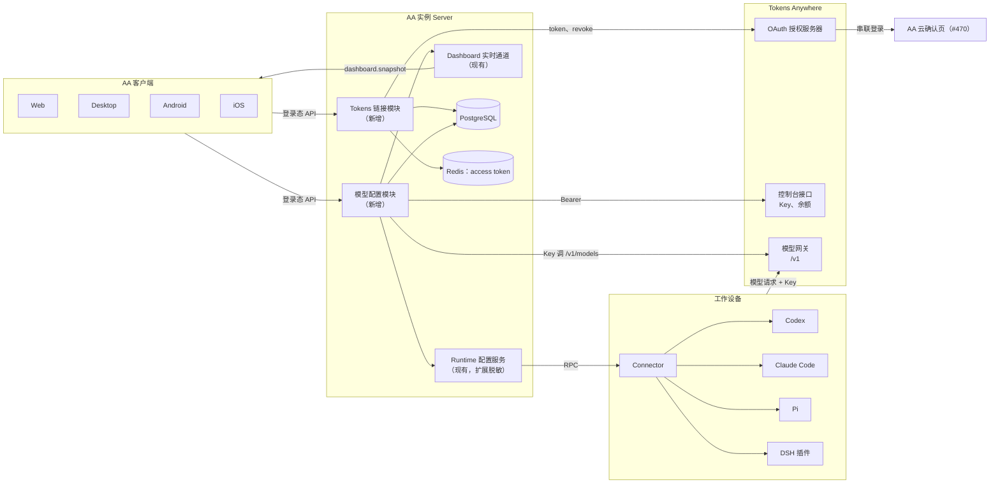
```mermaid
flowchart LR
    subgraph Clients["AA 客户端"]
        Web["Web"]
        Desktop["Desktop"]
        Android["Android"]
        IOS["iOS"]
    end

    subgraph AAServer["AA 实例 Server"]
        Link["Tokens 链接模块<br/>（新增）"]
        Center["模型配置模块<br/>（新增）"]
        RT["Runtime 配置服务<br/>（现有，扩展脱敏）"]
        WS["Dashboard 实时通道<br/>（现有）"]
        DB[("PostgreSQL")]
        Cache[("Redis：access token")]
    end

    subgraph Device1["工作设备"]
        Connector["Connector"]
        Codex["Codex"]
        Claude["Claude Code"]
        Pi["Pi"]
        DSH["DSH 插件"]
    end

    subgraph TA["Tokens Anywhere"]
        AS["OAuth 授权服务器"]
        Console["控制台接口<br/>Key、余额"]
        GW["模型网关<br/>/v1"]
    end

    AACloud["AA 云确认页（#470）"]

    Clients -- "登录态 API" --> Center
    Clients -- "登录态 API" --> Link
    WS -- "dashboard.snapshot" --> Clients
    Link --> DB
    Link --> Cache
    Link -- "token、revoke" --> AS
    Center -- "Bearer" --> Console
    Center -- "Key 调 /v1/models" --> GW
    Center --> RT
    Center --> DB
    Center --> WS
    RT -- "RPC" --> Connector
    Connector --> Codex & Claude & Pi & DSH
    AS -- "串联登录" --> AACloud
    Device1 -- "模型请求 + Key" --> GW
```

### 5.2 领域模型

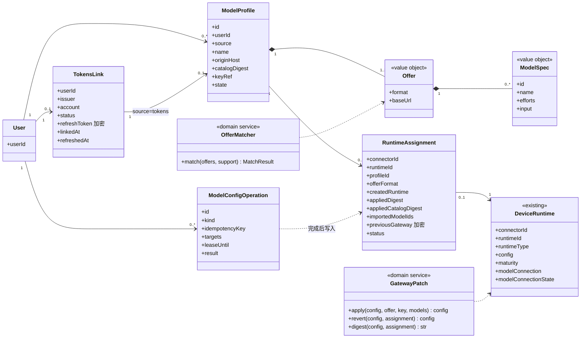
```mermaid
classDiagram
    direction LR

    class User {
        +userId
    }
    class TokensLink {
        +userId
        +issuer
        +account
        +status
        +refreshToken 加密
        +linkedAt
        +refreshedAt
    }
    class ModelProfile {
        +id
        +userId
        +source
        +name
        +originHost
        +catalogDigest
        +keyRef
        +state
    }
    class Offer {
        <<value object>>
        +format
        +baseUrl
    }
    class ModelSpec {
        <<value object>>
        +id
        +name
        +efforts
        +input
    }
    class RuntimeAssignment {
        +connectorId
        +runtimeId
        +profileId
        +offerFormat
        +createdRuntime
        +appliedDigest
        +appliedCatalogDigest
        +importedModelIds
        +previousGateway 加密
        +status
    }
    class ModelConfigOperation {
        +id
        +kind
        +idempotencyKey
        +targets
        +leaseUntil
        +result
    }
    class DeviceRuntime {
        <<existing>>
        +connectorId
        +runtimeId
        +runtimeType
        +config
        +maturity
        +modelConnection
        +modelConnectionState
    }
    class OfferMatcher {
        <<domain service>>
        +match(offers, support) MatchResult
    }
    class GatewayPatch {
        <<domain service>>
        +apply(config, offer, key, models) config
        +revert(config, assignment) config
        +digest(config, assignment) str
    }

    User "1" --> "0..1" TokensLink
    User "1" --> "0..*" ModelProfile
    TokensLink "1" --> "0..1" ModelProfile : source=tokens
    ModelProfile "1" *-- "1..3" Offer
    Offer "1" *-- "0..*" ModelSpec
    ModelProfile "1" --> "0..*" RuntimeAssignment
    RuntimeAssignment "0..1" --> "1" DeviceRuntime
    User "1" --> "0..*" ModelConfigOperation
    ModelConfigOperation ..> RuntimeAssignment : 完成后写入
    OfferMatcher ..> Offer
    GatewayPatch ..> DeviceRuntime
```

**端口与实现**

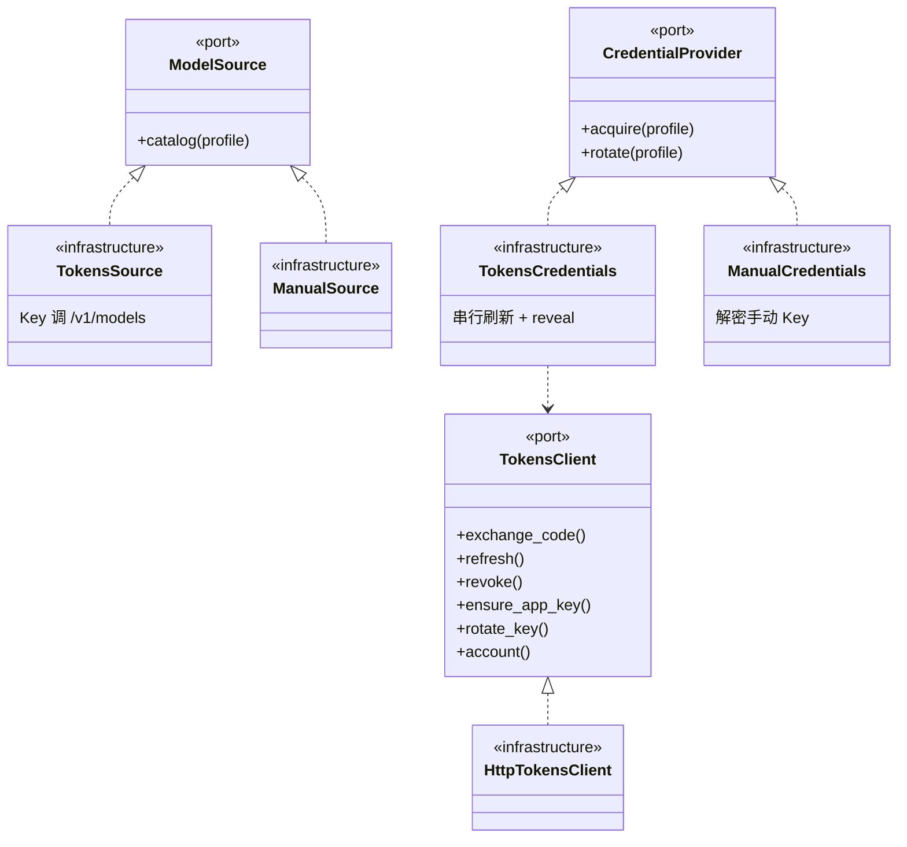
```mermaid
classDiagram
    direction TB

    class TokensClient {
        <<port>>
        +exchange_code()
        +refresh()
        +revoke()
        +ensure_app_key()
        +rotate_key()
        +account()
    }
    class ModelSource {
        <<port>>
        +catalog(profile)
    }
    class CredentialProvider {
        <<port>>
        +acquire(profile)
        +rotate(profile)
    }
    class HttpTokensClient {
        <<infrastructure>>
    }
    class TokensSource {
        <<infrastructure>>
        Key 调 /v1/models
    }
    class ManualSource {
        <<infrastructure>>
    }
    class TokensCredentials {
        <<infrastructure>>
        串行刷新 + reveal
    }
    class ManualCredentials {
        <<infrastructure>>
        解密手动 Key
    }
    TokensClient <|.. HttpTokensClient
    ModelSource <|.. TokensSource
    ModelSource <|.. ManualSource
    CredentialProvider <|.. TokensCredentials
    CredentialProvider <|.. ManualCredentials
    TokensCredentials ..> TokensClient
```

### 5.3 数据关系

跨系统的关联只有一个：`model_profiles.key_ref` 记着 Tokens 上那把 Key 的 ID，没有数据库外键。

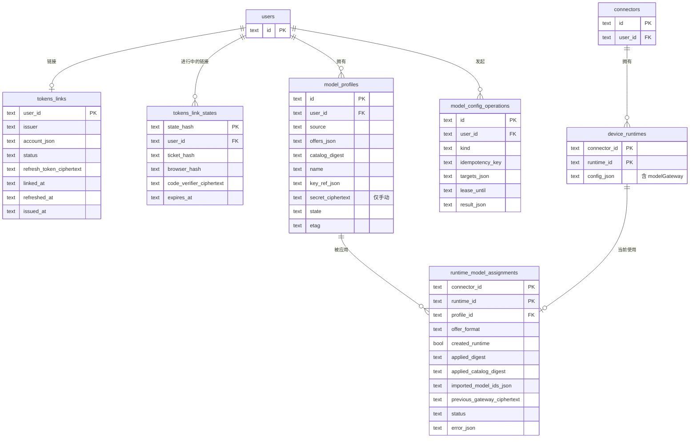
```mermaid
erDiagram
    users ||--o| tokens_links : "链接"
    users ||--o{ tokens_link_states : "进行中的链接"
    users ||--o{ model_profiles : "拥有"
    model_profiles ||--o{ runtime_model_assignments : "被应用"
    users ||--o{ model_config_operations : "发起"
    connectors ||--o{ device_runtimes : "拥有"
    device_runtimes ||--o| runtime_model_assignments : "当前使用"

    users {
        text id PK
    }
    tokens_links {
        text user_id PK
        text issuer
        text account_json
        text status
        text refresh_token_ciphertext
        text linked_at
        text refreshed_at
        text issued_at
    }
    tokens_link_states {
        text state_hash PK
        text user_id FK
        text ticket_hash
        text browser_hash
        text code_verifier_ciphertext
        text expires_at
    }
    model_profiles {
        text id PK
        text user_id FK
        text source
        text offers_json
        text catalog_digest
        text name
        text key_ref_json
        text secret_ciphertext "仅手动"
        text state
        text etag
    }
    runtime_model_assignments {
        text connector_id PK
        text runtime_id PK
        text profile_id FK
        text offer_format
        bool created_runtime
        text applied_digest
        text applied_catalog_digest
        text imported_model_ids_json
        text previous_gateway_ciphertext
        text status
        text error_json
    }
    device_runtimes {
        text connector_id PK
        text runtime_id PK
        text config_json "含 modelGateway"
    }
    connectors {
        text id PK
        text user_id FK
    }
    model_config_operations {
        text id PK
        text user_id FK
        text kind
        text idempotency_key
        text targets_json
        text lease_until
        text result_json
    }
```

### 5.4 在 Web 上链接

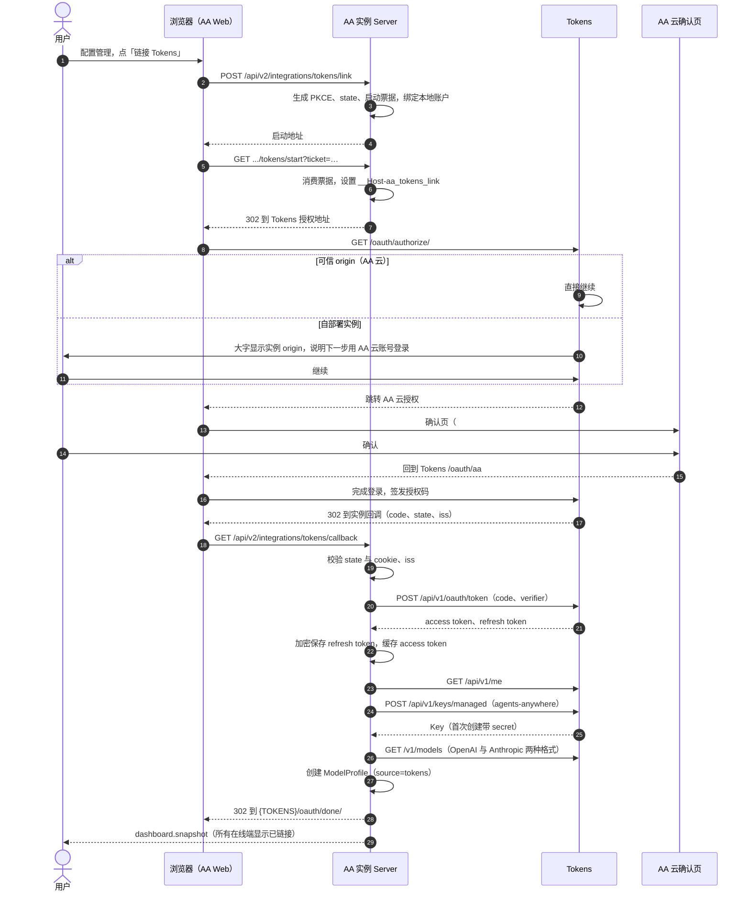
```mermaid
sequenceDiagram
    autonumber
    actor U as 用户
    participant B as 浏览器（AA Web）
    participant AS as AA 实例 Server
    participant TA as Tokens
    participant AC as AA 云确认页

    U->>B: 配置管理，点「链接 Tokens」
    B->>AS: POST /api/v2/integrations/tokens/link
    AS->>AS: 生成 PKCE、state、启动票据，绑定本地账户
    AS-->>B: 启动地址
    B->>AS: GET .../tokens/start?ticket=…
    AS->>AS: 消费票据，设置 __Host-aa_tokens_link
    AS-->>B: 302 到 Tokens 授权地址
    B->>TA: GET /oauth/authorize/
    alt 可信 origin（AA 云）
        TA->>TA: 直接继续
    else 自部署实例
        TA->>U: 大字显示实例 origin，说明下一步用 AA 云账号登录
        U->>TA: 继续
    end
    TA-->>B: 跳转 AA 云授权
    B->>AC: 确认页（#470）
    U->>AC: 确认
    AC-->>B: 回到 Tokens /oauth/aa
    B->>TA: 完成登录，签发授权码
    TA-->>B: 302 到实例回调（code、state、iss）
    B->>AS: GET /api/v2/integrations/tokens/callback
    AS->>AS: 校验 state 与 cookie、iss
    AS->>TA: POST /api/v1/oauth/token（code、verifier）
    TA-->>AS: access token、refresh token
    AS->>AS: 加密保存 refresh token，缓存 access token
    AS->>TA: GET /api/v1/me
    AS->>TA: POST /api/v1/keys/managed（agents-anywhere）
    TA-->>AS: Key（首次创建带 secret）
    AS->>TA: GET /v1/models（OpenAI 与 Anthropic 两种格式）
    AS->>AS: 创建 ModelProfile（source=tokens）
    AS-->>B: 302 到 {TOKENS}/oauth/done/
    AS-->>U: dashboard.snapshot（所有在线端显示已链接）
```

用户在 Tokens 或 AA 云取消时，回调带 `error`，Server 跳回配置管理页并提示。

上图画的是 Tokens 的正式授权页（anywhere-tokenhub#95）。

### 5.5 在 Desktop 或手机上链接

和 5.4 相同，只是启动地址在另一个浏览器里打开。App 不接收回调，通过实时快照知道结果。

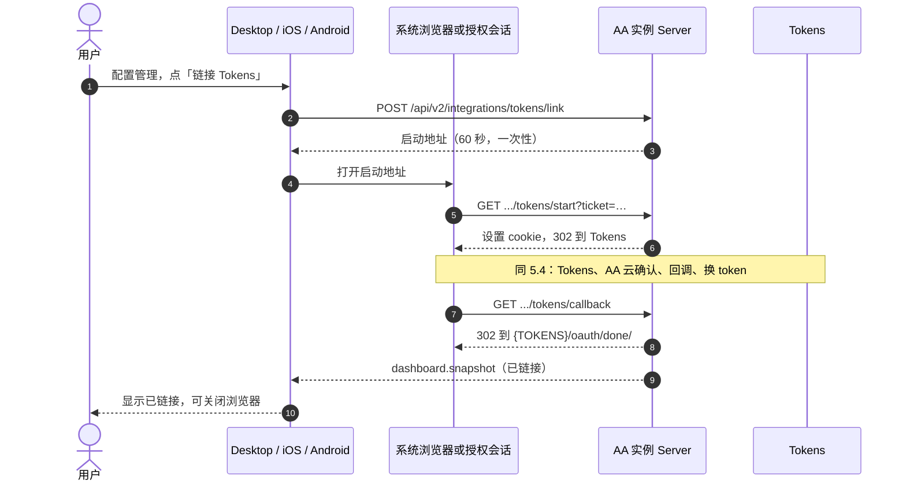
```mermaid
sequenceDiagram
    autonumber
    actor U as 用户
    participant App as Desktop / iOS / Android
    participant Br as 系统浏览器或授权会话
    participant AS as AA 实例 Server
    participant TA as Tokens

    U->>App: 配置管理，点「链接 Tokens」
    App->>AS: POST /api/v2/integrations/tokens/link
    AS-->>App: 启动地址（60 秒，一次性）
    App->>Br: 打开启动地址
    Br->>AS: GET .../tokens/start?ticket=…
    AS-->>Br: 设置 cookie，302 到 Tokens
    Note over Br,TA: 同 5.4：Tokens、AA 云确认、回调、换 token
    Br->>AS: GET .../tokens/callback
    AS-->>Br: 302 到 {TOKENS}/oauth/done/
    AS-->>App: dashboard.snapshot（已链接）
    App-->>U: 显示已链接，可关闭浏览器
```

### 5.6 刷新 access token

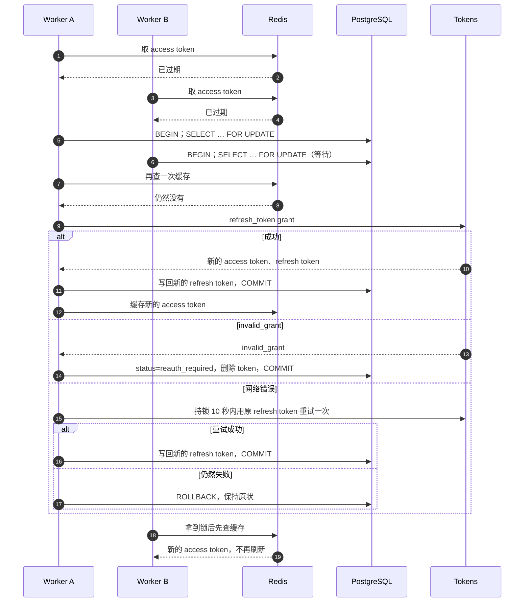
```mermaid
sequenceDiagram
    autonumber
    participant W1 as Worker A
    participant W2 as Worker B
    participant C as Redis
    participant DB as PostgreSQL
    participant TA as Tokens

    W1->>C: 取 access token
    C-->>W1: 已过期
    W2->>C: 取 access token
    C-->>W2: 已过期
    W1->>DB: BEGIN；SELECT … FOR UPDATE
    W2->>DB: BEGIN；SELECT … FOR UPDATE（等待）
    W1->>C: 再查一次缓存
    C-->>W1: 仍然没有
    W1->>TA: refresh_token grant
    alt 成功
        TA-->>W1: 新的 access token、refresh token
        W1->>DB: 写回新的 refresh token，COMMIT
        W1->>C: 缓存新的 access token
    else invalid_grant
        TA-->>W1: invalid_grant
        W1->>DB: status=reauth_required，删除 token，COMMIT
    else 网络错误
        W1->>TA: 持锁 10 秒内用原 refresh token 重试一次
        alt 重试成功
            W1->>DB: 写回新的 refresh token，COMMIT
        else 仍然失败
            W1->>DB: ROLLBACK，保持原状
        end
    end
    W2->>C: 拿到锁后先查缓存
    C-->>W2: 新的 access token，不再刷新
```

### 5.7 同步模型目录

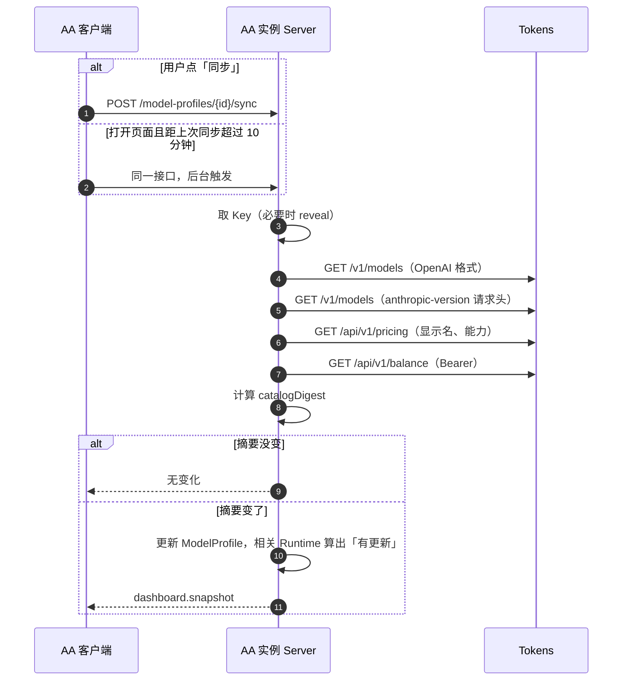
```mermaid
sequenceDiagram
    autonumber
    participant C as AA 客户端
    participant AS as AA 实例 Server
    participant TA as Tokens

    alt 用户点「同步」
        C->>AS: POST /model-profiles/{id}/sync
    else 打开页面且距上次同步超过 10 分钟
        C->>AS: 同一接口，后台触发
    end
    AS->>AS: 取 Key（必要时 reveal）
    AS->>TA: GET /v1/models（OpenAI 格式）
    AS->>TA: GET /v1/models（anthropic-version 请求头）
    AS->>TA: GET /api/v1/pricing（显示名、能力）
    AS->>TA: GET /api/v1/balance（Bearer）
    AS->>AS: 计算 catalogDigest
    alt 摘要没变
        AS-->>C: 无变化
    else 摘要变了
        AS->>AS: 更新 ModelProfile，相关 Runtime 算出「有更新」
        AS-->>C: dashboard.snapshot
    end
```

Key 被删除时，`/v1/models` 返回 401，相关 Runtime 显示失败。授权被撤销时，刷新 token 会得到 `invalid_grant`，链接进入「需要重新链接」。

### 5.8 应用到设备

网关型 Runtime（Codex、Claude、Pi）由 Server 在**一次加锁**里完成；只有 DSH 走 RPC。

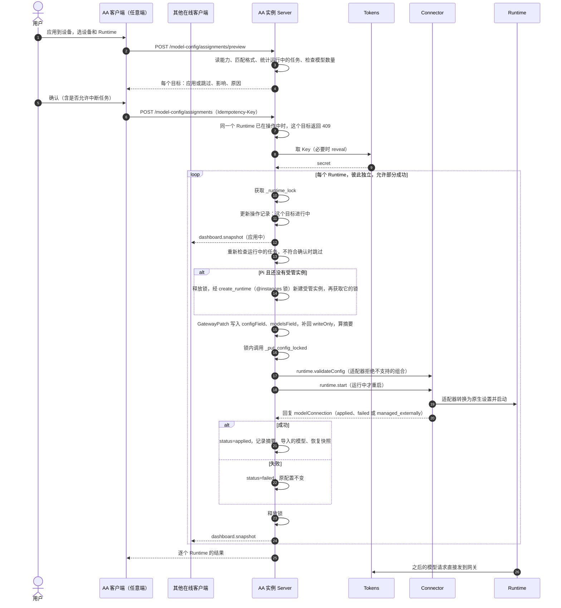
```mermaid
sequenceDiagram
    autonumber
    actor U as 用户
    participant C as AA 客户端（任意端）
    participant O as 其他在线客户端
    participant AS as AA 实例 Server
    participant TA as Tokens
    participant CN as Connector
    participant RT as Runtime

    U->>C: 应用到设备，选设备和 Runtime
    C->>AS: POST /model-config/assignments/preview
    AS->>AS: 读能力、匹配格式、统计运行中的任务、检查模型数量
    AS-->>C: 每个目标：应用或跳过、影响、原因
    U->>C: 确认（含是否允许中断任务）
    C->>AS: POST /model-config/assignments（Idempotency-Key）
    AS->>AS: 同一个 Runtime 已在操作中时，这个目标返回 409
    AS->>TA: 取 Key（必要时 reveal）
    TA-->>AS: secret

    loop 每个 Runtime，彼此独立，允许部分成功
        AS->>AS: 获取 _runtime_lock
        AS->>AS: 更新操作记录：这个目标进行中
        AS-->>O: dashboard.snapshot（应用中）
        AS->>AS: 重新检查运行中的任务，不符合确认时跳过
        alt Pi 且还没有受管实例
            AS->>AS: 释放锁，经 create_runtime（@instances 锁）新建受管实例，再获取它的锁
        end
        AS->>AS: GatewayPatch 写入 configField、modelsField，补回 writeOnly，算摘要
        AS->>AS: 锁内调用 _put_config_locked
        AS->>CN: runtime.validateConfig（适配器拒绝不支持的组合）
        AS->>CN: runtime.start（运行中才重启）
        CN->>RT: 适配器转换为原生设置并启动
        CN-->>AS: 回复 modelConnection（applied、failed 或 managed_externally）
        alt 成功
            AS->>AS: status=applied，记录摘要、导入的模型、恢复快照
        else 失败
            AS->>AS: status=failed，原配置不变
        end
        AS->>AS: 释放锁
        AS-->>O: dashboard.snapshot
    end
    AS-->>C: 逐个 Runtime 的结果
    RT->>TA: 之后的模型请求直接发到网关
```

### 5.9 恢复原配置

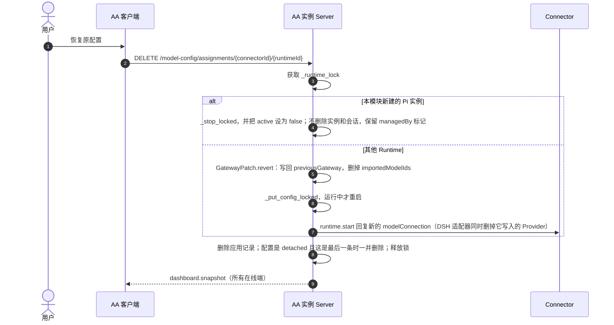
```mermaid
sequenceDiagram
    autonumber
    actor U as 用户
    participant C as AA 客户端
    participant AS as AA 实例 Server
    participant CN as Connector

    U->>C: 恢复原配置
    C->>AS: DELETE /model-config/assignments/{connectorId}/{runtimeId}
    AS->>AS: 获取 _runtime_lock
    alt 本模块新建的 Pi 实例
        AS->>AS: _stop_locked，并把 active 设为 false；不删除实例和会话，保留 managedBy 标记
    else 其他 Runtime
        AS->>AS: GatewayPatch.revert：写回 previousGateway，删掉 importedModelIds
        AS->>AS: _put_config_locked，运行中才重启
        AS->>CN: runtime.start 回复新的 modelConnection（DSH 适配器同时删掉它写入的 Provider）
    end
    AS->>AS: 删除应用记录；配置是 detached 且这是最后一条时一并删除；释放锁
    AS-->>C: dashboard.snapshot（所有在线端）
```

**绝不调用删除配置接口**：它会退役 Runtime，并删除它的全部会话和文件。原来没有配置过的 Runtime，恢复后保留已配置状态，只去掉网关和导入的模型。

### 5.10 轮换 Key

本实例所有用这把 Key 的 Runtime 都要更新，运行中的任务会被打断，所以必须先确认。

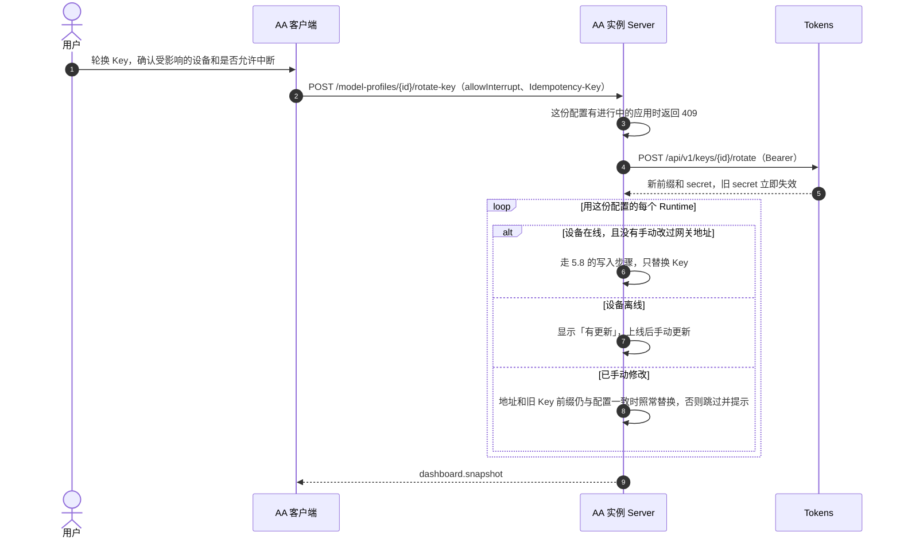
```mermaid
sequenceDiagram
    autonumber
    actor U as 用户
    participant C as AA 客户端
    participant AS as AA 实例 Server
    participant TA as Tokens

    U->>C: 轮换 Key，确认受影响的设备和是否允许中断
    C->>AS: POST /model-profiles/{id}/rotate-key（allowInterrupt、Idempotency-Key）
    AS->>AS: 这份配置有进行中的应用时返回 409
    AS->>TA: POST /api/v1/keys/{id}/rotate（Bearer）
    TA-->>AS: 新前缀和 secret，旧 secret 立即失效
    loop 用这份配置的每个 Runtime
        alt 设备在线，且没有手动改过网关地址
            AS->>AS: 走 5.8 的写入步骤，只替换 Key
        else 设备离线
            AS->>AS: 显示「有更新」，上线后手动更新
        else 已手动修改
            AS->>AS: 地址和旧 Key 前缀仍与配置一致时照常替换，否则跳过并提示
        end
    end
    AS-->>C: dashboard.snapshot
```

删除设备时，页面提示是否顺便轮换。设备丢失时，轮换是唯一能让旧 Key 失效的办法。

### 5.11 断开

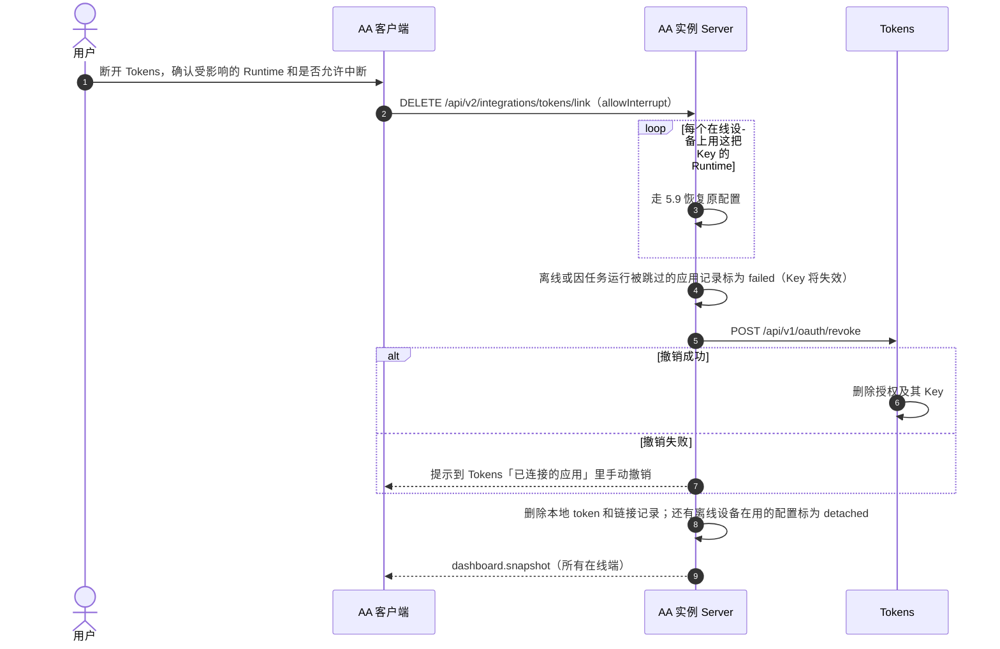
```mermaid
sequenceDiagram
    autonumber
    actor U as 用户
    participant C as AA 客户端
    participant AS as AA 实例 Server
    participant TA as Tokens

    U->>C: 断开 Tokens，确认受影响的 Runtime 和是否允许中断
    C->>AS: DELETE /api/v2/integrations/tokens/link（allowInterrupt）
    loop 每个在线设备上用这把 Key 的 Runtime
        AS->>AS: 走 5.9 恢复原配置
    end
    AS->>AS: 离线或因任务运行被跳过的应用记录标为 failed（Key 将失效）
    AS->>TA: POST /api/v1/oauth/revoke
    alt 撤销成功
        TA->>TA: 删除授权及其 Key
    else 撤销失败
        AS-->>C: 提示到 Tokens「已连接的应用」里手动撤销
    end
    AS->>AS: 删除本地 token 和链接记录；还有离线设备在用的配置标为 detached
    AS-->>C: dashboard.snapshot（所有在线端）
```

### 5.12 手动修改

现有弹窗和配置管理操作同一份 `config_json`，不用互相调用。

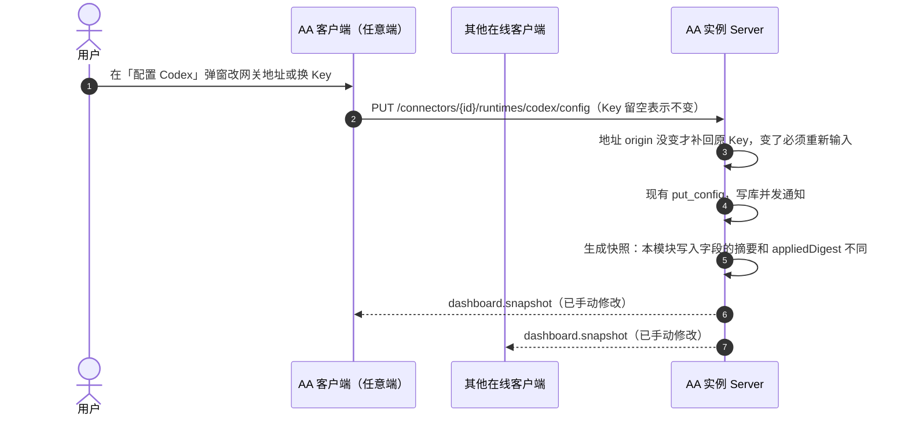
```mermaid
sequenceDiagram
    autonumber
    actor U as 用户
    participant C as AA 客户端（任意端）
    participant O as 其他在线客户端
    participant AS as AA 实例 Server

    U->>C: 在「配置 Codex」弹窗改网关地址或换 Key
    C->>AS: PUT /connectors/{id}/runtimes/codex/config（Key 留空表示不变）
    AS->>AS: 地址 origin 没变才补回原 Key，变了必须重新输入
    AS->>AS: 现有 put_config，写库并发通知
    AS->>AS: 生成快照：本模块写入字段的摘要和 appliedDigest 不同
    AS-->>C: dashboard.snapshot（已手动修改）
    AS-->>O: dashboard.snapshot（已手动修改）
```

只改环境变量或其他字段，不会被判为手动修改，因为摘要只覆盖本模块写入的字段。

### 5.13 嵌入 Tokens 控制台（可选，仅 Web）

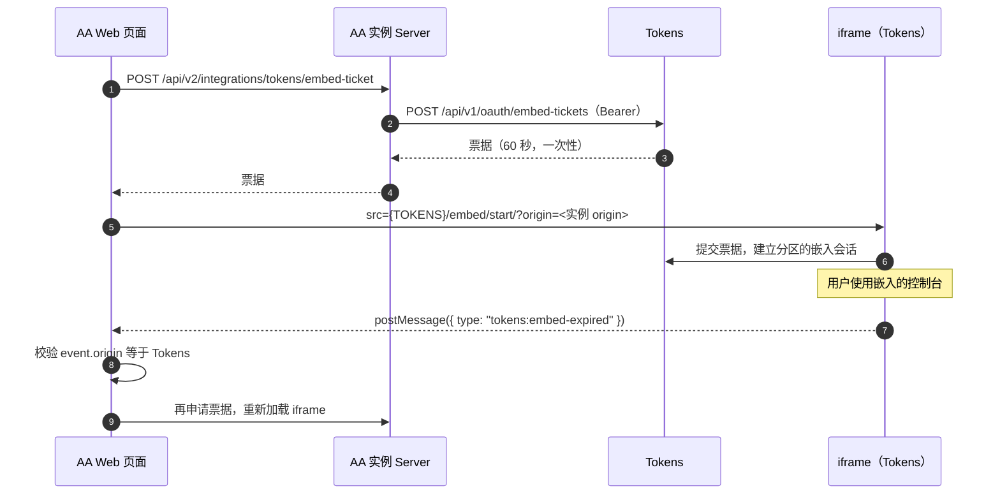
```mermaid
sequenceDiagram
    autonumber
    participant P as AA Web 页面
    participant AS as AA 实例 Server
    participant TA as Tokens
    participant F as iframe（Tokens）

    P->>AS: POST /api/v2/integrations/tokens/embed-ticket
    AS->>TA: POST /api/v1/oauth/embed-tickets（Bearer）
    TA-->>AS: 票据（60 秒，一次性）
    AS-->>P: 票据
    P->>F: src={TOKENS}/embed/start/?origin=<实例 origin>#ticket=…
    F->>TA: 提交票据，建立分区的嵌入会话
    Note over F: 用户使用嵌入的控制台
    F-->>P: postMessage({ type: "tokens:embed-expired" })
    P->>P: 校验 event.origin 等于 Tokens
    P->>AS: 再申请票据，重新加载 iframe
```

### 5.14 状态机

**Tokens 链接**

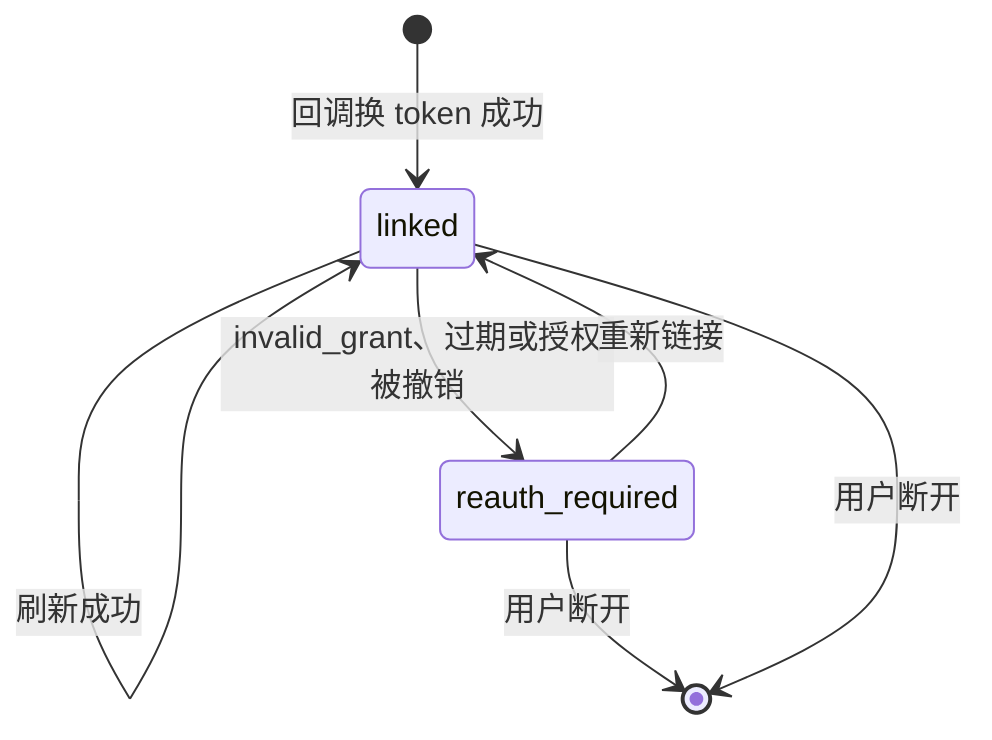
```mermaid
stateDiagram-v2
    [*] --> linked : 回调换 token 成功
    linked --> linked : 刷新成功
    linked --> reauth_required : invalid_grant、过期或授权被撤销
    reauth_required --> linked : 重新链接
    reauth_required --> [*] : 用户断开
    linked --> [*] : 用户断开
```

**应用记录**

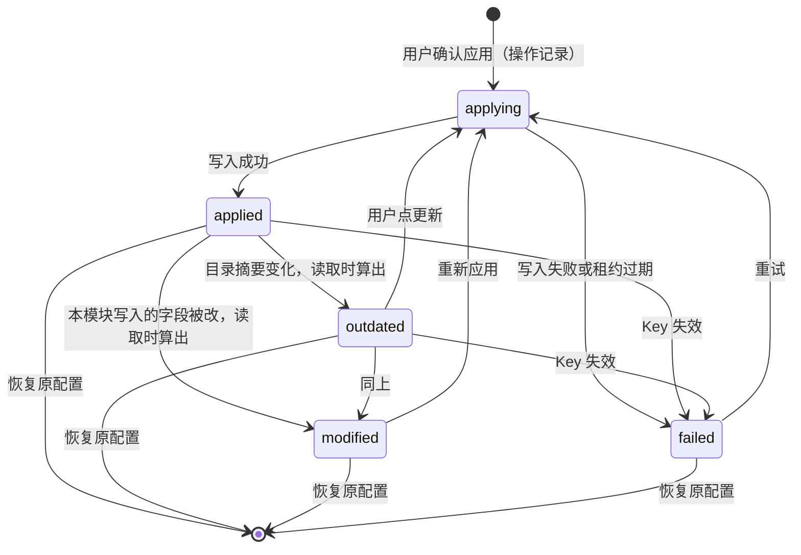
```mermaid
stateDiagram-v2
    [*] --> applying : 用户确认应用（操作记录）
    applying --> applied : 写入成功
    applying --> failed : 写入失败或租约过期
    failed --> applying : 重试
    applied --> outdated : 目录摘要变化，读取时算出
    outdated --> applying : 用户点更新
    applied --> modified : 本模块写入的字段被改，读取时算出
    outdated --> modified : 同上
    modified --> applying : 重新应用
    applied --> failed : Key 失效
    outdated --> failed : Key 失效
    applied --> [*] : 恢复原配置
    outdated --> [*] : 恢复原配置
    modified --> [*] : 恢复原配置
    failed --> [*] : 恢复原配置
```

`pending`（离线或等任务结束后自动应用）是第二阶段新增的，这里没有画。

### 5.15 Key 和 token 的路径

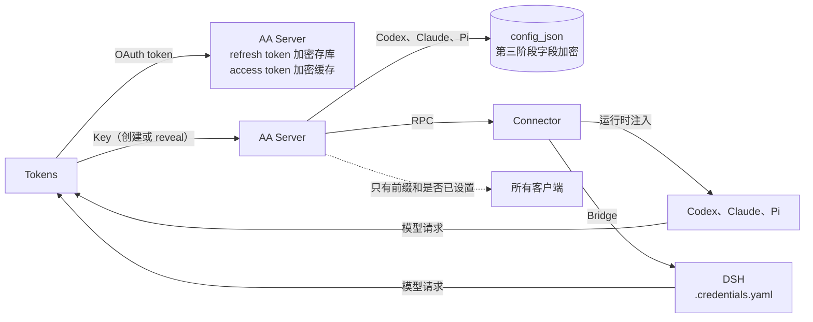
```mermaid
flowchart LR
    TA["Tokens"] -- "OAuth token" --> LS["AA Server<br/>refresh token 加密存库<br/>access token 加密缓存"]
    TA -- "Key（创建或 reveal）" --> AS["AA Server"]
    AS -- "Codex、Claude、Pi" --> DB[("config_json<br/>第三阶段字段加密")]
    AS -- "RPC" --> CN["Connector"]
    CN -- "运行时注入" --> RT1["Codex、Claude、Pi"]
    CN -- "Bridge" --> RT2["DSH<br/>.credentials.yaml"]
    RT1 -- "模型请求" --> TA
    RT2 -- "模型请求" --> TA
    AS -. "只有前缀和是否已设置" .-> CL["所有客户端"]
```

## 6. 数据

| 位置 | 存什么 | 不存什么 |
| --- | --- | --- |
| 客户端 | 不新增持久化 | Key、OAuth token |
| PostgreSQL | 下面五张表，含操作和幂等记录 | access token；Tokens 的 Key 不进新表 |
| Redis | 加密的 access token；没有 Redis 的单进程部署放在内存里 | — |
| `device_runtimes.config_json` | Codex、Claude、Pi 的 `modelGateway`（**沿用现状**） | — |
| 工作设备 | DSH 的 Provider 和凭据，存在 DSH 自身配置里 | — |

### 新增表

迁移编号接在合并时的最大值之后。

```text
tokens_links                本地账户与 Tokens 的授权，一个账户一条
  user_id PK FK users ON DELETE CASCADE
  issuer, account_json, status, refresh_token_ciphertext, linked_at, refreshed_at, issued_at

tokens_link_states          进行中的链接，10 分钟过期、一次性
  state_hash PK, user_id FK, ticket_hash, browser_hash, code_verifier_ciphertext,
  created_at, expires_at, consumed_at

model_profiles              模型配置
  id PK, user_id FK, source, name, origin_host, offers_json, catalog_digest,
  key_ref_json, secret_ciphertext（仅手动）, state, created_at, updated_at, etag
  -- Pi 受管实例另在 device_runtimes.metadata 记 managedBy: model-config

runtime_model_assignments   每台设备每个 Runtime 的应用记录
  (connector_id, runtime_id) PK, FK device_runtimes ON DELETE CASCADE
  profile_id FK model_profiles ON DELETE RESTRICT
  offer_format, created_runtime, applied_digest, applied_catalog_digest,
  imported_model_ids_json, previous_gateway_ciphertext,
  status, error_json, applied_at, updated_at

model_config_operations     应用、恢复、轮换、断开的操作记录，兼作幂等记录，完成后保留 24 小时
  id PK, user_id FK, kind, idempotency_key, request_digest, targets_json,
  lease_until, result_json, created_at, finished_at
  UNIQUE (user_id, idempotency_key)
```

**为什么这样建外键**：
- 删除 Runtime 时，应用记录跟着删除，不留孤儿。
- 配置还有设备在用时不能删除，断开时先标为 `detached`。

### Key 的存放

| Key | 存放 | 说明 |
| --- | --- | --- |
| Tokens 的托管 Key | 写入 `config_json.modelGateway.apiKey`，DSH 除外 | 需要时向 Tokens reveal。和手动填写走同一路径，现有弹窗不用为存储改动 |
| 手动添加的 Key | `model_profiles.secret_ciphertext`，应用时也写入 `config_json` | 用 `SecretBox` 加密 |
| 恢复快照 | `previous_gateway_ciphertext` | 只存应用前的 `modelGateway`，可能含用户原来的 Key |
| OAuth refresh token | `tokens_links.refresh_token_ciphertext` | 用 `SecretBox` 加密 |

**剩下的风险**：`config_json` 在数据库里仍是明文，第三阶段做字段加密。这把 Key 是本实例所有设备共用的，泄露影响比按设备发放更大，所以字段加密不宜拖太久。

## 7. 应用、更新与恢复

### 7.1 Server 接口

| 接口 | 说明 |
| --- | --- |
| `GET /api/v2/integrations/tokens` | 链接状态、Tokens 地址、账号、余额 |
| `POST /api/v2/integrations/tokens/link` | 发起链接，返回启动地址 |
| `GET /api/v2/integrations/tokens/start` | 浏览器打开；设置 cookie 后跳到 Tokens |
| `GET /api/v2/integrations/tokens/callback` | Tokens 回调 |
| `DELETE /api/v2/integrations/tokens/link` | 断开，带 `allowInterrupt` |
| `POST /api/v2/integrations/tokens/embed-ticket` | 嵌入票据（仅 Web） |
| `PUT /api/v2/admin/integrations/tokens` | 管理员修改 Tokens 地址；有账户已链接时返回 409，除非带 `disconnectAll` |
| `GET /model-profiles` | 配置列表 |
| `POST /model-profiles` | 手动添加 |
| `PATCH /model-profiles/{id}` | 修改，需要 `If-Match: <etag>` |
| `DELETE /model-profiles/{id}` | 删除，还有设备在用时返回 409 |
| `POST /model-profiles/{id}/sync` | 同步目录 |
| `POST /model-profiles/{id}/rotate-key` | 轮换 Key，仅 Tokens 来源；带 `allowInterrupt`，需要 `Idempotency-Key` |
| `GET /model-config/assignments` | 设备矩阵 |
| `POST /model-config/assignments/preview` | 预览 |
| `POST /model-config/assignments` | 应用；带 `allowInterrupt`，模型超过上限时带 `modelIds` 指定导入哪些；需要 `Idempotency-Key` |
| `DELETE /model-config/assignments/{connectorId}/{runtimeId}` | 恢复原配置，带 `allowInterrupt` |
| `GET /model-config/operations/{id}` | 查询操作进度和结果 |

本节的配置接口都在 `/api/v2` 下，例如 `/api/v2/model-profiles`。

**预览结果**：

```json
{
  "targets": [
    {
      "connectorId": "…", "runtimeId": "codex", "runtimeType": "codex",
      "decision": "apply", "offerFormat": "openai_responses",
      "effect": "restart", "runningSessions": 2,
      "replaces": { "kind": "manual", "host": "old.example.com" },
      "models": { "importing": 12, "existing": 3, "limit": 64 }
    },
    { "connectorId": "…", "runtimeId": "claude", "runtimeType": "claude", "decision": "skip", "reason": "format_unsupported" }
  ]
}
```

**跳过原因**：

| 原因 | 含义 |
| --- | --- |
| `format_unsupported` | Runtime 支持的格式中转站都不提供 |
| `not_installed` | 设备上没装这个 Runtime |
| `models_required` | Runtime 必须有模型列表，但目录为空 |
| `too_many_models` | 合并后超过 64 个；弹窗让用户勾选，应用时用 `modelIds` 提交 |
| `device_offline` | 设备离线 |
| `plugin_outdated` | DSH 插件不支持写入 |
| `profile_readonly` | DSH 当前 profile 不可写 |
| `managed_by_dsh` | DSH 已自行链接 Tokens（见 7.6） |
| `busy` | 有运行中的任务，且用户没有允许中断 |
| `secret_unconfigured` | 实例没有配置加密密钥 |

### 7.2 应用步骤

```text
0. 按 (账户, Idempotency-Key) 查操作记录，命中就返回同一个操作；否则新建操作记录和 5 分钟租约
1. 校验设备归属，读 ModelProfile，取 Key（必要时 reveal；手动来源解密）
2. 每个目标独立执行：
   a. 同一个 Runtime 已被另一个未过期的操作占用时，这个目标返回 409（不同 Runtime 可以并行）
   b. 获取 _runtime_lock；更新操作记录，发实时通知
   c. 重新读取 Runtime 和运行中的任务；与用户的确认不符时跳过（busy）
   d. GatewayPatch.apply（写 modelConnection.configField 和 modelsField）→ 补回 writeOnly → 校验 → _put_config_locked（运行中才 _restart_locked）
      Pi：按 metadata.managedBy 复用本模块的实例；没有时经 create_runtime 新建（见 7.3）
      适配器在 runtime.start 的回复里回报 modelConnection，Server 记下它和当时的连接摘要
   e. 成功：写或更新应用记录（applied，摘要、导入的模型、恢复快照）；失败：写 failed，原配置不变
   f. 释放锁，发实时通知
3. 操作完成，返回逐个目标的结果
```

**锁的规则**：现有 `put_config`、`set_active` 都会自己获取 `_runtime_lock`，而这把锁不可重入：分布式下是 Redis `SET NX`，在锁内再调用会等 300 秒后超时；单进程下是 `asyncio.Lock`，会永久死锁。所以：

- 把 `put_config` 加锁之后的部分拆成 `_put_config_locked`，`put_config` 加锁后调用它，配置管理在自己的锁内调用它；
- 启停直接用已有的 `_start_locked`、`_stop_locked`、`_restart_locked`，不调用 `set_active`；
- 新建 Pi 实例走 `create_runtime`，它用的是另一把 `@instances` 锁。加锁顺序固定为先 `@instances` 后实例锁，并且不在持有实例锁时去拿 `@instances`。

### 7.3 各 Runtime 的写法

| | Codex | Claude Code | Pi | DSH |
| --- | --- | --- | --- | --- |
| 接受格式 | `openai_responses` | `anthropic` | `openai_chat` | 三种都接受 |
| 谁写 | Server | Server | Server | 插件（RPC） |
| 写到哪里 | `modelGateway`、`customModels` | 同左 | 本模块的受管实例 | DSH 当前 profile |
| 生效 | 重启 Runtime | 重启 Runtime | 新实例，不影响本机 Pi | 热更新 |
| 模型列表 | 可选 | 可选（原版 Claude 模型不需要） | 可选，缺失时 Pi 自己拉 `/models` | 必需 |

**Codex**：只能走 Responses。Codex App 持有、经 IPC 跟随的线程很可能仍用 App 自己的配置，页面要说明，并实测确认。

**Pi**：
- **为什么新建实例**：已有的本机 Pi 实例改成受管模式会报 `pi_execution_source_changed`，所以要新建一个受管实例。
- **实例归属**：新实例在 `device_runtimes.metadata` 上标记 `managedBy: model-config`；应用记录挂在它的 `runtime_id` 上，`created_runtime=true`。
- **幂等**：每台设备最多一个本模块的受管 Pi 实例，按 `connectorId` 和这个标记查找。找到就更新（换了配置也复用同一个实例），恢复后再次应用也复用，不会建出多个。新建前先在操作记录里登记，重试时据此找回刚建的实例。
- **更新**：只改这个实例的配置，会话目录不变。
- **恢复**：用 `_stop_locked` 停止并设为非活动，不删除实例和会话，保留标记。
- **提示**：受管实例和本机 Pi 的历史相互独立，确认弹窗要说明。

**DSH**：
- **写入**：新增 Bridge 方法，插件调用 `ctx.credentials.set` 和 `ctx.settings.mutate`，写入时带 `expectedRevision`。
- **前提**：`settings.writable` 为 false 时返回 `profile_readonly`；DSH 没有运行时返回 `device_offline`。
- **待验证**：这两个接口目前只核对过类型声明，要先实测。

### 7.4 合并规则

| 配置项 | 规则 |
| --- | --- |
| `modelGateway` | 整项替换；应用前的值加密存进 `previous_gateway` |
| `customModels` | 删掉上次导入的（`importedModelIds`），加入新的；用户手动加的保留；ID 冲突时保留用户的；总数不超过 64 |
| 其他字段 | 不动 |
| 从未配置的 Runtime | 用 `defaults` 打底，写入后设为 active |

**摘要**：在 Server 补回 `writeOnly` 字段之后计算，只覆盖 `modelGateway` 和 `customModels` 中 `importedModelIds` 对应的条目。

### 7.5 更新

目录摘要变化后（新模型、改了策略、Key 被轮换），用这份配置的 Runtime 显示「有更新」，**不自动应用**，因为 Codex、Claude 更新要重启。页面提供「更新 N 个设备」。

第二阶段可加「自动更新」：在 Runtime 空闲时应用，复用 `pending` 机制。

### 7.6 和 DSH 自行链接的关系

dsh-desktop#1583 让 DSH Next 自己用 OAuth 链接 Tokens，并配置模型提供商。为避免两边写入重复的 Provider：

- **Provider ID**：AA 写入的 Provider 用独立前缀 `aa-tokens-<格式>`，不使用 Tokens 手动教程里的 `anywhere`。这样既不会覆盖用户手动配的 Provider，也满足规则 2。
- **跳过已自行链接的 DSH**：插件的 `inspect` 报告 DSH 是否已经自行链接 Tokens。是的话预览返回 `managed_by_dsh`，默认跳过，用户可以手动勾选。
- **和 #1583 对齐**：两边约定 DSH 自行链接时用的 Provider ID，让 `inspect` 能识别。

### 7.7 恢复

见 5.9。恢复是反向修改，不是整份写回快照，这样不会覆盖用户在应用之后做的其他修改。

### 7.8 离线设备

| 场景 | 第一版 | 第二阶段 |
| --- | --- | --- |
| 应用 | 离线设备不可选 | 可选，记为 `pending`，上线后自动应用 |
| 轮换后 | 显示「有更新」，上线后手动更新；在此之前它的请求会失败 | 上线后自动更新 |
| 断开时 | 应用记录标为失败，上线后手动恢复 | 上线后自动恢复 |

## 8. 显示

### 8.1 入口

#510 写的是「设置 → 集成 → 链接 Tokens」，本文的入口是设置里新增的「配置管理」。本文按一个菜单「配置管理」设计：链接 Tokens 放在页面顶部。是否单独设一个「集成」菜单，见第 13 节。

| 端 | 挂载位置 |
| --- | --- |
| Web | `settings-navigation.ts` 加 `model-configs`，放在「手机连接」之后；路由 `#/settings/model-configs` |
| Desktop | 渲染层同名文件（独立的一份） |
| Android | `ProfileSettingsDrawer` 加一行，`ProfileDetailPage.ModelConfigs` |
| iOS / iPadOS / Mac Catalyst | `AccountSettingsSheet` 的 Workspace 分组 |

### 8.2 Web / Desktop 页面

```text
配置管理
把模型服务应用到你的设备。

Tokens Anywhere                                   已链接 · wa***@x.com
┌──────────────────────────────────────────────────────────────┐
│ 余额 ¥123 · 策略：固定：默认 · Key：sk-a1b2…wxyz · 42 个模型    │
│ 地址 tokens.example.com · 2026-11-02 链接                       │
│                 [打开控制台] [同步] [轮换 Key] [断开]            │
└──────────────────────────────────────────────────────────────┘

其他模型配置                                          [+ 手动添加]
┌──────────────────────────────────────────────────────────────┐
│ 我的网关   gateway.example.com · sk-z9…    [编辑] [应用到设备]  │
└──────────────────────────────────────────────────────────────┘

设备                                              筛选：全部设备 ▾
MacBook Pro · 在线
┌──────────────────────────────────────────────────────────────┐
│ Codex    Tokens Anywhere   使用中                    [更换 ▾]   │
│ Claude   手动配置 · old.example.com                  [更换 ▾]   │
│ Pi       Tokens Anywhere（受管实例）  有更新          [更新]     │
│ DSH      已在 DSH 中链接 Tokens                                 │
└──────────────────────────────────────────────────────────────┘
```

**没链接时**：

```text
┌──────────────────────────────────────────────────────────────┐
│ Tokens Anywhere                                              │
│ 用你的 Agents Anywhere 云账号链接，一键配置模型和 Key。          │
│                                                [链接 Tokens]   │
└──────────────────────────────────────────────────────────────┘
```

**其他情况**：
- 实例没配加密密钥时，按钮不可用，并提示管理员配置。
- 链接进入「需要重新链接」时，卡片显示原因和「重新链接」。

**应用弹窗**：

```text
应用「Tokens Anywhere」
模型请求和其中的代码、提问将发送到 tokens.example.com。

MacBook Pro
  ☑ Codex    替换手动配置 old.example.com；将中断 2 个任务  ☑ 允许中断
  ☑ Claude   首次配置，没有运行中的任务
  ☑ Pi       新建受管实例，不影响本机 Pi，历史相互独立
  ☐ DSH      已在 DSH 中链接 Tokens
办公室电脑
  ☐ 全部     设备离线

                                              [取消] [应用]
```

应用后按 Runtime 显示成功、跳过或失败。

**和现有弹窗的关系**：「配置 Codex」弹窗改为只写 Key（见第 10 节），并加一行提示：「由配置管理应用：Tokens Anywhere」，可跳转。

### 8.3 Android / iOS

手机屏幕窄，改为两级页面：配置管理首页显示 Tokens 卡片、其他配置和设备列表，点设备进入 Runtime 列表。「应用到设备」用底部弹层或 Sheet，「链接 Tokens」按 4.2 打开授权会话。

### 8.4 Tokens 控制台

| 端 | 方式 |
| --- | --- |
| Web | 可选嵌入（见 5.13），实例页面的 CSP 要允许 `frame-src {TOKENS}` |
| Desktop | 用系统浏览器打开。页面的 origin 是 `aa-workbench://web`，和 Tokens 按授权 origin 设置的 `frame-ancestors` 对不上，无法嵌入 |
| Android / iOS | 用浏览器打开，原生 App 没有 iframe |

充值和需要重新验证的操作，Tokens 规定始终在新窗口打开。

## 9. 多端同步

### 9.1 现有机制

不用新建通道：

```text
任何一端改了配置 → Server 写库 → publish_dashboard_changed(user_id)
  → Redis 广播到所有 Server 实例 → 该账号每个在线客户端的 /dashboard/ws
  → 推送一份完整的 dashboard.snapshot（合并连续通知，只发最新一份）
```

- **快照里已经有 `runtimes`**：Runtime 配置、状态都在里面，Server 每次改 Runtime 配置都会发这个通知。
- **Web、Desktop**：设备页直接用快照里的 `runtimes` 渲染。
- **Android、iOS**：解析快照，但没读 `runtimes`，打开设备页时再用 HTTP 拉取，要补上。
- **断线重连**：一连上就收到完整快照，客户端不用自己对账。

### 9.2 快照增加 `modelConfig`

```json
{
  "type": "dashboard.snapshot",
  "runtimes": ["…现有，已脱敏…"],
  "modelConfig": {
    "tokens": { "status": "linked", "issuer": "https://tokens.example.com", "account": "wa***@x.com", "keyPrefix": "sk-a1b2" },
    "profiles": [{ "id": "…", "source": "tokens", "name": "Tokens Anywhere", "etag": "7", "keyPrefix": "sk-a1b2" }],
    "assignments": [{ "connectorId": "…", "runtimeId": "codex", "profileId": "…", "status": "applied" }]
  }
}
```

- **状态由 Server 算好**：包括 `modified`、`outdated`。
- **所有写操作都发通知**：链接、断开、刷新失败、同步、应用、恢复、轮换。账号级操作直接传 `user_id`。
- **HTTP 兜底**：第一次打开页面或实时连接断开时，才用 HTTP 接口。
- **契约**：快照结构属于对外接口，要更新 `docs/api/realtime.md`，以及 Web、Desktop 的协议类型。

### 9.3 并发

| 情况 | 处理 |
| --- | --- |
| 两端同时编辑同一份配置 | `If-Match: <etag>`，后到的得到 409 |
| 两端同时应用 | 同一个 Runtime 已在操作中时，后到的这个目标得到 409，并从快照看到「应用中」；不同 Runtime 可以并行 |
| 同一端重复点击 | 按 (账户, `Idempotency-Key`) 返回同一个操作 |
| 应用和轮换同时进行 | 轮换时这份配置有进行中的应用，返回 409 |
| 发起端断网或锁屏 | 操作在 Server 上继续，重连后从快照看到结果 |
| Server 重启时正在应用 | 租约过期后显示失败，可重试 |

## 10. Key 不返回给客户端（第一版）

**现状**：快照里的 `runtimes` 带完整的 `config`，其中包括 `modelGateway.apiKey`。现在任何一端改任何东西，Key 都会推送到这个账号下所有在线的客户端，包括手机；8 个返回 Runtime 的接口也一样。

### 10.1 规则

**识别敏感字段**：Server 按 uiSchema 的 `component: "modelGateway"` 识别。Codex、Claude、Pi 都已声明这个组件，所以**不依赖 Connector 版本**。以后新增的敏感字段，由 Connector 在 Schema 里标 `writeOnly: true`，Server 两种方式都认。

**出口脱敏**：8 个返回 `DeviceRuntimeView` 的接口和 `dashboard.snapshot`，统一在出口处理：

- 从 `config` 里移除 Key；
- 在 `DeviceRuntimeView` 上新增 `secretFields`，**不放进 `config`**，因为 `modelGateway` 的 Schema 不允许多余字段，客户端原样回传就会保存失败：

```json
{ "secretFields": { "modelGateway.apiKey": { "set": true, "hint": "sk-a1b2…wxyz" } } }
```

**写入合并**：`PUT …/config` 中 Key 缺失或为空时：

| 情况 | 处理 |
| --- | --- |
| `baseUrl` 的 origin 和已保存的相同 | 补回已保存的 Key |
| origin 变了 | 返回 422，必须重新输入 Key |
| 去掉整个 `modelGateway` | 清除 |

**origin 变了为什么不能补回**：否则任何能编辑配置的人，只要把地址改成自己的服务器，就能让 Runtime 把已保存的 Key 发过去。

**错误信息脱敏**：任何错误信息都不能带字段值，包括 Connector 和 Server 写入 `runtime.error` 的信息，以及 `PUT …/config` 的 422 响应体（Server 补回已保存的 Key 后校验失败时，Schema 校验器的消息可能带出它）。例如 Pi 的 `validate_config` 现在直接抛出 jsonschema 的错误，可能出现 `'sk-…' is too long`。做法：校验错误只返回字段路径和错误类型。

**防回归测试**：遍历所有返回 Runtime 的接口、快照和错误响应，断言输出里没有 Key，包括 `error` 字段。

### 10.2 四端弹窗

| 端 | 位置 |
| --- | --- |
| Web | `runtime-config-dialog.tsx` 的 `modelGateway` 组件，以及 Ajv 校验 |
| Desktop | 渲染层同名文件 |
| Android | `DeviceRuntimeConfigureSheet` |
| iOS | `RuntimeConfigurationModel`、`RuntimeConfigurationFieldView` |

改动：

- 已设置时显示「已设置 · sk-a1b2…wxyz」（前缀和后 4 位，全文统一这种格式）和「更换」；不更换时不提交 Key；校验时跳过已设置的字段。
- 去掉查看 Key 的眼睛按钮，因为客户端已经拿不到原值。
- 修改地址时提示需要重新输入 Key。
- 文案「它会作为 Runtime 配置的一部分被存储并返回」改为「保存后不会再显示」。

### 10.3 兼容

旧客户端打开弹窗时 Key 为空，Schema 要求必填，不重新输入 Key 就保存不了。这不会导致 Key 丢失，但用户会困惑。新 Server 和四端在同一版本发布，并写进升级须知。

## 11. 代码落点

### 11.1 AA Server

| 层 | 文件 |
| --- | --- |
| `core` | `model_config.py`：实体、格式匹配、`GatewayPatch`、摘要、状态优先级；`secret_fields.py`：敏感字段识别与合并 |
| `services` | `tokens_link.py`（链接、刷新、断开）、`model_config.py`（应用、恢复、轮换）、对应的端口文件；`device_runtimes.py` 拆出 `_put_config_locked` |
| `infra` | `tokens_client.py`（httpx）、`repositories/model_config.py`、`repositories/tokens_links.py`、`secret_box.py`（`cryptography`，AES-GCM）、后台保活任务 |
| `api` | `integrations_tokens.py`；`model_config.py`；`connector_runtimes.py` 出口脱敏和写入合并；`dashboard_stream.py` 快照脱敏并加入 `modelConfig` |
| 迁移 | 第 6 节的四张表 |

新增依赖：`cryptography`。分层要通过 `test_architecture_boundaries.py`。

### 11.2 Connector 与 DSH 插件

| 位置 | 改动 | 阶段 |
| --- | --- | --- |
| `connector/runtime_protocol` | 描述符的 `maturity`、`modelConnection`；start 回复的 `modelConnection` | 1 |
| Connector 各 Runtime 适配器 | 声明能力、校验时拒绝不支持的组合、启动后回报生效结果；Pi 本机模式不再静默忽略网关；Pi 的校验错误不带字段值 | 1 |
| Connector DSH 适配器 | 收到 `modelGateway` 时经 Bridge 写入 DSH，回报生效结果 | 1（`experimental`） |
| DSH 插件 `dsh-runtime/router.ts` | 对应的 Bridge 方法；`settings`、`credentials` 作为可选依赖 | 2 |

### 11.3 客户端

| 端 | 改动 |
| --- | --- |
| Web | 配置管理页、链接卡片、应用弹窗、嵌入控制台；快照类型；弹窗只写 |
| Desktop | 同 Web（渲染层是独立的一份）；用系统浏览器打开启动地址和 Tokens 控制台 |
| Android | 配置管理页、Custom Tabs 链接、快照读取 `runtimes` 和 `modelConfig`、弹窗只写 |
| iOS | 配置管理页、`ASWebAuthenticationSession` 链接、快照读取、弹窗只写、文案同步 |

### 11.4 契约与文档

- `docs/api/model-config.md`、`docs/api/realtime.md`。
- `contracts/runtime-control`：能力字段、DSH 新 RPC。
- `contracts/dsh-bridge/2.0`：新 Bridge 方法。
- CHANGELOG 和发布说明。

## 12. 分阶段

| 阶段 | 内容 | 结果 |
| --- | --- | --- |
| **0 前提与验证** | #470 合并并部署到 AA 云（Tokens 用它登录）；Tokens 部署 #94、#95，并把 AA 云加入 `TOKENS_OAUTH_TRUSTED_ORIGINS`；DSH 写入接口实测；确认 DeepSeek 能否走 Responses | 排除阻塞，可以联调 |
| **1 主流程** | 链接与刷新；配置管理模块；手动配置；Codex、Claude、Pi；四端配置管理页；快照同步；Key 只写不读 | 任何端都能链接和导入，改动实时同步，Key 不再发给客户端 |
| **2 DSH 与增强** | DSH 通道（含和 #1583 的协调）；离线和任务结束后自动应用（`pending`）；自动更新开关；Web 嵌入控制台 | 四个 Runtime 齐全 |
| **3 安全加固** | `config_json` 字段加密 | 数据库里不再有明文 Key |

**发版**：第 1 阶段有接口变化，按版本号规则升 MINOR，所有端（Server、Connector、Web、Desktop、Android、iOS、DSH 插件）的版本号一起升。

### 依赖

| 依赖 | 影响 |
| --- | --- |
| #470（与 main 冲突，需变基） | **前置条件**：Tokens 用 AA 云登录。#510 不要求再改它 |
| Tokens 的 OAuth 授权服务器 | 第 1–4 步都已合并（anywhere-tokenhub#94、#95、#98、#99）；AA 一侧的嵌入控制台还没做 |
| dsh-desktop#1583 | 和 DSH 自行链接的协调（7.6） |
| #441（Server 与 Connector 的控制 RPC 迁到 MeshCall） | DSH 的新 RPC 要多加一处映射 |
| #379（OpenCode） | 合并后按能力字段加一个 Runtime，可检验端口设计 |

## 13. 需要你确认

| # | 问题 | 建议 |
| --- | --- | --- |
| 1 | 入口：一个「配置管理」，还是「集成」（链接）和「配置管理」（应用）分开 | **一个「配置管理」**，链接放在页面顶部。和 #510 的「设置 → 集成」不一致，需要和 #510 的作者对齐 |
| 2 | 第 3.6 节的建议是否提到 #510 | **要提**。最小权限和后台限制关系到自部署实例的安全，越早定越好 |
| 3 | 第一版要不要手动配置 | **要**。没链接 Tokens、或用其他网关的用户离不开它 |
| 4 | 显示余额吗 | 显示，接口失败时隐藏 |
| 5 | DSH 是否第一版必须有 | 取决于第 0 阶段的实测和 #1583 的进展；建议第二阶段 |
| 6 | 嵌入控制台是否做 | 第二阶段，只做 Web；其他端打开浏览器 |
| 7 | 自部署实例默认显示 Tokens 入口吗 | **显示**，#510 要求默认可用。点「链接」之前不向 Tokens 发任何请求 |

## 14. 尚未验证

没有写代码，也没有端到端跑过：

- **前置条件还没完全就绪**：Tokens 授权服务器的第 1 步已合并但没部署，授权页还没有；#470 还没合并。第 3 节的授权页部分以设计为准，实现时可能会变。
- **`/v1/models` 未实测**：「按 Key 的策略和可用线路过滤」是读代码得出的。DeepSeek 能否走 Responses 未确认。
- **非 Web 端的 cookie 未实测**：Desktop、iOS、Android 在系统浏览器和授权会话里打开启动地址后，cookie 能否在 Tokens 往返中保持，需要真机验证。局域网 http 实例的 cookie 也要验证。
- **嵌入控制台的浏览器支持**：分区 cookie 的支持情况由 Tokens 实测，Safari 尤其要确认。
- **DSH**：`ctx.settings.mutate`、`ctx.credentials.set` 只核对过类型声明。
- **Codex**：经 IPC 跟随的线程不走网关，是从代码推断的。
- **任务中断提示**：手机改配置后会打断设备上运行中的任务，这个提示在真机上是否足够明显，需要确认。
- **刷新的残余风险**：网络错误导致刷新结果不明、10 秒内重试也失败时，之后再刷新可能被 Tokens 当作重放而撤销授权（见 4.4）。这与 #510 验收要求「重试不会导致撤销」存在张力，需要和 Tokens 确认是否放宽，例如延长容忍窗口或提供幂等的刷新。
- **图只验证了显示**：第 5 节的图经过 Mermaid 渲染检查，但流程本身只是设计。
