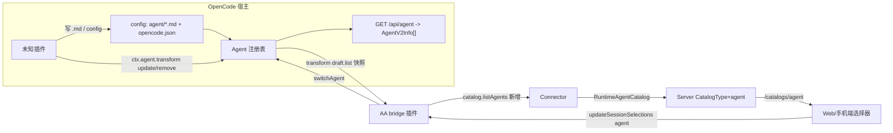

<!-- tm_board_write · 2026-09-26T19:38:17.874Z · role=researcher · session=20260926-213919 -->
# OpenCode V2 Agent 目录与切换机制 · AA 手机端接入调研

范围：本仓代码 + 本机 OpenCode 安装（`C:\Users\34296\.config\opencode`，宿主 opencode-cli 2.0.18）+ SDK/plugin 类型定义。**只读调研。** 路径省略仓库根 `D:\Github\Agents-Anywhere\` 与 `C:\Users\34296\.config\opencode\`。

## 0. 对 dispatch 前提的两处修正（重要）
1. `opencode-plugin/src/shared/protocol.ts:66-71` 的 `CATALOG_METHODS` **只有** `catalog.listModels` / `catalog.listPermissions`，**没有 `catalog.listAgents`**。因此当前 `catalog.listAgents` 走的是 `METHOD_NOT_FOUND` 分支（bridge-hub.ts:486-490），而非 `UNSUPPORTED_OPERATION`。两种都导致手机端列不出 Agent，结论不变。
2. V2 Event union（sdk v2 types.gen.d.ts:4）**没有 `agent.updated` 或任何 `agent.*` 域事件**。最接近的是 `catalog.updated` 与 `plugin.added`。见 §3。

## 1. Agent 的定义与来源
| 来源 | 机制 | 证据 |
|---|---|---|
| 内置 | config `agent` 段默认键 plan/build/general/explore/title/summary/compaction；`mode` 段 build/plan | sdk v2 types.gen.d.ts:1565-1578 |
| 用户配置 | `opencode.json(c)` 的 `agent.<id>: AgentConfig` + `default_agent`；或 `~/.config/opencode/agents/*.md` | types.gen.d.ts:1562,1570-1579；本机实测存在 agents/{architect,implementer,reviewer,researcher,team,tester}.md |
| 插件贡献 | V2 插件 `ctx.agent.transform(draft)`；`AgentDraft{list,get,default,update,remove}` —— **无 add** | plugin/dist/v2/effect/agent.d.ts:3-11 |

- **AgentConfig 字段**（决定一个 agent 能改什么）：model/variant/temperature/top_p/prompt/tools/disable/description/mode/hidden/options/color/steps/maxSteps/permission —— types.gen.d.ts:1351-1379。
- **唯一标识** = `id: string`；**可见属性** `AgentV2Info{id, model?, request:ProviderRequest, system?, description?, mode:"subagent"|"primary"|"all", hidden, color?, steps?, permissions}` —— types.gen.d.ts:3169-3180。
- **"可选项"判据**（推断）：`mode!=="subagent" && hidden!==true`。hidden 是否被列表返回 —— **未验证**。
- **插件能否注册 agent**：插件的 agent 编辑 API **没有 add**；@te-river/opencode-team-mode 官方文档明确 "a plugin cannot add an agent"（installation-v2.md:45），它靠 **写 `agents/*.md` + 配置 `default_agent`** 落地（v1 `config` hook：plugin/dist/index.d.ts:178）。→ 未知插件"贡献 agent"实质是**配置源新增**，不是独立注册通道。
- **本机已装插件核查**：`@te-river/opencode-team-mode` 已装并贡献 6 个 agent（.md + config）；`@slkiser/opencode-quota` **未安装**（opencode.jsonc 声明了但 node_modules 无目录，glob 无果）——**未验证**它是否注册 agent（装不上，无法确认）。

## 2. 枚举 API
| 通道 | 形状 | 作用域 | 证据 |
|---|---|---|---|
| 宿主 HTTP | `GET /api/agent?location{directory,workspace}` → `{location, data: AgentV2Info[]}`（"Retrieve currently registered agents"） | **location** | types.gen.d.ts:9632-9663 |
| SDK client | `client.agent.list({location})` | location | sdk.gen.d.ts:1513-1524 |
| 旧 HTTP | `GET /agent` → `Agent[]`（全局全局） | 全局 | types.gen.d.ts:7100-7122 |
| 插件侧 | **无查询 API**；仅 `ctx.agent.transform(draft=>…)` 钩子，回调里 `draft.list()` 可取全量 | 全局/注册表 | plugin/dist/v2/effect/agent.d.ts:3-11 |
| CLI/TUI | `context.data.location.agent.list(location)` | —— | **本机 plugin/sdk 类型中未找到**（grep 无果）→ **未验证**，可能仅 TUI 内部 |

- **含插件贡献项的完整列表**：只有 `/api/agent` 与插件的 `draft.list()` 是"注册表"视图，能看到配置源（含插件写入）的全部 agent。**但 AA 的 bridge 插件在 v2 ctx 里没有 client**（team-mode doc:424），所以插件**不能自己 GET /api/agent** —— 插件侧唯一通道是 `ctx.agent.transform` 快照。
- **关键缺口**：`opencode-plugin/src/server/opencode-ctx.ts:100-107` 的实测 ctx 只有 app/location/event/permission/session/options，**未声明 `agent`**；2.0.18 上 `ctx.agent` 是否可用 —— **未验证（唯一决定实现路径的项）**。
- 现存 mock 已按 `catalog.listAgents` 命名（opencode-plugin/tests/** 无，但 connector/contracts 侧… 见 §8）。

## 3. 运行期变更
- V2 Event union **无 agent.* 事件**（types.gen.d.ts:4）。邻近：`catalog.updated`（CatalogUpdated，payload `{[key]:unknown}` 不透明）types.gen.d.ts:4258-4273 / 5272-5278；`plugin.added`（PluginAdded，data.id）4634-4649 / 5788；`project.directories.updated` 4650。
- 会话级 `session.next.agent.switched`（SessionNextAgentSwitched）types.gen.d.ts:634/3415/5339 —— 用于回读，不是目录变更。
- **刷新策略**：收 `catalog.updated` / `plugin.added` 后重拉；插件侧 `transform` 钩子在注册表重建时触发（推断，**未验证**触发时机）。**无 agent.updated**，不能只订阅单一事件。

## 4. 切换语义（必答）
- `client.session.switchAgent({sessionID, agent?})` → **204 No Content**；注释 **"Switch the agent used by subsequent provider turns"** —— sdk.gen.d.ts:1662-1675；types.gen.d.ts:9816-9821。
- **语义**：改的是该会话**后续 provider 轮次**使用的 agent；对已发生轮次无追溯。
- **新建会话可直接指定**：`POST /api/session body.agent?: string`（types.gen.d.ts:9700-9709）→ 手机端建会话时可一次带 agent。
- **回读当前 agent**：
  1. `SessionV2Info.agent?: string`（types.gen.d.ts:3185）；
  2. 插件 projector 从 `step.started` 事件的 `agent` 字段写入 `state.selections.agent`（opencode-plugin/src/server/projector.ts:302-306）→ AA `session.getState().selections.agent` **已可回读**（bridge-hub.ts:837-857）。
- **切换是否连带改 model/permission**：AgentConfig 含 model/permission/tools（types.gen.d.ts:1351-1379）→ **推断会变**；但 `switchAgent` 是否显式重置 model —— **未验证（需真机）**。

## 5. plan 类 agent 的本质
- plan 是普通 AgentConfig（config `agent.plan` / `mode.plan`），字段含 `prompt / tools / permission / model / temperature / steps` → **不只是提示词**，可改**可用工具集与模型**（types.gen.d.ts:1351-1379）。
- 对手机端含义：plan/build 等都应作为**真实可选项**列出，标签/描述来自 `description`；不得硬编码三选项。

## 6. AA 侧对等模型（必答）
- **Connector 契约**：只有 `RuntimeModelCatalog` / `RuntimePermissionCatalog`（connector/connector/runtime_protocol/models.py:93-133）；**无 agent catalog**。`update_session_selections(session_id, selections)` 已存在（instance_binding.py:679-685；host.py:65）。
- **DSH（最接近先例）**：`agentPreset` 是 **RuntimeConfig 的一个 select 字段 `defaultAgentPreset`**，由 `catalogs.ts:94-110` 返回 `{runtime,revision,presets[{id,name,description,enabled,disabledReason}],configField,uiField:{component:'select',options:[…]}}`，经 dsh/provider.py:134-164 注入 config schema；**只在建会话时使用**（dsh/runtime.py:307-333），**首个 turn 后锁定**（dsh-bridge-next/RUNTIME_CONFIGURATION_PLAN.md:81）。→ DSH 是"**创建期模式**"，与 OpenCode 的**运行期 switchAgent 语义不同**；不可照搬。
- **Codex/Claude**：selections 仅 model/permission/effort（codex/domain/catalogs.py、codex/catalogs/reader.py）。
- **Server**：`CatalogType = Literal["model","permission"]` **硬编码**（core/catalogs.py:10）；capabilities 有 catalog.model/permission/effort，**无 catalog.agent**（core/capabilities.py:14-16）；`ProtocolModelCatalog/ProtocolPermissionCatalog` 无 agent（core/protocol.py:160-187）。路由 `/sessions/{id}/runtime/catalogs/{catalog}`（api/sessions.py:723/757）与 `/connectors/{id}/runtimes/{id}/catalogs/{catalog}`（api/connector_runtimes.py:295/326）**只实现 model/permission**；旧 `/agents/{runtime}/model-catalog` 返回 410 并提示改用新路由（api/agents.py:15-71）。
- **Web/前端**：`AgentSelectionDrawer` 已存在，接受**任意** `SelectionOption{id,label,description?,enabled?,disabledReason?}` 列表渲染（agent-selection-drawer.tsx:19-102；selection-settings-drawer.tsx:18-24）——**天然可渲染任意列表，非硬编码三选项**。**但命名冲突**：task-composer.tsx:263-265 里 `selectedAgent`/agentItems 实为**设备/运行时**选择（`runtimes.find(r=>r.runtimeId===selectedAgent)`）。AA 的 "agent" 目前指设备，不是 OpenCode agent —— 必须改名/分层。
- **切换链路已通**：web `updateSessionSelections`（api.ts:796-806）→ server `SessionSelectionPatchRequest{selections}`（core/models.py:869-875）→ connector `update_session_selections`（opencode/runtime.py:371）→ plugin `session.updateSelections`（bridge-hub.ts:739-761，键 agent/agentId/agentID）→ `ctx.session.switchAgent({sessionID,agent})`。**只缺"目录"。**

## 7. 动态适配与降级
- **未知插件新增 agent** → 落到配置源（agents/*.md 或 config agent 段）→ 出现在 `/api/agent` 与 `draft.list()` → 目录**自动包含**。
- **卸载/删除** → 配置源消失 → 自动消失（`AgentDraft.remove` 亦能删）。
- **降级（fail-soft）**：枚举不可用时 `catalog.listAgents` 复用现有 catalog 拒绝路径返回 `-32601 UNSUPPORTED_OPERATION`（bridge-hub.ts:486-490；CATALOG_METHOD_LIST），能力 `catalog.agent` 标 unavailable（bridge-hub.ts:1059-1060 同款）；AA 隐藏 Agent 选择器，其它功能不受影响——connector 已对单个 catalog 做 try/except 隔离（opencode/runtime.py:465-474）。

## 8. 影响清单（必答）
| 层 | 改动 | 依据 file:line |
|---|---|---|
| opencode-plugin | ① opencode-ctx.ts 增 `agent` 结构化探测（`transform`）；② protocol.ts `CATALOG_METHODS` 加 `listAgents:'catalog.listAgents'`；③ bridge-hub 实现（`draft.list()` 快照，按 mode/hidden 过滤）；④ CAPABILITY_IDS 加 `catalogAgent:'catalog.agent'` | protocol.ts:66-71,173-192；bridge-hub.ts:486-490,1059-1060；opencode-ctx.ts:100-107 |
| Connector | models.py 加 `RuntimeAgentCatalog`；bridge/models.py 加 `agent_catalog()`；runtime.py `list_agent_catalog()` + bootstrap 循环加一行；sync.py 加 `catalog.agent.update`；provider_config.py 能力位 | runtime_protocol/models.py:93-133；opencode/bridge/models.py:74-115；opencode/runtime.py:144-158,449-462；bridge/sync.py:398-401 |
| Server | core/catalogs.py `CatalogType` 加 `"agent"`；core/protocol.py 加 `ProtocolAgent*`；api/sessions.py + connector_runtimes.py 加 `catalogs/agent` 路由；services/catalogs.py + connector_notifications.py | core/catalogs.py:10；core/protocol.py:160-187；api/sessions.py:723/757；api/connector_runtimes.py:295/326 |
| Web/移动端 | api.ts 加 `getSessionAgentCatalog`/`getConnectorRuntimeAgentCatalog`；复用 SelectionOption 列表渲染；**修 "agent"=设备 的命名冲突**；仅 catalog 可用时显示 | web-next/src/features/dashboard/api.ts:808-873；agent-selection-drawer.tsx；task-composer.tsx:263 |
| 未验证（只能真机） | ① 2.0.18 上 `ctx.agent`/`transform` 是否可用；② hidden 是否被列表返回；③ switchAgent 是否连带重置 model/permission；④ `catalog.updated` 是否在 agent 变更时真的发；⑤ iOS/Android 契约字段；⑥ @slkiser/opencode-quota 是否贡献 agent | —— |

## 9. mermaid 调用图

