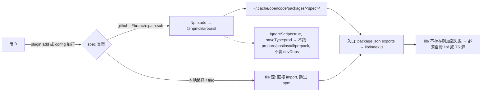

<!-- tm_board_write · 2026-09-26T18:26:01.337Z · role=researcher · session=20260926-213919 -->
# OpenCode V2 插件分发与安装机制调研（只读）

> 目标：在**不发布 npm 包**（要向上游提 PR，避免"两个发布者"）的前提下，给出「用户如何下载并安装 @agents-anywhere/opencode-plugin」的可信结论。
> 渠道：官方 V2 文档（opencode.ai/v2/docs）→ anomalyco/opencode 源码（分支持 dev）→ 本机缓存/日志只读佐证。**未执行任何安装命令**。

---

## 0. 结论速览

1. **安装形态受支持**：`github:owner/repo#branch::path:<子目录>` 官方文档有明确示例，可用。
2. **【最关键】安装时【不】运行任何 lifecycle 脚本**：源码把 `ignoreScripts: true` 硬编码传给 `@npmcli/arborist`，且 `saveType: "prod"`（连 devDependencies 都不装）。→ **prepare/postinstall/prepack 都不会跑**。
3. **推论**：我们的 TS 项目**必须把构建产物 `lib/` 提交进仓库**（或把 `exports` 直接指向 TS 源，见 §1d）。
4. 安装落盘目录：`~/.cache/opencode/packages/<sanitized-spec>/`（Windows：`C:\Users\<u>\.cache\opencode\packages\...`）。
5. 锁定版本 = 用精确 npm 版本或**完整 git commit**；跟踪升级 = 用分支，靠 `opencode plugin update`。

---

## 1. 受支持的插件安装形态

### 1a. Git 规格 + ::path: 子目录选择器 —— 可用【官方文档明确，High】

官方 V2 文档 *Plugins → Manage*（https://opencode.ai/v2/docs/plugins）原文：

```sh
opencode plugin add 'github:acme/plugins#main::path:packages/opencode-plugin'
```

> "Branches, tags, complete commit hashes, and npm's `::path:` repository-subdirectory selectors are supported. Configure local paths directly; tarball and npm alias targets are not accepted by `plugin add`."

- 同时支持 `github:…`、`git+https://…`、`git+ssh://…`（含私有仓库，走本机 git 凭据）。
- **落盘目录**：源码 `packages/core/src/npm.ts`：
  ```ts
  const directory = (pkg: string) => path.join(global.cache, "packages", sanitize(pkg))
  ```
  即 `~/.cache/opencode/packages/<sanitized-spec>/`。本机实测（只读）看到同族目录：`C:\Users\34296\.cache\opencode\packages\opencode-browser@latest\{package.json,package-lock.json}`，以及宿主 2.0.16 旧布局 `…\.cache\opencode\npm\@slkiser\opencode-quota@latest\1790301612433\{package.json,package-lock.json}`。两种布局都生成 **package.json + package-lock.json** → 底层就是 **npm(arborist) 安装**，不是软链。

### 1b. 【最关键一问】安装时是否运行 lifecycle 脚本？——**不运行**【源码，High】

`packages/core/src/npm.ts`（dev 分支）原文：

```ts
const npmOptions = yield* NpmConfig.load(input.dir)
const arborist = new Arborist({
  ...npmOptions,
  path: input.dir,
  binLinks: true,
  progress: false,
  savePrefix: "",
  ignoreScripts: true,      // ← 在 ...npmOptions 之后，永远生效
})
return yield* Effect.tryPromise({
  try: () => arborist.reify({ ...npmOptions, add, save: true, saveType: "prod" }),
```

- `ignoreScripts: true` 写在 `...npmOptions` **之后** → 即使 `NpmConfig` 想打开脚本也被覆盖。
- `reify({...npmOptions, add, save:true, saveType:"prod"})` 里**没有再出现** `ignoreScripts`，沿用构造时的 `true`。
- `saveType: "prod"` → **只装 dependencies，不装 devDependencies**。

**双重结论**：
- `prepare` / `postinstall` / `prepack` / `install` 全部**不会执行**（git 依赖的 `prepare` 同样被 `ignoreScripts` 抑制）。
- 即便脚本能跑，`saveType:"prod"` 也不会装 `tsdown` 等 devDeps，**构建在安装期根本无从发生**。

→ **在本仓库语境下：要把构建产物 `lib/` 提交进 git；不能依赖安装期 `prepare` 构建。**（或见 §1d：把 `exports` 指向已被 Bun 原生支持的 TS 源，彻底免构建。）

### 1c. 本地目录 / 路径安装【官方文档明确 + 源码，High】

官方文档支持这些写法：`"./plugins/local"`（相对路径，相对"所在 config 文件"解析）、`"../shared/plugin.ts"`、`"/absolute/path/plugin.ts"`、`"file:///home/me/plugins/local"`。

源码 `packages/opencode/src/plugin/shared.ts`：

```ts
export function pluginSource(spec: string): PluginSource {
  if (isPathPluginSpec(spec)) return "file"
  return "npm"
}
const INDEX_FILES = ["index.ts","index.tsx","index.js","index.mjs","index.cjs"]
```

- 路径类 spec → `source = "file"` → **跳过 npm 流程**，直接由宿主（Bun）动态 import。
- 目录类插件：先读 `package.json` 的 `exports` 定位入口；没有 `package.json` 时回退找 `index.*`。

**自动发现**（官方文档）：项目级 → 每个 `.opencode/plugins/` 下的 `.ts`/`.js` 与"直接包目录"自动加载；全局级 → `~/.config/opencode/plugins/`（本机现存 `plugins/team-mode.js.disabled-20260926`）。注意：与项目根 `opencode.json(c)` **同级**的 `plugins/` **不会**被自动发现。

**指向本仓库 opencode-plugin/ 目录能否直接工作？** 能，但有前提：路径类插件**不走构建**，宿主直接 import。若 `exports` 指向 `./lib/index.js`，则 **`lib/` 必须已存在**（手动 `yarn build` 或已提交）。

### 1d. .ts 单文件 vs 目录项目【官方文档，High】

- 单文件 `.ts/.js`：宿主 Bun 直接加载，无需构建。目录包：走 `package.json` `exports`。
- **重要**：官方 *build/plugins → Publish* 的最小 manifest 直接把 `exports` 指向 **TS 源**（`{ "type":"module", "exports": { ".": "./src/index.ts", "./rpc": "./src/rpc.ts" } }`），而不是编译产物。我们的设计 §4.1.6「零运行时依赖，仅 Node 内建」恰好满足 → **可作为"免提交 lib/"的替代方案（Medium，官方示例但需按我们多文件结构验证）**。

---

## 2. 更新与版本管理【官方文档明确，High】

```sh
opencode plugin check            # 检查 server 与 TUI-only 包插件是否有更新
opencode plugin update           # 更新所有过期的包
opencode plugin update <pkg>     # 只更新/检查该目标
```

> "…**Local plugins and exact package revisions are skipped.**"
> "Server startup … checks unpinned npm and Git plugins for updates … **Exact npm versions and full Git commit hashes stay pinned.**"

本机实测佐证（只读）：`@latest` 首次解析后**把具体版本写死进缓存 package.json**：`…\npm\@slkiser\opencode-quota@latest\1790301612433\package.json` → `{"dependencies":{"@slkiser/opencode-quota":"4.10.3"}}` → 与"@latest 缓存不自动刷新"线索一致；刷新需显式 `plugin update`。

| 目标写法 | 被 check/update 管理 | 说明 |
|---|---|---|
| `github:o/r#main::path:...`（分支） | ✅ | 跟踪分支 HEAD |
| `github:o/r#<40位完整commit>` | ❌ 视为 pin | 锁定版本首选 |
| `pkg@1.2.3` | ❌ 视为 pin | npm 精确版本被 pin |
| `pkg@latest` | ✅ | 首解析后缓存写死具体版本 |
| 本地路径 / file: | ❌ | 本地插件被跳过，用户自行构建 |

---

## 3. 无 npm 发布前提下的候选分发路径

安装期不跑脚本这一条，直接决定下面每个方案都必须"自带可用产物"。

| # | 方案 | 用户操作步骤 | 代价 / 风险 | 置信度 |
|---|---|---|---|---|
| ① | **Git 规格 + ::path:（推荐）** | `opencode plugin add 'github:<org>/Agents-Anywhere#main::path:opencode-plugin'`（或 config plugins 加该串） | 仓库须**提交 lib/**；分支跟踪时新 commit 何时生效依赖 plugin update；私有仓库需 git 凭据 | High |
| ② | **本地路径 + 预构建** | clone → `cd opencode-plugin && yarn install && yarn build` → config 写绝对路径（或放进 `~/.config/opencode/plugins/`） | 用户须手工 build；升级=git pull+rebuild；无需 npm、无需提交 lib/；开发自用最佳 | High |
| ③ | **提交 lib/ + Git 规格** | 同 ①，静态产物进仓库 | 仓库体积/噪音，lib/ 与源码可能 drift；换来"装上即用" | High |
| ④ | **exports 指向 TS 源 + Git 规格** | 把 `exports` 改为 `./src/*.ts`，去掉 lib/，再走 ① | 依赖宿主 Bun 直接编译多文件 TS；需实测 `./tui` 入口 | Medium |



**推荐**：主推 **①/③ 组合**（Git + ::path: + 提交 lib/），用户零构建、可被 plugin update 管理、不产生第二个 npm 发布者；**④** 作为"仓库不想放产物"的干净替代，需团队补一次实测。

---

## 4. 版本一致性（避免"两个发布者"）

- **单一真源**：以 `opencode-plugin/package.json` 的 `version` 为唯一版本号；`docs/releases/` 与根 README 的版本由发布脚本从该字段生成/校验，禁止手改两处。
- **分发即"发布"**：走 git 规格时，package.json.version 就是对外版本；CI 在打 tag 时校验字段与 tag 一致（如 tag `opencode-plugin-v0.1.0` ↔ version `0.1.0`）。
- **锁定 vs 跟踪**：锁定 → 完整 commit 或 tag（`#<tag>::path:opencode-plugin`，edge）；跟踪 → 分支 `#main`，靠 `plugin update` 拉新提交。
- **不产生第二发布者**：全程无 npm publish；check/update 读 git（分支）而非 npm registry，因此没有"npm 版本线"与"仓库版本线"分裂。
- 入口可用 `ctx.app.version` 做兼容性上报；`engines.opencode:">=2"` 已在 package.json 声明。

---

## 5. 官方推荐的第三方分发方式（原文）

官方**没有**单独的"third-party distribution"章节；分发在 *Plugins → Manage*（安装）与 *build/plugins → Publish*（打包）两处给出：

- 安装侧（Manage）："Package installation accepts npm names with versions, tags, or ranges, plus **npm-compatible Git package specifications**. Git repositories can use hosted shortcuts, HTTPS, or SSH, including private repositories available through your existing Git credentials."
- 打包侧（Publish）："A package plugin uses the same default export as a local plugin."，并给出把 `exports` 指向 `./src/index.ts` 的最小 manifest；"Use versions compatible with the OpenCode release you target and test the installed package, not only a workspace-linked copy."

→ 官方把 **Git 规格**列为一等公民，等于官方向"不发布 npm 也能分发"背书。

---

## 6. 证据清单

| 结论 | 来源 | 置信度 |
|---|---|---|
| `github:…#branch::path:sub` 受支持 | https://opencode.ai/v2/docs/plugins （Manage 段） | High |
| 安装期 ignoreScripts:true + saveType:"prod" | anomalyco/opencode@dev `packages/core/src/npm.ts`（Arborist 构造 + reify） | High |
| 路径 spec 走 file 源、跳过 npm | `packages/opencode/src/plugin/shared.ts`（pluginSource, INDEX_FILES） | High |
| 安装落盘 `~/.cache/opencode/packages/<spec>/` | `packages/core/src/npm.ts`（directory()）+ 本机磁盘 | High |
| 缓存写死具体版本（@latest→4.10.3） | `C:\Users\34296\.cache\opencode\npm\@slkiser\opencode-quota@latest\1790301612433\package.json` | High |
| 加载入口 entrypoint=…/dist/index.js | `C:\Users\34296\.local\share\opencode\log\opencode.log:35` | High |
| 本地 link 安装先例（DSH） | `dsh-bridge-next/README.md`「本地构建与安装」段 | High |
| 设计 §4 双入口 / §4.1 零运行时依赖 | `.git\opencode-team\20260926-213919\opencode-design\01-architect-integration-design.md` | High |

---

## 7. 未验证 / 缺口

- **未做端到端实测**：按要求禁止安装，未真正跑 `opencode plugin add` git 规格 → "git+::path: 实际是否成功"停在"文档明确 + 源码可见"，非运行时验证。
- `sanitize()` 对含 ::path: / 斜杠 spec 的目录命名未逐行确认（Low）。
- 本仓库**未实测**"exports 指向 ./src/*.ts（方案④）在 V2 下 ./tui 入口能否正常 import"（Medium）。
- 本机同时存在 `~/.cache/opencode/npm/…`（2.0.16 旧布局）与 `…/packages/…`（dev 新布局），未确证 2.0.18 起是否统一为 packages/。
- `plugin update` 对 git 分支"是否重跑 reify 拉取新 commit"为文档推断，未实测。
