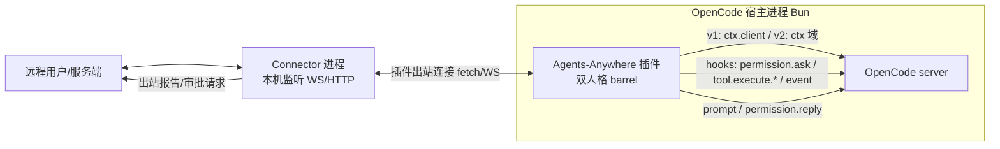

<!-- tm_board_write · 2026-09-26T13:50:23.994Z · role=researcher · session=20260926-213919 -->
# OpenCode 插件与扩展能力调研 — Agents-Anywhere 接入可行性判定

调研日期 2026-09-26 · thoroughness: very thorough · 只读调研，未修改任何文件。
对象：OpenCode（官网 opencode.ai；npm 组织 @opencode-ai / @opencode；GitHub sst/opencode，搜索结果亦见 anomalyco/opencode 镜像）。
本机佐证：OpenCode v2 主机（2.0.18，依据 @te-river/opencode-team-mode 内研究文档同日实测）+ ~/.config/opencode/node_modules 下 @opencode-ai/plugin@1.18.24、@opencode-ai/sdk@1.18.24、@te-river/opencode-team-mode@1.6.1。

证据分档标记：【D】官方文档明确支持 ·【S】源码/类型可见但未文档化 ·【L】社区做法/本机实测/推断。

## 0. 总体结论

设想的「存在于 OpenCode 内部的插件 ↔ 本机 Connector 进程」形态**可行**，零侵入约束可满足（用户只需在配置加一行 plugins 条目或跑一次 opencode plugin add）。五项关键能力全部有证据。最大风险不是能力缺失，而是 **OpenCode 存在两代互不兼容的插件 API**：v1（命名导出钩子式，官方文档站默认内容）与 v2（default export {id, setup(ctx)}，本机 2.0.18 实际运行的一代）。要同时覆盖两代，需发布 team-mode 式"双人格"包。

## 1. 插件机制

【D】v1 线（https://opencode.ai/docs/plugins，页面更新 2026-09-26）：
- 两种加载：本地文件（项目级 .opencode/plugins/、全局 ~/.config/opencode/plugins/，启动自动扫描）+ npm 包（配置数组，文档示例键名 "plugin"）。
- npm 插件启动时用 Bun 自动安装，缓存 ~/.cache/opencode/node_modules/。
- 加载顺序：全局配置 → 项目配置 → 全局插件目录 → 项目插件目录；所有钩子按序执行；同名同版本 npm 包只加载一次。
- 插件 = JS/TS 模块，导出一个或多个插件函数 async (ctx) => Hooks；ctx 暴露 project / directory / worktree / client（OpenCode SDK 客户端）/ $（Bun Shell API）。
- TS 类型从 "@opencode-ai/plugin" 导入；本地插件可用外部依赖（配置目录 package.json + 宿主 bun install）。

【S】v2 线（本机 forensics：team-mode docs/research/plugin-loader-contract.md，host 2.0.16/2.0.18）：
- v2 读 config.**plugins**（复数；本机 opencode.jsonc 实证生效）；条目 = 字符串 | {package, options} | "-target"（移除）。
- 接受形态 = default export **{id, setup(ctx)}** 或 {id, effect}**（联合 schema）；v1-only {id, server} 在 2.x 报 SchemaError："Plugin must export a default definition with an id and an effect or setup function"。官方声明 "V1 plugin implementations do not run in V2"。
- 本地目录安装必须指向**含根 index.js 的目录**；仅声明 package.json#exports 的目录被静默跳过（无日志）。绝对路径指向文件被拒（"must be a directory"）。
- `opencode plugin add <spec>`：仅接受 npm/git specifier；AST 编辑写入全局 opencode.json 的 plugins 数组（tmp+rename，0o600）。
- 运行时 = Bun；插件在 OpenCode 服务器进程内运行（in-process）。注意：一次 CLI 调用可能启动多个 server 进程，插件会各加载一份（team-mode 实测计数器分裂）。
- 双代兼容先例：@te-river/opencode-team-mode 1.6.1 default export 同时携带 .server(input,options)（v1 半）与 {id, setup}（v2 半）。

## 2. 插件 API 面

【S】v1 Hooks 全表（@opencode-ai/plugin@1.18.24 dist/index.d.ts:173-322）：
dispose · event({event})（全事件总线）· config · tool{[name]:ToolDefinition}（自定义工具）· auth（自定义 provider 认证）· provider · "chat.message"({sessionID,agent?,model?,messageID?,variant?} → {message,parts}) · "chat.params" · "chat.headers" · **"permission.ask"(input:Permission → output:{status:"ask"|"deny"|"allow"})** · "command.execute.before" · "tool.execute.before"({tool,sessionID,callID}→{args}) · "shell.env" · "tool.execute.after"(→{title,output,metadata}) · "experimental.chat.messages.transform" · "experimental.chat.system.transform" · "experimental.provider.small_model" · "experimental.session.compacting" · "experimental.compaction.autocontinue" · "experimental.text.complete" · "tool.definition"。
PluginInput 还含 serverUrl:URL 与 experimental_workspace.register（index.d.ts:36-46）。

【D】事件总线全表（官方 plugins 文档"事件"节）：
command.executed · file.edited · file.watcher.updated · installation.updated · lsp.client.diagnostics · lsp.updated · message.part.removed/updated · message.removed/updated · **permission.asked / permission.replied** · server.connected · session.created/compacted/deleted/diff/error/**idle**/status/updated · todo.updated · shell.env · tool.execute.after/before · tui.prompt.append / tui.command.execute / tui.toast.show。

【L】v2 ctx 域（host-http-api.md §4，2026-09-26 实测 host 2.0.18）：
session: hook create get switchAgent switchModel **prompt** generate command synthetic interrupt update move wait **context** · permission: **hook list get reply** · experimental: terminal.read · storage: get set remove scan · agent/model/command/mcp/worktree: list/get/transform/reload · event: subscribe（async iterable）· rpc（调用约定未读出）。

【L】v2 实测差异坑：无 chat.message 等价钩子（消息持久化前不可见，只能事后读 session.hook("context") 组装历史）；execute.before 参数字段是 **input** 不是 args；子会话的 session.idle 不转发给插件订阅者；ctx 方法接收单个扁平对象 {sessionID}（非 v1 的 {path:{id}}）。

## 3. 关键能力判定（逐条）

a. 读完整会话消息/工具调用记录 — **可行**【High】
- v1：client.session.messages/message（sdk.gen.d.ts:170-178）+ event 钩子订阅 message.updated/message.part.updated + tool.execute.before/after 逐次捕获。REST GET /session/:id/message。
- v2：ctx.session.context({sessionID})（实测返回扁平数组 {id,time:{created},text,type}）；HTTP GET /api/session/{id}/message、/api/session/{id}/context。
- timeline 同步 = 初始拉取（messages/context）+ 增量事件流（event 订阅）。

b. 拦截权限并代答（远程审批）— **可行**【High】（安全风险：Critical——权限决策外流远端，必须 TLS+设备身份+用户可见确认；插件自答=self-allowing，team-mode 项目明确拒绝调用 reply 的先例）
- v1 钩子 "permission.ask"：直接写 output.status="allow"|"deny" 同步代答（index.d.ts:225-227）。
- v1 SDK：client.postSessionIdPermissionsPermissionId（"Respond to a permission request"，sdk.gen.d.ts:377-381）；REST POST /session/:id/permissions/:permissionID {response, remember?}。
- v2：ctx.permission.{list,get,reply}（实测存在，reply 参数至少含 {sessionID}，完整形状未测）；HTTP GET /api/permission/request + POST /api/session/{id}/permission + GET/DELETE /api/permission/saved。
- 事件：permission.asked / permission.replied 可订阅。

c. 注入用户消息/继续会话 — **可行**【High】
- v1：client.session.prompt / promptAsync（sdk.gen.d.ts:174,182）；client.session.command（斜杠命令）；REST POST /session/:id/message（同步等响应）、/prompt_async（204 立返）。
- v2：ctx.session.prompt / synthetic；HTTP POST /api/session/{id}/synthetic。
- 佐证：官方 /tui 端点（append-prompt/submit-prompt）即 IDE 插件驱动 TUI 的同路数。

d. 列会话/项目、读配置 — **可行**【High（v1）/ Medium（v2 会话列表）】
- v1：client.session.list、client.project、client.config.get/providers、client.app.agents、client.command.list；REST GET /session /project /config /config/providers /agent /command。
- v2：ctx.agent/model/command 有 list；**ctx.session 无 list**（实测域表）——列会话需走 HTTP（/api 线）或事件累积。

e. 插件对外网络连接 — **可行**【fetch: High（实测）；WebSocket: Medium（Bun 原生能力+playwright-core 1.63.0 佐证，未直接实测）】
- 插件运行于 Bun、in-process、无沙箱记载；本机 team-mode 插件 tm/webfetch.js:480 实际使用 globalThis.fetch 出站 HTTP。
- 插件还能用 $ 执行 shell、装任意 npm 依赖——无任何网络隔离。安全风险：Medium（供应链信任）。

## 4. 服务端/SDK 路线

【D】v1 线（https://opencode.ai/docs/server、/docs/sdk）：
- `opencode serve` 无头 HTTP 服务器：默认端口 4096、hostname 127.0.0.1、--cors（可多次）、--mdns；OPENCODE_SERVER_PASSWORD 基本认证（用户名 opencode）。
- 平时跑 TUI 时也内嵌一个服务器（TUI 只是客户端）；OpenAPI 3.1 规范在 /doc（可生成客户端）；/tui/* 端点可预填/提交 prompt（IDE 插件在用）。
- API 全表（官方 server 文档）：/global/health、/global/event(SSE)、/project、/config(+PATCH)、/config/providers、/provider*、/session 全套（list/create/status/get/delete/patch/children/todo/init/fork/**abort**/share/diff/summarize/revert/unrevert/**permissions/:permissionID**）、/session/:id/message(GET/POST)、/prompt_async、/command、/shell、/find*、/file*、/experimental/tool、/lsp、/formatter、/mcp(POST 动态加)、/agent、/log、/tui/*、/auth、/event(SSE)、/doc。
- SDK @opencode-ai/sdk：createOpencode()（起服务器+客户端）/ createOpencodeClient({baseUrl})（仅客户端）；OpencodeClient 域：global project pty config tool instance path vcs session command provider find file app mcp lsp formatter tui auth event + postSessionIdPermissionsPermissionId。
【L】v2 线（本机 forensics）：/api/* 路由族 + HTTP Basic（用户名 opencode，密码在 ~/.config/opencode/service.json，43 字符）+ GET /api/info 发现（端口动态）；路由含 /api/plugin(+check/update)、/api/session/{id}/message|context、/api/permission/request、/api/session/{id}/permission、/api/pty、/api/fs/*、/api/websearch、/api/session/{id}/wait|synthetic|interrupt|compact|fork、/api/event(SSE)。npm @opencode/plugin@2.0.18（deps: effect 4.0.0-rc、@opencode/client 等）。
结论：**server API 可承接全部数据面**（会话/消息/权限/abort 都有端点），插件可薄化为注册/发现+进程内事件流。v1 插件 ctx 自带 client（无需 HTTP）；v2 走 HTTP 需读 service.json 密码 = 新信任边界（team-mode 明确不读）。

## 5. 分发安装

【D+L】npm publish 后用户两种接入：配置文件加一行（v2 实测键名 "plugins": ["pkg@latest"]；官方文档示例写 "plugin"）或 `opencode plugin add <pkg>`（CLI 自动安装+写全局配置）。本地路径：plugins 数组指向含 index.js 的目录，或丢进 ~/.config/opencode/plugins/ 自动加载。无官方插件市场；官方文档有"生态系统"浏览页。社区实例：opencode-helicone-session、opencode-wakatime（官方文档举例）、@te-river/opencode-team-mode、@slkiser/opencode-quota（本机在用）、opencode-usage-quota-tracker、ai-sdk-provider-opencode-sdk（npm 检索）。满足零侵入约束：不改 OpenCode 源码、不 fork。

## 6. 成熟度

- 版本：@opencode-ai/plugin 1.18.24（v1 线）· @opencode/plugin 2.0.18（v2 线）· 本机主机 2.0.18。
- 破坏性变更：v1→v2 一次大断裂（v1 插件不跑在 v2，官方声明）；v2 自身 2.0.16→2.0.18 loader 细节仍在变（目录解析规则）。v2 依赖 effect 4.0.0-rc（RC 版）。
- 文档质量：v1 线完整（事件全表、示例、server/SDK 页）；**v2 插件 API 官方文档未能定位**（/docs/v2/plugins 404）——v2 知识靠 forensics。
- 社区插件存在且活跃（本机两个第三方插件在用即证）。
- 实测坑：多进程重复加载、静默跳过目录插件、子会话事件不转发。

## 7. 建议

1. 形态：OpenCode 插件（双人格 barrel：v1 .server + v2 {id,setup}）+ 本机 Connector 进程（监听 localhost 端口），插件出站连 Connector（fetch 已实测可行；WebSocket 用 Bun 原生）。
2. 数据面优先级：v1 宿主用 ctx.client（in-process SDK，零 HTTP）；v2 宿主用 ctx 域（session.context/permission.reply/prompt）为主，HTTP /api/* 为补充（需评估 service.json 信任边界，或让用户显式授权）。
3. timeline：初始 client.session.messages / ctx.session.context + event 订阅增量（message.updated、tool.execute.before/after、permission.asked、session.idle）。
4. 远程审批：v1 permission.ask 钩子代答 或 ctx.permission.reply / POST permissions 端点；必须加用户本地确认与审计，防 self-allowing。
5. 注入：client.session.prompt/promptAsync（v1）、ctx.session.prompt/synthetic（v2）。
6. 风险对冲：锁定插件包版本（@latest 有重复加载与静默跳过坑）；对 v2 API 形状做启动自检（decode 错误命名必需键的探测法，team-mode 已验证）；关注 v2 文档发布。

## 8. Gaps（未能确认）

- v2 官方插件文档是否存在（/docs/v2/plugins 404；可能有版本切换器未触达）——需在 v2 宿主上实测 ctx.permission.reply 完整参数形状与 ctx.session.prompt 参数。
- v2 /api/* 是否同时保留 v1 REST（4096）——未测。
- sst/opencode 与 anomalyco/opencode 仓库归属迁移细节（搜索结果两见；npm repository 字段获取失败）。
- 插件内 WebSocket 直连：Bun 能力推断+playwright-core 佐证，未实测。
- GitHub 源码直读（raw.githubusercontent.com 超时）——plugin/index.ts 源码级 hook 清单未取到，以本机 .d.ts 替代（同为权威类型面）。

## 附：设想架构的依赖图

