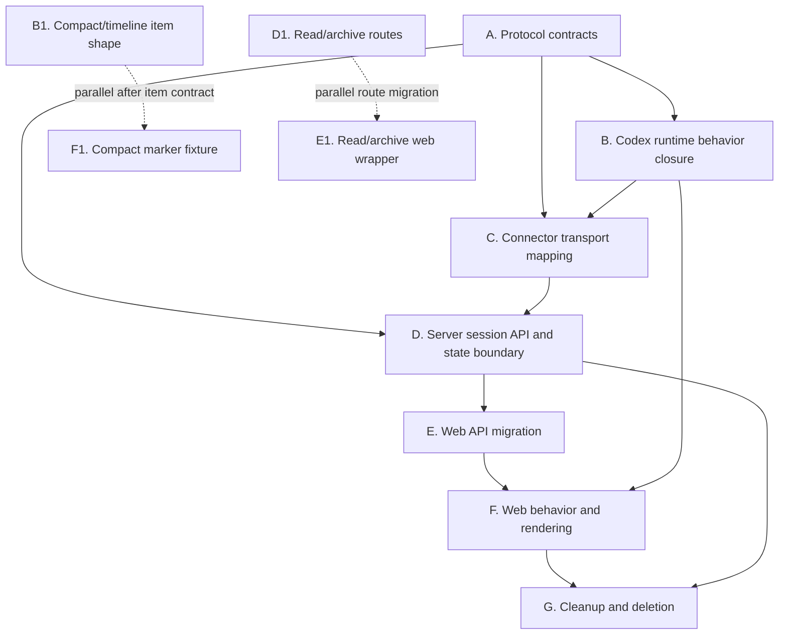

# Runtime protocol refactor execution dependencies

This document is the working execution map for the v2 connector/runtime/session
refactor. It describes which work can run in parallel and which work must wait
for a previous contract or behavior to be stable.

The target architecture is already described by the runtime protocol and API
documents. This file only answers execution ordering.

## Current state

The repository is in a mixed state:

- `connector.runtime_protocol` already has the basic `AgentRuntime`,
  `RuntimeHostClient`, `SessionMeta`, `SessionState`, and timeline item
  concepts.
- Codex runtime has moved toward the SDK and has partial controllers for turns,
  selections, commands, notifications, and timeline accumulation.
- Server still mixes durable session metadata, runtime state, active run
  tracking, notices, and effective capability derivation.
- Web already consumes `effectiveCapabilities`, but still calls old session
  endpoints and still uses runtime/session status in several UI decisions.

The refactor should not continue as isolated bug patches. The next work should
close the protocol boundary first, then move server and web onto that boundary.

## Work packages

### A. Protocol contracts

Add the missing cross-layer types and methods:

- runtime-scoped effective capability types
- session-scoped effective capability types
- connector-to-runtime reads for runtime/session capabilities
- runtime-to-host capability update calls
- final REST method names and payload shapes used by server and web

Output:

- typed connector protocol models
- server/web API contracts updated if implementation discovers minor gaps

This package is the main dependency for server and web API migration.

### B. Codex runtime behavior closure

Make Codex runtime own the live facts for a session:

- `waiting`, `running`, `blocked`, `idle`, and `error`
- send/steer/interrupt availability
- compact start/progress/done/error
- selection state and next-turn application
- no-active-turn recovery to `idle`
- SDK event to stable timeline item projection

Output:

- Codex can answer live state and capability reads.
- Codex can push live state and capability updates through the host.
- Compact is represented as one stable timeline item that updates state.

This depends on A for capability types, but parts of compact/timeline projection
can be implemented in parallel once item shapes are agreed.

### C. Connector transport mapping

Map runtime protocol calls to server-facing connector notifications and RPC
responses:

- `session.state.updated`
- `runtime.capability.updated`
- `timeline.itemUpsert`
- `timeline.sync`
- `notice.upsert`
- runtime RPC dispatch for session actions

Output:

- runtime adapters never emit server notification method names directly.
- bulk sync still uses `POST /connector/ingest`.
- live updates prefer `WS /connector/ws`.

This depends on A and should be verified with B.

### D. Server session API and state boundary

Move server to the new boundary:

- durable `SessionMeta`
- durable `SessionTimeline`
- runtime-owned, non-durable `SessionState`
- runtime-owned, non-durable `SessionNotice`
- effective capability as the frontend action contract

Server should stop deriving runtime truth from durable `sessions.status` or
`active_run`. Server may apply platform policy such as auth, ownership,
takeover, connector online/offline, and connector reachability.

Output:

- new session runtime REST endpoints
- new read/archive endpoints
- session WS envelope carries timeline/state/notice/capability updates for one
  session
- old endpoint blocks removed or marked as migration-only during the cutover

This depends on A. It can be developed with fake connector RPCs before B is
complete, but final correctness depends on B and C.

### E. Web API migration

Move web calls to the new REST shape:

- `POST /sessions/read`
- `POST /sessions/archive`
- `/sessions/{id}/runtime/state`
- `/sessions/{id}/runtime/capabilities`
- `/sessions/{id}/runtime/catalogs/model`
- `/sessions/{id}/runtime/catalogs/permission`
- `/sessions/{id}/runtime/commands`
- `/sessions/{id}/runtime/selections`
- `/sessions/{id}/runtime/messages`
- `/sessions/{id}/runtime/steer`
- `/sessions/{id}/runtime/interrupt`
- `/sessions/{id}/runtime/notices/{noticeId}/respond`

Command list reads the full command list. The frontend performs fuzzy matching
locally.

Output:

- no session command query endpoint use
- no agent catalog query-string connector id use
- selection click always requests the backend immediately

This depends on D's routes existing. It can start with API wrapper changes once
route contracts are fixed.

### F. Web behavior and rendering

Update UI behavior to match the new facts:

- action availability comes from effective capabilities
- runtime state is display state, not an action state machine
- compact displays as a stable block marker with progress/done states
- tool groups and tool rows use marker-style rendering
- group expanded/collapsed state survives item updates
- mobile carousel text is bounded to avoid layout jump and flicker

Output:

- send/interrupt/steer buttons reflect effective capabilities
- compact no longer shows runtime notice cards
- timeline updates do not re-collapse open groups

This can partly run in parallel with E using local fixtures, but final wiring
depends on E.

### G. Cleanup and deletion

Remove stale implementation paths after the new flow is verified:

- DB-backed runtime state assumptions
- `sessions.status` as runtime truth
- UI capability derivation from status
- old session routes
- stale compatibility tests
- dynamic dict probing in Codex business logic where SDK/protocol types are known

Output:

- tests represent the new boundary only
- old behavior cannot accidentally be called by web or connector

This must wait for A through F.

## Parallelism

Can run in parallel:

- A1 protocol type additions and D1 server route skeletons, if route payloads are
  based on the existing docs.
- B1 Codex compact/timeline item shape and F1 web compact marker fixtures, after
  the compact item contract is agreed.
- B2 Codex selection validation and E1 web selection API wrapper, after the
  selection endpoint path is fixed.
- D2 read/archive route rewrite and E2 read/archive web wrapper migration.
- F2 tool marker rendering can start from existing timeline fixtures while B
  continues improving SDK projection.

Must wait:

- D final effective capability implementation must wait for A capability models.
- E runtime endpoint migration must wait for D route availability.
- F action button behavior must wait for E API state shape and capability shape.
- G cleanup must wait for at least one end-to-end Codex session flow passing:
  create/start, stream, idle, send second message, interrupt, compact, selection
  update, refresh.

## Dependency graph

## Recommended execution order

1. Add protocol capability models and methods.
2. Implement Codex runtime session/runtime capability reads and pushes.
3. Fix Codex compact and no-active-turn state behavior.
4. Add server runtime-scoped session endpoints and read/archive endpoints.
5. Move server effective capability projection to runtime-provided facts plus
   platform policy.
6. Migrate web API wrappers to the new endpoint paths.
7. Migrate composer action gating to effective capabilities only.
8. Migrate compact/tool rendering to stable marker items.
9. Run an end-to-end Codex flow and delete old routes/tests once the new flow is
   confirmed.

Current status on `v2-connector-refactor`:

- Steps 1-5 have backend/connector test coverage and are implemented enough for
  frontend migration.
- Codex runtime behavior has targeted coverage for:
  - session/runtime capability reads and host pushes;
  - selection validation and next-turn state publication;
  - no-active-turn interrupt convergence to `idle`;
  - compact start/done/error as one stable timeline item plus blocked/idle
    state transitions;
  - approval requests as runtime notices, not legacy `approval.requested`;
  - typed Codex timeline projection including context compaction.
- Remaining verification for those behaviors is end-to-end Web + real Codex SDK
  runtime behavior, especially consecutive sends, streaming, tool approval,
  compact completion, and connector restart recovery.

## Verification gates

Each gate should be committed independently.

1. Protocol gate:
   - type/lint passes for connector protocol modules
   - no runtime adapter emits capability payloads as untyped dictionaries

2. Codex runtime gate:
   - create/start streams timeline items
   - terminal turn publishes `idle`
   - second message after terminal turn is accepted
   - no-active-turn interrupt moves state to `idle`
   - compact start and done update one item id

3. Server API gate:
   - new routes respond with documented shapes
   - old route tests are removed or marked migration-only
   - server no longer derives send/interrupt/steer from persisted session status

4. Web gate:
   - no web code calls old session runtime endpoints
   - selection click sends `PATCH /runtime/selections`
   - command menu reads full command list without query
   - action buttons use effective capabilities

5. End-to-end gate:
   - new session from web
   - streaming response visible without refresh
   - idle visible after completion
   - second message works without refresh
   - interrupt works during running state
   - compact blocks input, then unblocks after done
   - refresh does not duplicate user or assistant messages
