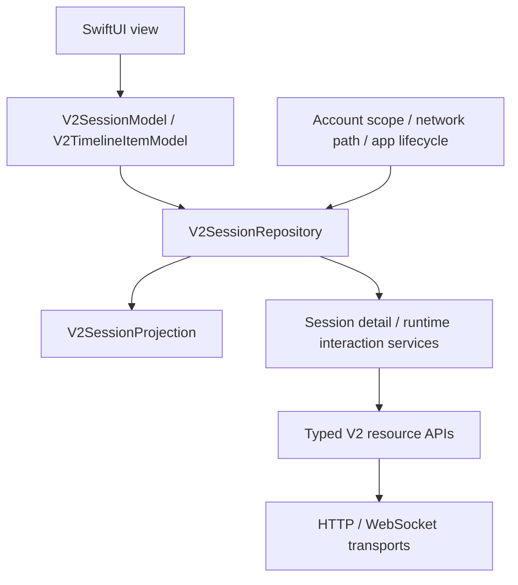

# iOS API alignment

Backend baseline: `origin/v2` at `1d0517cd` (2026-09-06).

This document records the transport, typed-resource and business-service
alignment baseline. The subsequent native chat, New Session and interaction
integration is documented in [NATIVE_CHAT.md](NATIVE_CHAT.md).

## Contract boundaries

- Authentication and account identity follow the current email account contract.
- Connector discovery distinguishes runtime types from configured instances.
  Instance creation sends a name, configuration, and the requested active state
  in one request; catalog requests target the selected instance.
- Projects use `/projects` for list/create/rename/pin/delete and project-scoped
  session pagination/archive-all. Creating a session requires `projectId` and its
  matching connector/workspace. Reusing the same canonical directory requires an
  explicit UI confirmation because the create endpoint may rename that project.
- Dashboard snapshots include projects and separate active/archived first-page
  cursors. Global and per-project pagination retain independent membership.
- Session metadata and creation carry the runtime type and instance separately.
  History, runtime state, capabilities, selections, notices, takeover, sync, and
  attachments use their current resource endpoints.
- Dashboard and session updates use single-use WebSocket tickets. Session event
  recovery retains the server cursor and snapshot-required signal. Unknown
  extension events remain available to the future UI reducer.
- File browsing preserves structured RPC errors and supports native text reads
  alongside the existing web preview flow.
- Retired session/runtime calls belong in `_deprecated`, outside the app target.

Terminal, Connector execution and server administration are outside this
client-core alignment. The native presentation is documented separately.

## Native data ownership



`Domain` contains wire values and typed timeline content; these values own no I/O.
The repository owns requests, the current projection, subscriptions and caches.
`Models/Session` exposes `@MainActor @Observable` references with stable identity.
Runtime facts are a separate observable object; streaming only changes the
affected timeline row's value, leaving other row references intact.

Obtain a model from `AppState.sessionModel(id:)` (or the scoped repository) and
pass it to the session view. A view can use `@Bindable var session:
V2SessionModel`, `.task { await session.connect() }`, `session.timeline` in a
`ForEach`, `session.draft` as a binding and `session.sendDraft()` as an explicit
button action. The `.task` lasts for the observation lifetime; cancellation
removes that observer. Multiple views share one session socket. Use
`session.runtime.isFresh`/`session.canSend` for controls, not cached status alone.
History/refresh actions are on the model; other typed operations remain on the
scoped repository and services. The native chat receives these observations
through a separate 30 Hz presentation model rather than rendering every frame.

Each `V2ClientServices` instance belongs to a normalized server origin, account
and credential lifetime. Replacing credentials or signing out shuts down the
network session, cancels work, clears the repository and invalidates retained
observable objects. Dashboard reads also reject late results from an old scope.

## Cache and recovery policy

- The default in-memory LRU keeps 8 inactive sessions, up to 1,000 timeline items
  per session, and model/permission catalogs for 30 seconds. Active subscriptions
  and sessions with drafts or unresolved sends are protected from eviction.
  A user browsing older history retains that window and explicitly loads latest
  to return to the tail. No automatic history/media prefetch runs on cellular.
- Snapshot, history, recovery and catalog reads coalesce per session. Versions
  reject stale in-flight results after refresh, reset or catalog invalidation.
  Item revisions prevent older history from overwriting streamed content.
  Page `nextSeq` never acknowledges unread events. A required snapshot can reset
  the cursor backwards after the server resets its sequence.
- Versioned disk archives retain dashboard data, up to 8 sessions and 128 MiB
  of session data, with a 64 MiB per-record ceiling. Histories keep the existing
  1,000-item bound; thumbnails use the existing 16 MiB per-session limit. Upload
  bytes are dropped from persisted attachments after a server file ID is known.
  Serial atomic writes are coalesced during streaming and flushed on background;
  pending messages are saved before their non-idempotent send. Records are scoped
  by normalized server/account, protected on iOS and excluded from backups.
- Cold launch restores the saved page and available local content before network
  validation. A unavailable server produces a nonblocking glass notice and read
  backoff. Cached runtime permissions and pending approvals are not trusted:
  controls wait for subscription/recovery and fresh runtime state. An interrupted
  pending send restores as uncertain, then reconciles by clientMessageId; it never
  replays automatically. Sign-out removes that account's archive and blocks late
  writes through the invalidated handle. Corrupt/unsupported records are ignored.
  The first launch after upgrading from the memory-only client must sync once to
  establish a launch profile and cache. History never fetched remains unavailable
  offline. Interaction form drafts and unsubmitted New Session attachment picks
  remain process-local; New Session text is saved in account-scoped preferences.
- `NWPathMonitor` exposes availability, cellular cost and Low Data Mode. Known
  offline paths pause subscriptions while retaining content. Foreground/network
  recovery obtains a new single-use ticket. After `session.subscribed`, durable
  cursor recovery runs before refreshing runtime state, capabilities and notices.
  Live projection frames can change at the same sequence/event ID and are not
  deduplicated like durable timeline events.
- Reads alone retry transient failures at most twice, with backoff and
  `Retry-After` handling. Authentication/permission failures require intervention.
  URLSession waits for connectivity with 30-second request and 90-second resource
  timeouts. Writes and multipart uploads are never replayed by the client.
  Session sockets use bounded buffers; overflow reconnects and recovers. A
  45-second absence of server frames/keepalives is detected on a 15-second check
  interval, including when the system still reports an online path.
- Session read receipts are a separate idempotent metadata operation. Opening
  a session records local seen progress immediately, and account-scoped workers
  coalesce the receipt independently of SwiftUI view tasks. Its monotonic
  `lastReadSeq` merges independently of runtime `updatedSeq`. Transient failures
  retry with bounded backoff only while that session is visible and foreground;
  account changes cancel work and discard local progress. This does not replay
  messages, approvals, takeover requests or uploads.
- Sending keeps a stable `clientMessageId` and a pending delivery object. HTTP
  acceptance and authoritative timeline confirmation are different states.
  Ambiguous transport/RPC failures retain the draft and an uncertain outcome;
  an echo wins even if HTTP subsequently fails. A repeated tap cannot resubmit
  that unresolved draft. Concurrent edits to the next draft are preserved.
  The ID correlates echoes and is not assumed to provide backend idempotency.

## Validation approach

Add headless Swift tests that compile the production client core, intercept real
URLSession requests, and decode fixtures produced by the current Python backend
models. Verify request methods, namespaced paths, query/body shapes, runtime
identity, nullable selections, error responses, and WebSocket frames without
starting a server or simulator. Record the final results and handoff here.

From the repository root:

```sh
DEVELOPER_DIR=/Applications/Xcode-beta.app/Contents/Developer swift test --package-path ios
cd server
uv run python ../ios/scripts/export_contract_fixtures.py --check
```

The fixture exporter imports the current backend models and reads real FastAPI
route decorators without constructing the application or contacting storage.
On backend contract changes, regenerate the fixture and review the resulting
diff before adjusting the client tests.

Current validation: 170 headless tests across 22 suites pass against the production
client core. Added coverage includes project request/query contracts, paginated
snapshot races, project reuse, stale device inventory, post-pairing queue ownership,
cold offline cache restoration, account/credential separation, corrupt archives,
removed-cache write suppression, local-to-server creation handoff and optimistic
message visibility before upload. The complete unsigned iOS Debug target and
backend fixture check pass without starting a server or simulator. Manual device
checks remain in [NATIVE_CHAT.md](NATIVE_CHAT.md).
